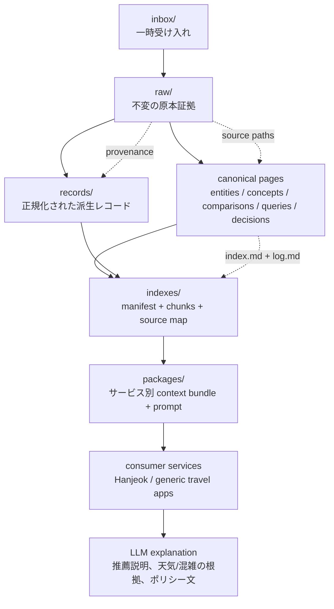
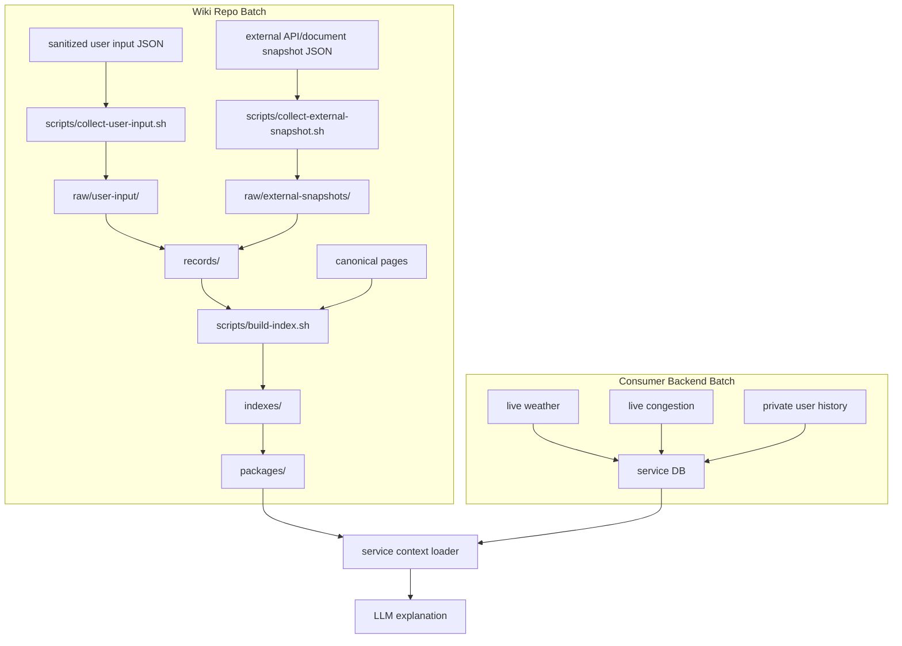
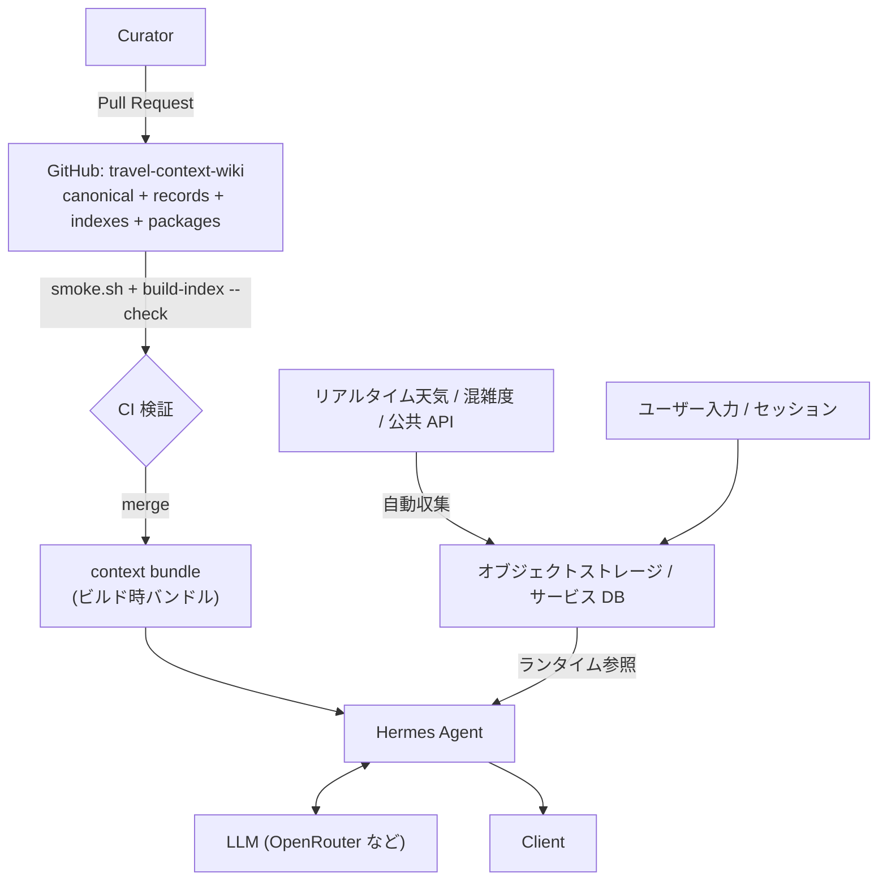
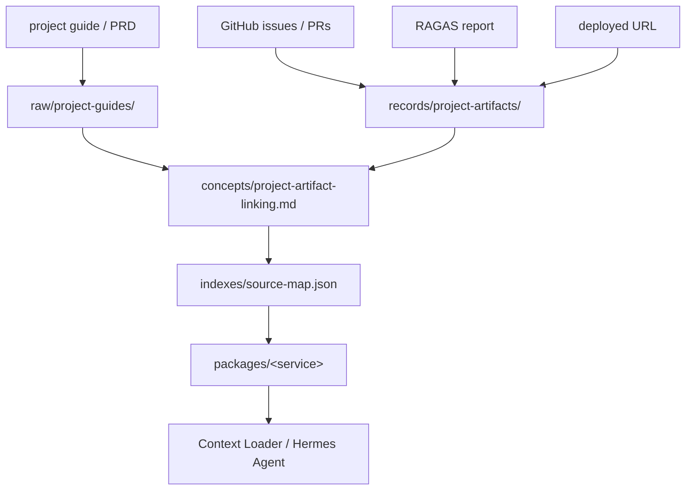
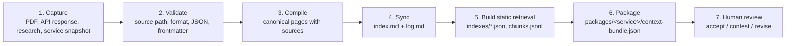

<div align="center">

# 🧭 Travel Context Wiki

**旅行・観光・天気・混雑度・地域コンテキストのための、根拠に基づく LLM ナレッジレイヤー。**

推薦を決めるのは旅行サービスです。この wiki はその推薦を説明し、検証します。

<br/>

[](https://www.data.go.kr/)
[](https://www.data.go.kr/)
[](#-ライセンス)
[](./SCHEMA.md)
[](#-仕様駆動ワークフロー)
[](#-クイックスタート)

<br/>

[English](./README.md) · [한국어](./README.ko.md) · **日本語**

</div>

---

## 📖 目次

- [これは何ですか?](#-これは何ですか)
- [Travel Context Layer](#-travel-context-layer)
- [データ出典](#-データ出典)
- [ナレッジレイヤー](#-ナレッジレイヤー)
- [リポジトリ構成](#-リポジトリ構成)
- [データフロー](#-データフロー)
- [サービス連携モデル](#-サービス連携モデル)
- [バッチ収集モデル](#-バッチ収集モデル)
- [ナレッジストアの境界](#-ナレッジストアの境界)
- [エージェントへの配信](#-エージェントへの配信)
- [プロジェクト成果物のリンク](#-プロジェクト成果物のリンク)
- [クイックスタート](#-クイックスタート)
- [仕様駆動ワークフロー](#-仕様駆動ワークフロー)
- [MVP スコープ](#-mvp-スコープ)
- [スコープ外](#-スコープ外)
- [コントリビュート](#-コントリビュート)
- [ライセンス](#-ライセンス)

---

## 🤔 これは何ですか?

**Travel Context Wiki** は、**旅行先・観光公共データ・天気・混雑度・地域コンテキスト・研究資料**
を接続し、LLM が利用できるようにした汎用の Markdown/Git ベースのナレッジリポジトリです。

このリポジトリは特定サービスのコードを**置き換えません**。各旅行サービスは自身のバックエンドで
**決定的な**推薦を行い、この wiki はその推薦を _説明・検証する_ **コンテキストレイヤー**として
使われます。Hanjeok はこの wiki を利用する最初の消費サービスにすぎず、唯一の目的ではありません。

> **一言でいうと:** 何を推薦するかはサービスが決め、根拠に基づく _なぜ_ をこの wiki が提供します。

---

## 🧩 Travel Context Layer

ユーザーが旅行サービスに **目的地・日付・時間帯・移動半径・旅行の好み** を入力すると、サービスの
バックエンドは観光地・天気・混雑度・移動条件をもとに候補とコースを計算します。その後 LLM は
このリポジトリの **canonical wiki** を検索し、次のような説明を生成します。

- なぜ今日この旅行先が適しているのか
- 天気がコース選択にどう影響するのか
- 混雑している場合、どの代替地が適しているのか
- 屋内/屋外の代替はどんな基準で分かれるのか
- 公共 API と研究資料の根拠はどこにあるのか

---

## 🗃 データ出典

この wiki の canonical ナレッジは **韓国観光公社 (KTO) の公共データ OpenAPI** に基づいており、
韓国の公共データポータルを通じて公開されている資料です。すべての派生レコードと canonical page は
`raw/` 配下の原本証拠スナップショットまで逆追跡できます。

[](https://www.data.go.kr/)
[](https://www.data.go.kr/)
[](https://www.data.go.kr/)
[](https://www.data.go.kr/)

| データ出典 | 提供機関 | 用途 | 原本証拠 |
| --- | --- | --- | --- |
| TourAPI KorService2 (韓国語観光情報) | 韓国観光公社 (KTO) | 観光地の詳細、座標、画像、概要 | `raw/public-tourism-api/2026-openapi-briefing.txt` |
| 観光地混雑度・訪問者推移予測 | 韓国観光公社 (KTO) | `congestion-diagnosis` の混雑度グレーディング | `raw/public-tourism-api/2026-openapi-briefing.txt` |
| 観光地別の関連観光地 | 韓国観光公社 (KTO) | `alternative-scoring` の代替候補構成 | `raw/public-tourism-api/2026-openapi-briefing.txt` |
| 天気 / 季節性データ | 気象 OpenAPI _(予定)_ | 天気認識推薦と屋内/屋外フォールバック | `raw/weather-api/` _(取得予定)_ |

> 2026-05 の OpenAPI 説明会資料は、約 **458 万件** の観光データをリアルタイム OpenAPI として公開する
> 韓国観光公社の公共データサービスを説明しています。原本スナップショットは `raw/` 配下に原文のまま
> 保存され、決して編集されず、更新は新しいスナップショットとしてのみ行われます。再配布の前に、
> [公共データポータル](https://www.data.go.kr/) で正確なライセンス条件 (例: KOGL) を確認してください。

---

## 🗂 ナレッジレイヤー

```text
Layer 1: Evidence
  raw/public-tourism-api/     観光公共 API 説明会、マニュアル、政策資料
  raw/weather-api/            天気 API のドキュメントと検証資料
  raw/tourism-research/       観光・混雑・天気影響に関する論文/レポート
  raw/service-snapshots/      この wiki を消費するサービスの設計/ハーネススナップショット
  raw/experiments/            API 実呼び出しの検証結果

Layer 2: Canonical Memory
  entities/                   観光/天気 API、機関、データセット、主要システム
  concepts/                   天気認識推薦、混雑回避、季節性、地域コンテキスト
  comparisons/                API/データソース/推薦ポリシーの比較
  queries/                    再利用可能な根拠ベースの Q&A
  decisions/                  LLM wiki の運用とサービス連携の意思決定

Layer 3: Operation Metadata
  SCHEMA.md                   wiki 契約
  index.md                    active canonical catalog
  log.md                      append-only operation history
```

---

## 📁 リポジトリ構成

| レイヤー | パス | 目的 |
| --- | --- | --- |
| 一時受け入れ | `inbox/` | 出典と形式がまだ確定していない入力 |
| 原本証拠 | `raw/` | 修正しない原本資料、API レスポンス、PDF 抽出物、サービススナップショット |
| 正規化レコード | `records/` | サービスが読みやすい派生 JSON |
| Canonical メモリ | `concepts/`, `entities/`, `queries/`, `decisions/`, `comparisons/` | 人が読み、LLM が検索するナレッジ |
| 検索インデックス | `indexes/` | 静的 RAG manifest、chunk、source map |
| サービスパッケージ | `packages/` | サービス別 context bundle と prompt |

---

## 🔀 データフロー

この構成は `hyunolike/2nd-brain-template` の **Evidence → Canonical Memory → Discovery → Human
Decision** の流れに従いつつ、旅行サービス連携のために正規化レコードとサービスパッケージを
追加しています。



---

## 🔌 サービス連携モデル

```mermaid
sequenceDiagram
    participant User
    participant Service as Travel Service Backend
    participant Package as packages/&lt;service&gt;
    participant Index as indexes/manifest.json
    participant Wiki as Canonical Wiki
    participant LLM

    User->>Service: destination + date + time slot + radius + preferences
    Service->>Service: calculate candidates, weather context, congestion context, route
    Service->>Package: load context-bundle.json and prompt.md
    Package->>Index: read retrieval policy and eligible pages
    Index->>Wiki: select canonical pages and normalized records
    Wiki-->>Service: source-grounded context
    Service->>LLM: backend facts + retrieved context + prompt
    LLM-->>Service: explanation only, no ranking changes
    Service-->>User: recommendation + weather/congestion/context explanation
```

**重要なルール:** LLM は **説明のみ** を生成し、サービスの推薦順位を決して変更しません。

---

## ⚙️ バッチ収集モデル

初期段階では、独立したバックエンドバッチサーバーを置きません。このリポジトリのバッチは
**sanitized evidence capture** と **static index build** までを担当します。リアルタイムの天気、
リアルタイムの混雑度、ユーザー別の推薦履歴のように、速く変化したり個人的なデータは消費サービスの
バックエンドが管理します。



### バッチコマンド

```bash
scripts/collect-user-input.sh harness/fixtures/user-input-capture.valid.json /tmp/wiki-user-input
scripts/collect-external-snapshot.sh harness/fixtures/external-tourism-snapshot.valid.json /tmp/wiki-external
scripts/build-index.sh
scripts/build-index.sh --check
./harness/scripts/smoke.sh
```

**ルール:**

- `collect-user-input.sh` は `consentForWiki` が `true` かつ `containsPersonalData` が `false` でなければ入力を拒否します。
- `collect-external-snapshot.sh` はソース URL、ライセンス、収集時刻、ペイロードを要求します。
- `build-index.sh --check` は CI 安全モードで、コミット済みの検索成果物が古い場合に失敗します。
- 認証が必要なリアルタイム API ポーリングは、この公開 wiki リポジトリではなく、**サービス
  バックエンドまたはシークレット管理されたスケジュールジョブ**に後から追加すべきです。

---

## 🧱 ナレッジストアの境界

エージェントが読むストアは一つではありません。よくある設計ミスは「ナレッジストア」と
「データランディングゾーン」を一つのオブジェクトストレージに詰め込むことですが、両レイヤーは
**書き込み主体も頻度も削除可能性も異なります。** この wiki はその境界をリポジトリの境界として
引きました。

| | **この GitHub リポジトリ** | **オブジェクトストレージ / サービス DB** |
| --- | --- | --- |
| 保持するもの | canonical pages, `records/`, `indexes/`, `packages/` | リアルタイム天気、リアルタイム混雑度、ユーザー入力、セッション履歴 |
| 書き込み主体 | 人 (Pull Request) | バッチとランタイム (マシン) |
| 書き込み頻度 | 低い。変更ごとにレビュー | 高い。分単位も可能 |
| 検証ゲート | `smoke.sh` + コードレビュー | サービススキーマ検証 |
| 履歴 | Git の全履歴、diff、blame | 最新値が中心 |
| 削除 | 困難。履歴に残る | 容易 |
| 個人情報 | **禁止** | サービス境界内でのみ許可 |

ナレッジレイヤーを Git に置くと、**出典追跡がリポジトリの標準機能**になります。逆に高頻度の自動
収集を Git に置くとコミット履歴が膨張し、同時書き込みで push の競合が発生し、一度入った個人情報を
消すには履歴の書き換えが必要になります。そのため自動収集はこのリポジトリに入りません。



エージェントは **静的コンテキストはバンドルから、リアルタイムの事実はサービスストアから** 受け取り
ます。この優先順位は `indexes/retrieval-policy.md` がすでに規定しています: backend facts が最優先で、
次に `packages/`、その次に canonical page です。

---

## 🚚 エージェントへの配信

このリポジトリのナレッジを稼働中のエージェントへ届ける方法は 3 つあります。

| 方式 | 動作 | 適した場面 |
| --- | --- | --- |
| **ビルド時バンドル (推奨)** | イメージビルド時にリポジトリをコピー/clone し、`packages/` と `indexes/` をイメージに含める | ランタイムのネットワーク依存とレート制限が許されないとき。更新は再デプロイ |
| ランタイム pull + キャッシュ | 起動時に clone、webhook や定期 pull で更新 | ナレッジが頻繁に変わり、再デプロイが負担なとき |
| HTTP 直接取得 | 静的ホスティングで `indexes/` を公開して fetch | バンドルが不可能なとき。CDN のキャッシュ遅延とレート制限を考慮 |

`packages/<service>/context-bundle.json` と `indexes/manifest.json` が、この配信を前提に作られた
成果物です。3 つの方式すべてがこの 2 ファイルをエントリポイントとして使います。

---

## 🔗 プロジェクト成果物のリンク

オープンソース AI 自動化エージェントプロジェクト資料の要求を反映し、この wiki はサービスデータ
だけでなく **ポートフォリオ成果物** もリンク可能な artifact として管理します。PRD、GitHub
Issue/PR、RAGAS 評価レポート、デプロイ URL、service package、GraphRAG export は
`records/project-artifacts/` に記録し、canonical page と source-map で逆追跡します。



これにより、デプロイされた AI サービスをポートフォリオ資産として説明できます。サービス URL から
Issue、実装、評価、prompt パッケージ、検索ルール、そして最初のプロジェクト要件まで逆追跡できます。

---

## 🚀 クイックスタート

```bash
./harness/scripts/smoke.sh
```

このフォルダを **Obsidian vault** として、または **VS Code** で開いてください。canonical page を
追加・変更する前に、`SCHEMA.md`、`index.md`、そして `log.md` の最新エントリを読んでください。

### 運用ワークフロー



---

## 📐 仕様駆動ワークフロー

このリポジトリは **Spec Kit** のスキャフォールディングを含みます。大きな変更は次の順序で進めます。

```text
$speckit-constitution
$speckit-specify
$speckit-plan
$speckit-tasks
$speckit-implement
```

新しいランタイム連携機能は、必ず `harness/scenarios/` のシナリオ、`harness/fixtures/` の fixture、
そして Spec Kit の feature ブランチから始めなければなりません。

---

## ✅ MVP スコープ

- 最初の観光 OpenAPI 説明会の抽出物と、最初の消費サービスのスナップショットを原本証拠として保存。
- 観光データ、天気認識推薦、混雑認識ルーティング、LLM 説明境界の canonical wiki page を維持。
- 正規化 `records/`、検索 `indexes/`、サービス `packages/` を派生成果物として維持。
- frontmatter、source path、index エントリ、log エントリ、Spec Kit ファイルを検査する決定的な smoke スクリプトを提供。
- 今後の機能作業は `$speckit-specify`、`$speckit-plan`、`$speckit-tasks`、`$speckit-implement` で進める。

---

## 🚫 スコープ外

- LLM が実際の旅行コースを決定すること。
- ユーザーのリクエストごとにリアルタイムで論文検索すること。
- API キー、公共データサービスキー、Telegram トークン、ユーザーの旅行履歴を Git に保存すること。
- 各消費サービスの決定的な推薦ロジックを置き換えること。

---

## 🤝 コントリビュート

1. まず `SCHEMA.md`、`index.md`、`log.md` の最新エントリを読んでください。
2. 新しいランタイム機能は `harness/scenarios/` にシナリオ、`harness/fixtures/` に fixture を追加してください。
3. canonical page を作成・変更したら、`index.md` と `log.md` を **同じ変更で** 更新してください。
4. PR を開く前に、ローカルでゲートを実行してください。
   ```bash
   ./harness/scripts/smoke.sh
   scripts/build-index.sh --check
   ```
5. 個人の旅行入力、位置情報、API キー、サービスキー、トークンは絶対にコミットしないでください。

---

## 📄 ライセンス

現在、ライセンスファイルは宣言されていません。ライセンスが追加されるまでは、すべての権利が
リポジトリ所有者に留保されているものとして扱ってください。この資料を再利用する場合は、Issue を
開いて条件を確認してください。

<div align="center">
<br/>

[English](./README.md) · [한국어](./README.ko.md) · **日本語**

<sub>推薦を決めるのは旅行サービスです。この wiki はその推薦を説明し、検証します。</sub>

</div>
