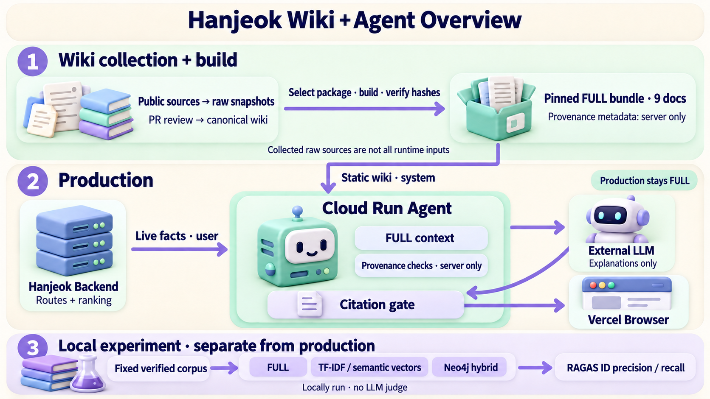
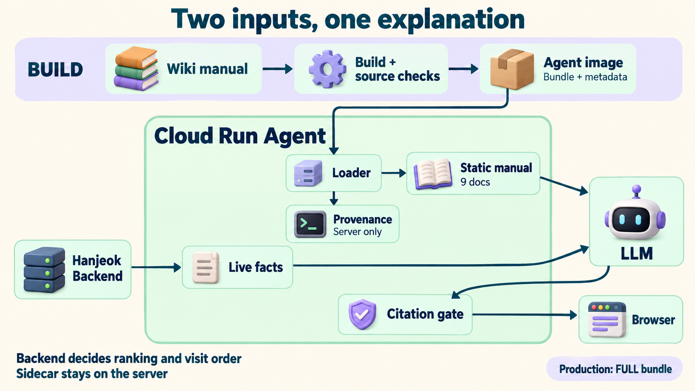
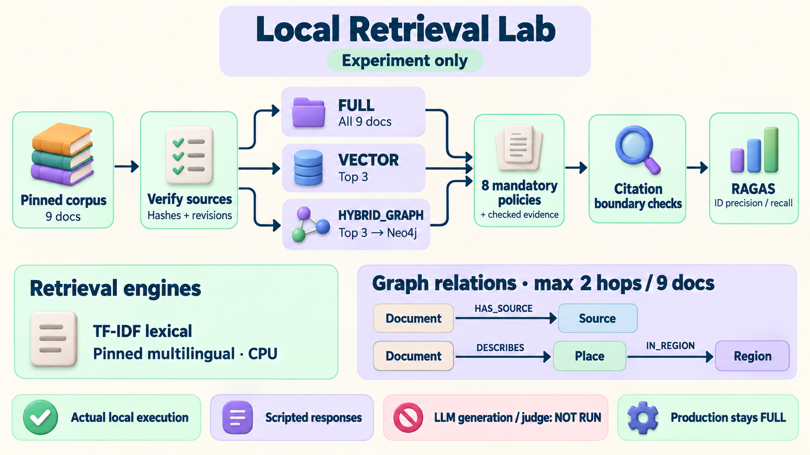

<div align="center">

# 🧭 Travel Context Wiki

**旅行・観光・天気・混雑度・地域コンテキストのための、根拠に基づく LLM ナレッジレイヤー。**

推薦を決めるのは旅行サービスです。この wiki はその推薦を説明し、検証します。

<br/>

[](https://www.data.go.kr/)
[](https://www.data.go.kr/)
[](#-ライセンス)
[](./SCHEMA.md)
[](#-仕様駆動ワークフロー)
[](#-クイックスタート)

<br/>

[English](./README.md) · [한국어](./README.ko.md) · **日本語**

</div>

---

## Hanjeok Wiki と Agent の全体構造



この図は現在の FULL 運用経路です。検索の展開準備は変更点で別に示します。sidecar はサーバー専用、順位は backend が決めます。

---

## 従来の FULL 方式から変わった点

**運用は FULL のままです。** 2026-10-10 の読み取り専用 Cloud Run 設定確認でも agent `ea47917` が Ready・100% traffic で検索設定はありません。agent #14/wiki #33 は外部で merge 済み。この追加作業は別の feature branch から新 Draft PR で確認します。API/選択実装は検証済みで cloud 展開は保留です。

| 項目 | 従来の FULL | 現在のローカル実装 |
| --- | --- | --- |
| モデル入力 | 9 文書、UTF-8 24,703 bytes 全文を system、backend facts を user に渡す | 既定 FULL は元の bytes を保持し、検索を呼びません。VECTOR/HYBRID_GRAPH も必須 8 ポリシーを常に保持し、任意 seed JSON は信頼しない user データです。 |
| 検索と役割 | ビルド時 package の文書リスト。Kotlin が全文から説明 | 独立 Python ASGI API は固定インデックスを検索して文書 ID・hash・出典署名だけを返し、Kotlin がローカル本文・根拠・引用を検証します。facts 原文や履歴は検索 API に送らず、順位は backend が決めます。 |
| ベクトル・関係 | 実行時検索なし | 語彙 TF-IDF と実行済みの固定 CPU 意味モデルを区別。HYBRID は検証済み文書/出典と seed の場所/地域関係のみ、最大 2 ホップ/9 文書です。 |
| 固定・公開 | bundle と sidecar を agent image に固定 | index/model/runtime/bundle/sidecar を固定・再検証し、検証後にローカル registry を手動公開/rollback。実行中の再ロードや cloud traffic 変更はありません。 |
| 引用・キャッシュ・復帰 | 全文の引用許可リストと UUID + facts hash | リクエスト別引用検証と context ID 付き cache/single-flight により、同時 selected/FULL も分離。認証・timeout・古い version・根拠不足は検証済み FULL、基準全文の破損は fail closed。 |
| 評価 | 既存 29 fixture の scripted 比較、過去モデル評価 | 実際の RAGAS 0.3.9 文書 ID precision/recall。HTTP/Neo4j/Kotlin E2E の provider も scripted で、有料 LLM/judge や回答品質の実証はありません。 |

**ローカル検証完了:** Python API 19/19、新 CPU builder 13/13、JVM 339/339（56 suite）、lab 34/34、元の 29 fixture/58 行。全 Linux ARM64 CPU 意味 image を実際に build し、新 index・Neo4j・HTTP・Kotlin で実行しました。HYBRID/VECTOR は各 35 fixture/105 route と実 facts EXPLAIN を検証。HYBRID は SELECTED、VECTOR は必須 seed 欠落を明記して元の FULL に復帰します。[Linux 実行・再現](docs/linux-semantic-followup-report.md)。旧 native/lexical/RAGAS 記録は保存し、新しい Linux RAGAS/LLM 点数とは主張しません。

**amd64 の部分検証:** 既存 builder image の build、x86_64 Python、`pip check`、実モデルの重み読み込みを確認しました。新 amd64 index、health、最終 fixture 結果は未確認です。旧 Mac index を含む builder は展開用ではありません。[保存した出力と復旧記録](docs/amd64-semantic-recovery.md)で段階を区別します。

**展開前:** Cloud Run 用の新 linux/amd64 image/index、private IAM/network 経路、実 production Enterprise Neo4j reader ACL の検証が必要です。検索 service/reader endpoint/secret は確認範囲にありません。[対象・順序・費用の前提](docs/linux-semantic-followup-report.md)。credentials/IAM/resource/traffic や別 Hanjeok DB/SMTP 展開は変更していません。

**限界:** 任意文書は 501-byte Gyeongbokgung seed だけなので、文書選択削減の上限は約 2.03%。総 token/費用削減や回答品質向上は未測定です。保存済み意味実験の VECTOR/HYBRID precision は 0.250000/0.172619、recall は 0.645833/1.000000（24 件）。最終根拠の完全性は 30/35 と 35/35、VECTOR の seed 欠落 5 件を保持します。新しい guard は必要 seed 欠落時に FULL へ戻し、旧指標を変更しません。Microsoft の完全な community GraphRAG ではなく、存在しない交通/天気や合成関係は curated graph に含めません。

agent #14/wiki #33 とその head の CI は merge 済み PR の過去の証拠です。この追加作業は別の Draft PR で確認します。[公開準備記録](docs/publication-preparation.json) と旧検証 JSON は当時の範囲を保存します。[現在の図修正](docs/readme-illustration-correction.json) で有用な既存 3D 図を復元し重複を削除しました。新しい画像は生成していません。

### 検索構造 — ローカル実装、未デプロイ


API と Kotlin の境界は本文と比較表で区別します。実行時モデル download は禁止し、検証した source hash/revision のみを使用します。整合性は意味的な真実やレビュー完了の証明ではありません。


## 📖 目次

- [これは何ですか?](#-これは何ですか)
- [Travel Context Layer](#-travel-context-layer)
- [データ出典](#-データ出典)
- [収集状況](#-収集状況)
- [ナレッジレイヤー](#-ナレッジレイヤー)
- [リポジトリ構成](#-リポジトリ構成)
- [データフロー](#-データフロー)
- [サービス連携モデル](#-サービス連携モデル)
- [バッチ収集モデル](#-バッチ収集モデル)
- [ナレッジストアの境界](#-ナレッジストアの境界)
- [エージェントへの配信](#-エージェントへの配信)
- [説明モデル](#-説明モデル)
- [プロジェクト成果物のリンク](#-プロジェクト成果物のリンク)
- [クイックスタート](#-クイックスタート)
- [仕様駆動ワークフロー](#-仕様駆動ワークフロー)
- [MVP スコープ](#-mvp-スコープ)
- [スコープ外](#-スコープ外)
- [コントリビュート](#-コントリビュート)
- [ライセンス](#-ライセンス)

---

## 🤔 これは何ですか?

**Travel Context Wiki** は、**旅行先・観光公共データ・天気・混雑度・地域コンテキスト・研究資料**
を接続し、LLM が利用できるようにした汎用の Markdown/Git ベースのナレッジリポジトリです。

このリポジトリは特定サービスのコードを**置き換えません**。各旅行サービスは自身のバックエンドで
**決定的な**推薦を行い、この wiki はその推薦を _説明・検証する_ **コンテキストレイヤー**として
使われます。Hanjeok はこの wiki を利用する最初の消費サービスにすぎず、唯一の目的ではありません。

> **一言でいうと:** 何を推薦するかはサービスが決め、根拠に基づく _なぜ_ をこの wiki が提供します。

---

## 🧩 Travel Context Layer

ユーザーが旅行サービスに **目的地・日付・時間帯・移動半径・旅行の好み** を入力すると、サービスの
バックエンドは観光地・天気・混雑度・移動条件をもとに候補とコースを計算します。その後 LLM は
このリポジトリの **canonical wiki** を検索し、次のような説明を生成します。

- なぜ今日この旅行先が適しているのか
- 天気がコース選択にどう影響するのか
- 混雑している場合、どの代替地が適しているのか
- 屋内/屋外の代替はどんな基準で分かれるのか
- 公共 API と研究資料の根拠はどこにあるのか

---

## 🗃 データ出典

この wiki の canonical ナレッジは **公共データ OpenAPI** に基づいています。韓国観光公社 (KTO) の
観光データと大気質の参照データを、韓国の公共データポータルを通じて取得しており、すべての派生
レコードと canonical page は `raw/` 配下の原本証拠スナップショットまで逆追跡できます。

[](https://www.data.go.kr/)
[](https://www.data.go.kr/)
[](https://www.data.go.kr/)
[](https://www.data.go.kr/)
[](https://www.data.go.kr/data/15073877/openapi.do)
[](https://www.data.go.kr/data/15101972/openapi.do)

| データ出典 | 提供機関 | 用途 | 原本証拠 |
| --- | --- | --- | --- |
| TourAPI KorService2 (韓国語観光情報) | 韓国観光公社 (KTO) | 観光地の詳細、座標、画像、概要 | `raw/public-tourism-api/2026-openapi-briefing.txt` |
| 観光地混雑度・訪問者推移予測 | 韓国観光公社 (KTO) | `congestion-diagnosis` の混雑度グレーディング | `raw/public-tourism-api/2026-openapi-briefing.txt` |
| 観光地別の関連観光地 | 韓国観光公社 (KTO) | `alternative-scoring` の代替候補構成 | `raw/public-tourism-api/2026-openapi-briefing.txt` |
| エアコリア測定所リスト | 韓国環境公団 (KECO) | 地域の大気質の根拠がどの測定所から来たかを明示 | `raw/external-snapshots/air-quality-airkorea-station-list.json` |
| 地域別訪問者数 (韓国観光データラボ) | 韓国観光公社 (KTO) | 混雑度のパーセンタイル尺度を実測の訪問量に接地させる | `raw/external-snapshots/tourism-visitors/<YYYY-MM>.json` _(2026-06 以降)_ |
| 天気 / 季節性データ | 気象 OpenAPI _(予定)_ | 天気認識推薦と屋内/屋外フォールバック | `raw/weather-api/` _(取得予定)_ |

> 2026-05 の OpenAPI 説明会資料は、約 **458 万件** の観光データをリアルタイム OpenAPI として公開する
> 韓国観光公社の公共データサービスを説明しています。原本スナップショットは `raw/` 配下に原文のまま
> 保存され、決して編集されず、更新は新しいスナップショットとしてのみ行われます。再配布の前に、
> [公共データポータル](https://www.data.go.kr/) で正確なライセンス条件 (例: KOGL) を確認してください。

上の 3 行は説明会資料から読み取った文書上の出典で、下の 2 行はスケジュールされたワークフローが
自動で取得します ([スケジュールされたワークフロー](#スケジュールされたワークフロー) を参照)。
ライセンスはそれぞれ異なります。エアコリアの測定所リストは **KOGL 第 3 類型** (出典表示 + 変更禁止)
であり、訪問者数の時系列には利用許諾範囲の制限がありません。訪問者の行はソースが返したまま保存し、
`touDivCd` が分ける 現地人 / 外地人 / 外国人 を集約しません。保存前に集約すると派生データが `raw/`
に入ってしまうからです。

---

## 📊 収集状況

| 保存した公開参照資料 | 値 |
| --- | --- |
| 取得期間 | 2 か月 (2026-06–2026-07) |
| 日次行 | 49,137 |
| 最新期間の自治体 | 270 |
| 測定所 | 672 |
| 最後の変更取得 | 2026-09-14 |

コミット済み統計成果物の値で、リアルタイム観測ではありません。`scripts/build-collection-stats.sh` が raw snapshot から計算します。日付は最後に内容が変わった取得、地域は最新期間のみ。定期 SVG 生成は保持し、重複図は README から削除しました。

---

## 🗂 ナレッジレイヤー

```text
Layer 1: Evidence
  raw/public-tourism-api/     観光公共 API 説明会、マニュアル、政策資料
  raw/weather-api/            天気 API のドキュメントと検証資料
  raw/tourism-research/       観光・混雑・天気影響に関する論文/レポート
  raw/service-snapshots/      この wiki を消費するサービスの設計/ハーネススナップショット
  raw/experiments/            API 実呼び出しの検証結果
  raw/external-snapshots/     スケジュール取得: 参照リストと期間スナップショットの時系列
  raw/user-input/             同意を得てサニタイズしたユーザー入力キャプチャ
  raw/project-guides/         成果物リンクの根拠となるプロジェクトガイド/PRD

Layer 2: Canonical Memory
  entities/                   観光/天気 API、機関、データセット、主要システム
  concepts/                   天気認識推薦、混雑回避、季節性、地域コンテキスト
  comparisons/                API/データソース/推薦ポリシーの比較
  queries/                    再利用可能な根拠ベースの Q&A
  decisions/                  LLM wiki の運用とサービス連携の意思決定

Layer 3: Operation Metadata
  SCHEMA.md                   wiki 契約
  index.md                    active canonical catalog
  log.md                      append-only operation history
  harness/                    シナリオ、フィクスチャ、smoke ゲート
```

---

## 📁 リポジトリ構成

| レイヤー | パス | 目的 |
| --- | --- | --- |
| 一時受け入れ | `inbox/` | 出典と形式がまだ確定していない入力 |
| 原本証拠 | `raw/` | 修正しない原本資料、API レスポンス、PDF 抽出物、サービススナップショット |
| 正規化レコード | `records/` | サービスが読みやすい派生 JSON |
| Canonical メモリ | `concepts/`, `entities/`, `queries/`, `decisions/`, `comparisons/` | 人が読み、LLM が検索するナレッジ |
| 検索インデックス | `indexes/` | 静的 RAG manifest、chunk、source map |
| サービスパッケージ | `packages/` | サービス別 context bundle と prompt |

---

## 🔀 データフロー

この構成は `hyunolike/2nd-brain-template` の **Evidence → Canonical Memory → Discovery → Human
Decision** の流れに従いつつ、旅行サービス連携のために正規化レコードとサービスパッケージを
追加しています。

入力は `inbox/` から不変の `raw/` に保存し、出典付き `records/` と canonical 文書に整理します。両者を `indexes/` に接続し、明示した `packages/` 一覧でサービスへ渡します。出典パスと revision を保持し、canonical 更新は `index.md` と `log.md` も更新します。

---

## 🔌 サービス連携モデル

デプロイ済みの Hanjeok 連携には**二つの入力**があります。wiki の静的マニュアルとバックエンドの現在の facts です。ポリシーと正規化レコードは**ビルド時**に組み立て、質問ごとに GitHub から検索しません。実行時に agent がコース、混雑度、代替候補を取得します。順位と訪問順はバックエンドが決定し、モデルは全文マニュアルで説明します。天気・営業時間の facts は提供しません。

| 入力 | 境界 | 用途 |
| --- | --- | --- |
| 全文マニュアル: 9 文書 / UTF-8 24,703 bytes | wiki build → agent image → model `system` | ポリシーと静的文脈 |
| バックエンド facts | 実行時取得 → model `user` | 現在のコースと事実 |
| metadata sidecar | build → server integrity/provenance | サーバー検証専用、モデル入力ではない |

現在の FULL は 3D 図、ローカル検索準備は本文と比較表で区別します。wiki 構造・保存境界の説明は一般的な能力を示し、Hanjeok agent の実行時検索や天気対応を示すものではありません。


---

## ⚙️ バッチ収集モデル

初期段階では、独立したバックエンドバッチサーバーを置きません。このリポジトリのバッチは
**sanitized evidence capture** と **static index build** までを担当します。リアルタイムの天気、
リアルタイムの混雑度、ユーザー別の推薦履歴のように、速く変化したり個人的なデータは消費サービスの
バックエンドが管理します。

Wiki batch は匿名化 fixture と外部 snapshot を `raw/` に保存し、records・canonical・indexes・service package を作ります。実時間の観測と個人履歴は消費側 backend の runtime DB に置きます。

### バッチコマンド

```bash
scripts/collect-user-input.sh harness/fixtures/user-input-capture.valid.json /tmp/wiki-user-input
scripts/collect-external-snapshot.sh harness/fixtures/external-tourism-snapshot.valid.json /tmp/wiki-external
scripts/collect-period-snapshot.sh harness/fixtures/period-snapshot.valid.json /tmp/wiki-periods
scripts/build-index.sh
scripts/build-index.sh --check
scripts/build-bundle.sh --list
scripts/build-bundle.sh hanjeok
scripts/build-collection-stats.sh --check
./harness/scripts/smoke.sh
```

**ルール:**

- `collect-user-input.sh` は `consentForWiki` が `true` かつ `containsPersonalData` が `false` でなければ入力を拒否します。
- `collect-external-snapshot.sh` はソース URL、ライセンス、収集時刻、ペイロードを要求します。
- `collect-period-snapshot.sh` は**増え続ける時系列**を扱います。`YYYY-MM` の期間ごとに 1 ファイルを
  書き、すでに保存した期間は決して書き換えません。単一ファイルの収集器ではこれを表現できません。
  ペイロードが毎回変わるため、「変化がなければスキップ」というフィルタが何も濾さなくなるからです。
- `build-index.sh --check` は CI 安全モードで、コミット済みの検索成果物が古い場合に失敗します。
- `build-bundle.sh <service>` はパッケージを、エージェントが実際に送る文字列へ組み立てます。
  [エージェントへの配信](#-エージェントへの配信) を参照してください。
- 認証が必要な API ポーリングは、いまや**このリポジトリの中で**動きます。ただし `SCHEMA.md` の
  _Scheduled Collection Rules_ が定める狭い例外の中だけです。ゆっくり変わる公開参照データであること、
  1 日 1 回を超えないこと、サービスキーは実際に取得するワークフローステップだけが読むこと、URL を
  ログに出さないこと、`raw/` に着地してプルリクエストを開くこと。リアルタイムの観測値、個人に関する
  データ、1 日より細かい粒度で意味を持つデータは、消費サービスのバックエンドに残ります。

### スケジュールされたワークフロー

| ワークフロー | 内容 | 周期 |
| --- | --- | --- |
| `collect-air-quality-stations.yml` | エアコリアの**測定所リスト**を取得します。参照リストであり、濃度の実測値ではありません | 毎週火 06:00 KST |
| `collect-regional-visitors.yml` | 基礎自治体別の日次訪問者数を、月単位の不変な期間スナップショットとして取得 | 毎月 8 日 06:00 KST |
| `collection-stats.yml` | すでにコミットされた証拠から `docs/collection-stats.svg` を描き直す | 毎日、および `raw/external-snapshots/` を変更する push ごと |
| `wiki-batch.yml` | `smoke.sh` と `build-index.sh --check` を実行 | すべての push と PR、および毎週 |
| `stale-capture-check.yml` | `collect/*` の PR が3日以上開いたままなら失敗 | 毎日 07:00 KST |

- `DATA_GO_KR_SERVICE_KEY` がなければ収集器は notice を残してスキップします。シークレットの不在で
  実行が失敗することはなく、`scripts/` 配下のどのスクリプトもシークレットを必要としません。
- 取得物は `raw/` までで止まり、プルリクエストを開きます。`records/` の導出、`indexes/` の再構築、
  canonical page への昇格は人の仕事として残り、レビューゲートは迂回されません。
- `main` へ直接 push するワークフローは `collection-stats.yml` だけです。コミット済みの証拠を描き
  直すだけで独自の主張を加えないため、レビュアーが下す判断が存在しないからで、この例外は
  `SCHEMA.md` の _Generated Artifact Rules_ に明記されています。

---

## 🧱 ナレッジストアの境界

エージェントが読むストアは一つではありません。よくある設計ミスは「ナレッジストア」と
「データランディングゾーン」を一つのオブジェクトストレージに詰め込むことですが、両レイヤーは
**書き込み主体も頻度も削除可能性も異なります。** この wiki はその境界をリポジトリの境界として
引きました。

| | **この GitHub リポジトリ** | **オブジェクトストレージ / サービス DB** |
| --- | --- | --- |
| 保持するもの | canonical pages, `records/`, `indexes/`, `packages/` | リアルタイム天気、リアルタイム混雑度、ユーザー入力、セッション履歴 |
| 書き込み主体 | 人 (Pull Request) | バッチとランタイム (マシン) |
| 書き込み頻度 | 低い。変更ごとにレビュー | 高い。分単位も可能 |
| 検証ゲート | `smoke.sh` + コードレビュー | サービススキーマ検証 |
| 履歴 | Git の全履歴、diff、blame | 最新値が中心 |
| 削除 | 困難。履歴に残る | 容易 |
| 個人情報 | **禁止** | サービス境界内でのみ許可 |

ナレッジレイヤーを Git に置くと、**出典追跡がリポジトリの標準機能**になります。逆に高頻度の自動
収集を Git に置くとコミット履歴が膨張し、同時書き込みで push の競合が発生し、一度入った個人情報を
消すには履歴の書き換えが必要になります。高頻度・個人データの収集は外部に置きます。前述の、緩やかに変化する公開参照データのレビュー付き収集のみが狭い例外です。

Curator は PR で wiki を変更し、smoke/index 検証とレビュー後に bundle を作ります。実時間の観測と個人 session は消費側 backend が担当します。Hanjeok 運用は backend facts と FULL manual を使い、この一般的な保存境界は天気検索や object storage を追加しません。

エージェントは **静的コンテキストはバンドルから、リアルタイムの事実はサービスストアから** 受け取り
ます。この優先順位は `indexes/retrieval-policy.md` がすでに規定しています: backend facts が最優先で、
次に `packages/`、その次に canonical page です。

---

## 🚚 エージェントへの配信

このリポジトリのナレッジを稼働中のエージェントへ届ける方法は 3 つあります。

| 方式 | 動作 | 適した場面 |
| --- | --- | --- |
| **ビルド時バンドル (推奨)** | イメージビルド時にリポジトリをコピー/clone し、`packages/` と `indexes/` をイメージに含める | ランタイムのネットワーク依存とレート制限が許されないとき。更新は再デプロイ |
| ランタイム pull + キャッシュ | 起動時に clone、webhook や定期 pull で更新 | ナレッジが頻繁に変わり、再デプロイが負担なとき |
| HTTP 直接取得 | 静的ホスティングで `indexes/` を公開して fetch | バンドルが不可能なとき。CDN のキャッシュ遅延とレート制限を考慮 |

`packages/<service>/context-bundle.json` と `indexes/manifest.json` が、この配信を前提に作られた
成果物です。3 つの方式すべてがこの 2 ファイルをエントリポイントとして使います。

### Hanjeok のビルド時と実行時の契約



現在の FULL 運用入力です。全文は system、backend facts は user、sidecar はサーバー専用。選択検索の準備は別に説明します。


wiki #31 と agent #12 は統合済みです。[運用検証](docs/production-verification.json)は 2026-10-09 09:13 UTC に agent `ea47917` の Ready、トラフィック 100%、health/readiness UP、全文バンドルと sidecar hash の一致を確認しました。フロントもデプロイ済みです。この検証で実際の LLM 呼び出しは行っていません。別の Hanjeok DB/SMTP 展開は保留のままです。
ビルド時に wiki の出典 hash と Git revision を検査し、全文バンドルと文書・
出典・主張のレビュー状態を持つ JSON sidecar を生成します。agent は両方を
同時にパッケージ化します。sidecar は整合性検査と `/agent/provenance` に
使い、モデルへの入力には含めません。実行時はバックエンドの facts が優先で、
推薦順位もバックエンドが決めます。

`POST /agent/explain` は毎回 facts を取得し、コース UUID と facts の実際の
UTF-8 バイトの SHA-256 をキャッシュと処理中リクエストのキーにします。
ヒット時は保存した説明と実際の生成時刻を返します。未保存・期限切れなら
モデルで生成・検証し、生成完了から 5 分間保存します。facts が変われば別キーに
なり、取得や生成の失敗時に古い説明へ戻りません。`retrievedAt` は facts 取得
完了時刻であり、予報の公開時刻や情報の鮮度を保証しません。

`POST /agent/ask/stream` は別の経路です。facts と会話の文脈からモデルが
混雑度・代替候補の取得を提案し、サーバーが引数を検証してツールを実行します。
結果をループに返し、引用ゲートを通過してから本文をストリーミングします。
履歴は新しい事実ではなく、拒否・失敗した取得は根拠の集合に加えません。
非ストリーミングの `POST /agent/ask` にツールループはありません。
どちらの ASK 経路も説明キャッシュを使いません。

hash/revision の整合性と限定的な引用トピック検査は、意味的な真実や実験承認の
証明にはなりません。既存の主張は `unverified`、変更された出典は再レビューが
必要です。wiki 生成器と agent は統合済みです。今後の更新でもバンドル本文と sidecar を同時に同期してください。
[出典バージョンの決定](decisions/bind-claims-to-source-versions.md)を参照してください。


### ローカルのベクトル・関係・RAGAS 実験



[実験記録](docs/retrieval-experiment-report.md)は実行済み語彙/意味検索、実際の Neo4j と RAGAS 文書 ID 指標を区別します。必須 8 ポリシーを保持し、回答生成/LLM 判定は行いません。

### オフライン文書選択比較

`SELECTED_EXPERIMENT` はオフライン比較で、運用は **FULL** のままです。8 ポリシー文書は必須、`records/places/gyeongbokgung.json` だけが任意です。不明な質問・参照は検証済み全文へ fallback し、body/sidecar hash の破損は fail closed します。運用に GraphRAG、ベクトル DB、実行時検索は導入していません。ローカル実装は下記で区別します。[結果と限界](docs/context-selection-report.md): system bytes の最大削減は 501/24,703 = 2.03%。scripted provider/tool は配線検証のみで、有料モデル品質、精度、遅延、トークン、費用は未測定です。

### バンドルの構築

```bash
scripts/build-bundle.sh --list
scripts/build-bundle.sh hanjeok
```

`build-bundle.sh` は、パッケージの canonical page、正規化レコード、サービス prompt を 1 本の決定的な
文字列に連結します。LLM の `system` ブロックで `cache_control` のブレークポイントの背後にそのまま
置くための出力です。順序は探索せず、パッケージが宣言します。ポリシーのページが先、そのポリシーが
指す値が次、サービス prompt が最後で、指示がユーザーターンに最も近く座るようにしています。

決定性が核心です。出力はファイルの内容と宣言された順序だけに依存し、タイムスタンプもホスト名も
実行回数もディレクトリの列挙順も混ざりません。1 バイト変わるだけであらゆるリクエストがキャッシュ
ミスになり、費用が出ていくのに、どのテストも失敗しないからです。`smoke.sh` は連続 2 回の実行を
バイト単位で比較します。さらに `----- FILE: … -----` という形の行を含むソースファイルは拒否します。
その行があると文書が存在しないパスを捏造でき、引用チェックはまさにその捏造されたパスを実在するもの
として受け入れてしまいます。バンドルが 40KB のソフト上限を超えると警告しますが、現在ははるかに
下回っています。静的なローカル検索がベクトルストアに勝る理由でもあります。

---

## 🧪 説明モデル

バンドルは紙の上の計画ではなく、すでに走らせたものです。`harness/scripts/explain-spike.sh` は、
組み立てたバンドルとフィクスチャのバックエンド事実をモデルへ送り、説明と引用、そしてプロバイダが
返した使用量を出力します。サーバーも DB もコンテナもなしに「この wiki は機能するのか」に答える、
最小の装置です。

```bash
./harness/scripts/explain-spike.sh --provider openrouter
```

両プロバイダのリクエストを同じバンドルと同じフィクスチャから組み立てるため、比較はプロンプトでは
なくモデルを測ります。出力契約もどちらも同じ `{ explanation, citations }` で、一方はスキーマで、
もう一方は `tool_choice` で固定した関数呼び出しで強制します。このスクリプトが `scripts/` ではなく
`harness/` にあるのは API キーが要るからです。`scripts/` 配下のスクリプトはシークレットを要求できま
せん。キーがなければ、送るはずだったリクエストボディをそのまま出力して正常終了します。

**測定が決めたこと** (`decisions/choose-explanation-model.md`): ハーネスが数える禁止行動は
候補を**分けられませんでした**。同じプロンプト、同じフィクスチャ、各 5 回の実行で `gpt-4o-mini` と
`gpt-4o` はどちらも 7 種すべて 0% でした。分けたのは規則には見えない軸、韓国語の可読性です。実行
あたりの指摘は 1.2 件対 0.5 件で、小さいモデルの側では文の途中にアルファベットの断片が残り、JSON の
英語のフィールド名がそのまま写り、韓国語に存在しない助詞が付きました。どれも規則には触れませんが、
このレイヤーが生み出すものは文だけです。コースと等級はサービスが作り、エージェントが足すのは文章
です。だからショーケースは `gpt-4o` で走らせます。

7 種はその測定を行った日にハーネスが数えていた数です。いま何が規則で何個あるかは
`packages/explanation-rules.json` が定めます。八つで、それぞれが一致すべき文書の一覧を持って
います。

限界は数字を避けずに数字の隣に記録しています。Anthropic はキーがなく測定していません。判定者が
`gpt-4o` であり、片方の実行では自分の出力を自分で採点しました。そしてこの表全体が、フィクスチャ 1 件と
モデルあたり 5 回の実行に載っています。

---

## 🔗 プロジェクト成果物のリンク

オープンソース AI 自動化エージェントプロジェクト資料の要求を反映し、この wiki はサービスデータ
だけでなく **ポートフォリオ成果物** もリンク可能な artifact として管理します。PRD、GitHub
Issue/PR、RAGAS 評価レポート、デプロイ URL、service package、GraphRAG export は
`records/project-artifacts/` に記録し、canonical page と source-map で逆追跡します。

PRD は `raw/project-guides/`、issue/PR・評価報告・展開 URL は `records/project-artifacts/` に保存します。canonical ページから `indexes/source-map.json`、service package、consumer context loader に出典を接続します。

これにより、デプロイされた AI サービスをポートフォリオ資産として説明できます。サービス URL から
Issue、実装、評価、prompt パッケージ、検索ルール、そして最初のプロジェクト要件まで逆追跡できます。

---

## 🚀 クイックスタート

```bash
./harness/scripts/smoke.sh
```

このフォルダを **Obsidian vault** として、または **VS Code** で開いてください。canonical page を
追加・変更する前に、`SCHEMA.md`、`index.md`、そして `log.md` の最新エントリを読んでください。

### 運用ワークフロー

証拠収集 → 出典パス・JSON・frontmatter 検証 → 出典付き canonical 作成 → `index.md`/`log.md` 同期 → static index 作成 → service context packaging → 人による受容・異議・修正レビュー。

---

## 📐 仕様駆動ワークフロー

このリポジトリは **Spec Kit** のスキャフォールディングを含みます。大きな変更は次の順序で進めます。

```text
$speckit-constitution
$speckit-specify
$speckit-plan
$speckit-tasks
$speckit-implement
```

新しいランタイム連携機能は、必ず `harness/scenarios/` のシナリオ、`harness/fixtures/` の fixture、
そして Spec Kit の feature ブランチから始めなければなりません。

---

## ✅ MVP スコープ

- 最初の観光 OpenAPI 説明会の抽出物と、最初の消費サービスのスナップショットを原本証拠として保存。
- 観光データ、天気認識推薦、混雑認識ルーティング、LLM 説明境界の canonical wiki page を維持。
- 正規化 `records/`、検索 `indexes/`、サービス `packages/` を派生成果物として維持。
- ゆっくり変わる公開参照データをスケジュール取得し、プルリクエストとして上げる。シークレットは取得ステップの外に出さない。
- サービスごとに決定的でキャッシュ可能な context bundle を組み立て、説明スパイクで最後まで確かめる。
- frontmatter、source path、index エントリ、log エントリ、Spec Kit ファイルを検査する決定的な smoke スクリプトを提供。
- 今後の機能作業は `$speckit-specify`、`$speckit-plan`、`$speckit-tasks`、`$speckit-implement` で進める。

---

## 🚫 スコープ外

- LLM が実際の旅行コースを決定すること。
- ユーザーのリクエストごとにリアルタイムで論文検索すること。
- リアルタイムの観測値の取得。大気質の濃度やライブの混雑度など、1 日より細かい粒度で意味を持つ値は扱いません。
- API キー、公共データサービスキー、Telegram トークン、ユーザーの旅行履歴を Git に保存すること。
- 各消費サービスの決定的な推薦ロジックを置き換えること。

---

## 🤝 コントリビュート

1. まず `SCHEMA.md`、`index.md`、`log.md` の最新エントリを読んでください。
2. 新しいランタイム機能は `harness/scenarios/` にシナリオ、`harness/fixtures/` に fixture を追加してください。
3. canonical page を作成・変更したら、`index.md` と `log.md` を **同じ変更で** 更新してください。
4. PR を開く前に、ローカルでゲートを実行してください。
   ```bash
   ./harness/scripts/smoke.sh
   scripts/build-index.sh --check
   ```
5. 個人の旅行入力、位置情報、API キー、サービスキー、トークンは絶対にコミットしないでください。

---

## 📄 ライセンス

現在、ライセンスファイルは宣言されていません。ライセンスが追加されるまでは、すべての権利が
リポジトリ所有者に留保されているものとして扱ってください。この資料を再利用する場合は、Issue を
開いて条件を確認してください。

<div align="center">
<br/>

[English](./README.md) · [한국어](./README.ko.md) · **日本語**

<sub>推薦を決めるのは旅行サービスです。この wiki はその推薦を説明し、検証します。</sub>

</div>
