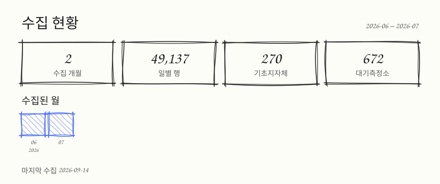
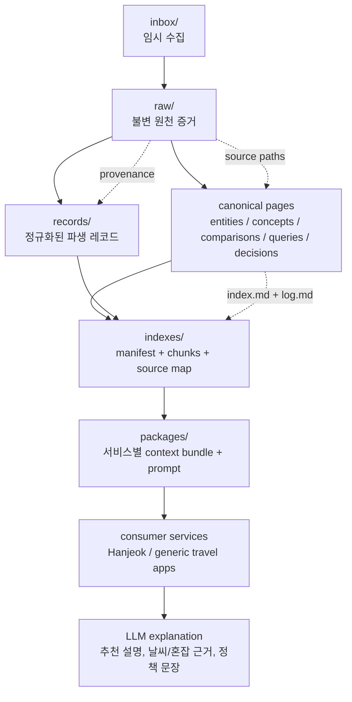
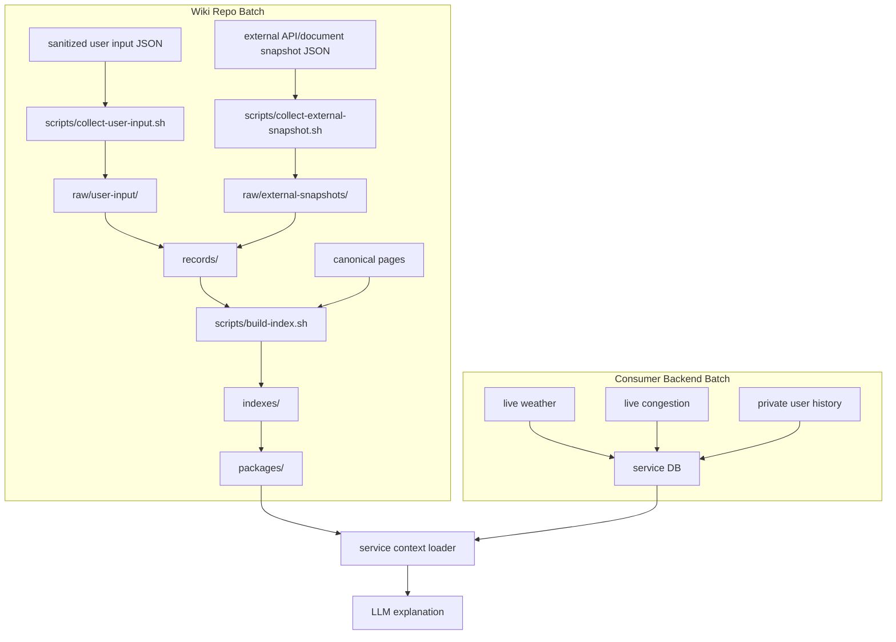
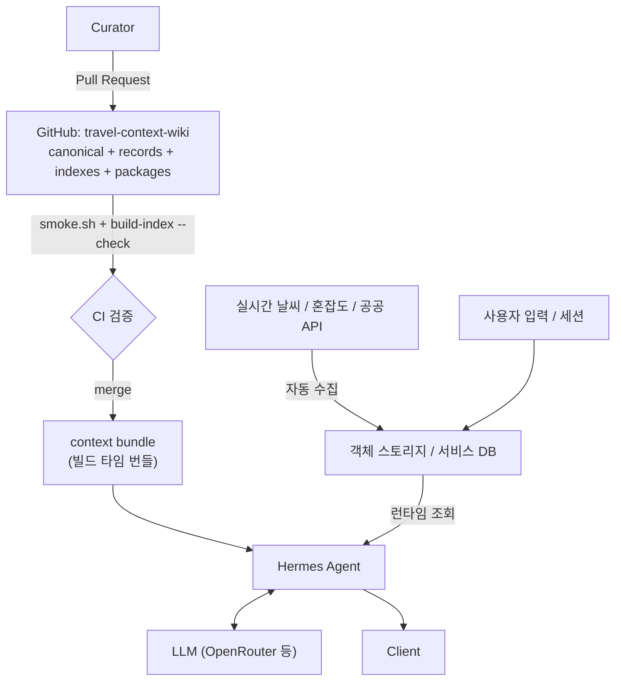
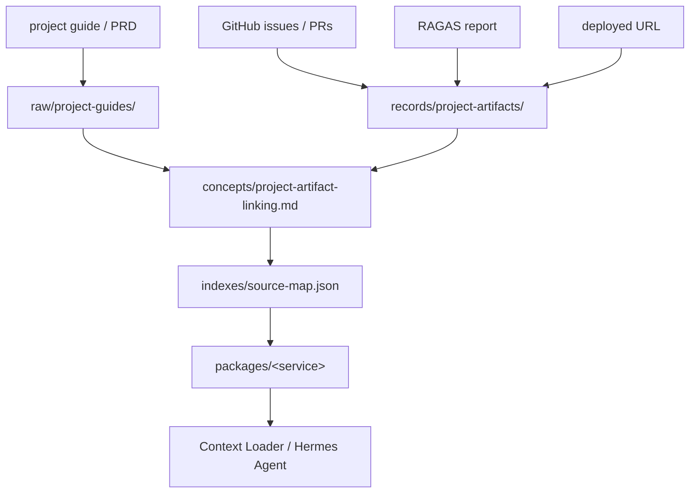
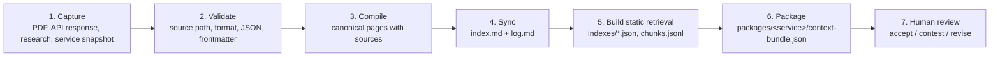

<div align="center">

# 🧭 Travel Context Wiki

**여행·관광·날씨·혼잡도·지역 맥락을 위한 근거 기반 LLM 지식 레이어.**

추천은 여행 서비스가 결정합니다. 이 wiki는 그 추천을 설명하고 검증합니다.

<br/>

[](https://www.data.go.kr/)
[](https://www.data.go.kr/)
[](#-라이선스)
[](./SCHEMA.md)
[](#-스펙-기반-워크플로우)
[](#-빠른-시작)

<br/>

[English](./README.md) · **한국어** · [日本語](./README.ja.md)

</div>

---

## 📖 목차

- [무엇인가요?](#-무엇인가요)
- [Travel Context Layer](#-travel-context-layer)
- [데이터 출처](#-데이터-출처)
- [수집 현황](#-수집-현황)
- [지식 계층](#-지식-계층)
- [레포지토리 구조](#-레포지토리-구조)
- [데이터 흐름](#-데이터-흐름)
- [서비스 연동 모델](#-서비스-연동-모델)
- [배치 수집 모델](#-배치-수집-모델)
- [지식 저장소 경계](#-지식-저장소-경계)
- [에이전트 전달](#-에이전트-전달)
- [설명 모델](#-설명-모델)
- [프로젝트 산출물 연결](#-프로젝트-산출물-연결)
- [빠른 시작](#-빠른-시작)
- [스펙 기반 워크플로우](#-스펙-기반-워크플로우)
- [MVP 범위](#-mvp-범위)
- [범위 밖](#-범위-밖)
- [기여하기](#-기여하기)
- [라이선스](#-라이선스)

---

## 🤔 무엇인가요?

**Travel Context Wiki**는 **여행지, 관광 공공데이터, 날씨, 혼잡도, 지역 맥락, 연구 자료**를
연결해 LLM이 사용하도록 만든 범용 Markdown/Git 기반 지식 레포지토리입니다.

이 레포는 특정 서비스의 코드를 **대체하지 않습니다**. 여행 서비스는 각자의 백엔드에서
**결정적인** 추천을 수행하고, 이 wiki는 그 추천을 _설명하고 검증하는_ **컨텍스트 레이어**로
사용됩니다. 한적은 이 wiki를 사용하는 첫 번째 소비 서비스일 뿐, 유일한 목적이 아닙니다.

> **한 줄 요약:** 무엇을 추천할지는 서비스가 정하고, 근거 기반의 _왜_ 는 이 wiki가 제공합니다.

---

## 🧩 Travel Context Layer

사용자가 여행 서비스에 **목적지, 날짜, 시간대, 이동 반경, 여행 선호**를 입력하면 서비스
백엔드는 관광지, 날씨, 혼잡도, 이동 조건을 기반으로 후보와 코스를 계산합니다. 이후 LLM은
이 레포의 **canonical wiki**를 검색해 다음 설명을 만듭니다.

- 오늘 이 여행지가 왜 적합한가
- 날씨가 코스 선택에 어떤 영향을 주는가
- 혼잡하면 어떤 대안지가 적합한가
- 실내/실외 대안은 어떤 기준으로 갈리는가
- 공공 API와 연구 자료의 근거는 어디에 있는가

---

## 🗃 데이터 출처

이 wiki의 canonical 지식은 **공공데이터 OpenAPI**에 근거합니다. 한국관광공사(KTO)의 관광 데이터와
대기질 참조 데이터를 공공데이터포털을 통해 받아오며, 모든 파생 레코드와 canonical page는 `raw/`
아래의 원천 증거 스냅샷으로 역추적됩니다.

[](https://www.data.go.kr/)
[](https://www.data.go.kr/)
[](https://www.data.go.kr/)
[](https://www.data.go.kr/)
[](https://www.data.go.kr/data/15073877/openapi.do)
[](https://www.data.go.kr/data/15101972/openapi.do)

| 데이터 출처 | 제공기관 | 용도 | 원천 증거 |
| --- | --- | --- | --- |
| TourAPI KorService2 (국문 관광정보) | 한국관광공사 (KTO) | 관광지 상세, 좌표, 이미지, 개요 | `raw/public-tourism-api/2026-openapi-briefing.txt` |
| 관광지 집중률 방문자 추이 예측 | 한국관광공사 (KTO) | `congestion-diagnosis` 혼잡 등급화 | `raw/public-tourism-api/2026-openapi-briefing.txt` |
| 관광지별 연관 관광지 | 한국관광공사 (KTO) | `alternative-scoring` 대안 후보 구성 | `raw/public-tourism-api/2026-openapi-briefing.txt` |
| 에어코리아 측정소 목록 | 한국환경공단 (KECO) | 지역의 대기질 근거가 어느 측정소에서 왔는지 명시 | `raw/external-snapshots/air-quality-airkorea-station-list.json` |
| 지역별 방문자 수 (한국관광 데이터랩) | 한국관광공사 (KTO) | 혼잡 백분위 척도를 실제 방문량에 근거시키기 | `raw/external-snapshots/tourism-visitors/<YYYY-MM>.json` _(2026-06부터)_ |
| 날씨 / 계절성 데이터 | 기상 OpenAPI _(예정)_ | 날씨 인지 추천 및 실내/실외 폴백 | `raw/weather-api/` _(수집 예정)_ |

> 2026-05 OpenAPI 설명회 자료는 약 **458만 건**의 관광 데이터를 실시간 OpenAPI로 개방하는 한국
> 관광공사 공공데이터 서비스를 설명합니다. 원천 스냅샷은 `raw/` 아래에 원문 그대로 보존되며 절대
> 수정하지 않고, 갱신은 새 스냅샷으로만 이뤄집니다. 재배포 전에는
> [공공데이터포털](https://www.data.go.kr/)에서 정확한 라이선스 조건(예: 공공누리/KOGL)을
> 확인하세요.

앞의 세 줄은 설명회 자료에서 읽어낸 문서상의 출처이고, 뒤의 두 줄은 예약 워크플로우가 스스로
가져옵니다([예약 워크플로우](#예약-워크플로우) 참고). 라이선스는 각각 다릅니다. 에어코리아 측정소
목록은 **공공누리 제3유형**(출처표시 + 변경금지)이고, 방문자 수 시계열은 이용허락범위 제한이
없습니다. 방문자 행은 소스가 돌려준 그대로 저장하며, `touDivCd`가 현지인, 외지인, 외국인으로 나눈
값을 합치지 않습니다. 저장 전에 집계하면 파생 데이터가 `raw/`에 들어가기 때문입니다.

---

## 📊 수집 현황



`scripts/build-collection-stats.sh`가 `raw/external-snapshots/`를 읽어 매일 다시 그립니다.
숫자가 그대로인 날은 커밋하지 않으므로, 그림에 찍힌 날짜는 그린 날이 아니라 증거가 마지막으로
수집된 날입니다. 수집기는 값이 바뀌지 않은 페이로드를 건너뛰고 저장된 기간은 불변으로 다루므로,
정확히는 마지막으로 실행된 날이 아니라 마지막으로 **달라진** 날입니다.

그림이 세는 것은 증거 계층이 실제로 가진 것뿐입니다. 저장된 기간 수, 일별 행 수, 최신 기간에
포함된 기초지자체 수, 대기측정소 수이고, 수집하지 않은 것은 그리지 않습니다. 기초지자체 수는 최신
기간만 셉니다. 모든 기간을 합치면 "한 번이라도 등장한" 지역을 보고하게 되는데, 그건 더 좋아 보이는
숫자이지 같은 주장이 아닙니다.

---

## 🗂 지식 계층

```text
Layer 1: Evidence
  raw/public-tourism-api/     관광 공공 API 설명회, 매뉴얼, 정책 자료
  raw/weather-api/            날씨 API 문서와 검증 자료
  raw/tourism-research/       관광, 혼잡, 날씨 영향 관련 논문/리포트
  raw/service-snapshots/      이 wiki를 소비하는 서비스의 설계/하네스 스냅샷
  raw/experiments/            API 실호출 검증 결과
  raw/external-snapshots/     예약 수집물: 참조 목록과 기간 스냅샷 시계열
  raw/user-input/             동의를 받고 정제한 사용자 입력 캡처
  raw/project-guides/         산출물 연결의 근거가 되는 프로젝트 가이드/PRD

Layer 2: Canonical Memory
  entities/                   관광/날씨 API, 기관, 데이터셋, 주요 시스템
  concepts/                   날씨 인지 추천, 혼잡 회피, 계절성, 지역 맥락
  comparisons/                API/데이터소스/추천 정책 비교
  queries/                    재사용 가능한 근거 기반 질의응답
  decisions/                  LLM wiki 운영과 서비스 연동 의사결정

Layer 3: Operation Metadata
  SCHEMA.md                   wiki 계약
  index.md                    active canonical catalog
  log.md                      append-only operation history
  harness/                    시나리오, 픽스처, smoke 게이트
```

---

## 📁 레포지토리 구조

| 계층 | 경로 | 목적 |
| --- | --- | --- |
| 임시 수집 | `inbox/` | 아직 출처와 형식이 확정되지 않은 입력 |
| 원천 증거 | `raw/` | 수정하지 않는 원천 자료, API 응답, PDF 추출본, 서비스 스냅샷 |
| 정규화 레코드 | `records/` | 서비스가 읽기 쉬운 JSON 파생 데이터 |
| Canonical 메모리 | `concepts/`, `entities/`, `queries/`, `decisions/`, `comparisons/` | 사람이 읽고 LLM이 검색하는 지식 |
| 검색 인덱스 | `indexes/` | 정적 RAG manifest, chunk, source map |
| 서비스 패키지 | `packages/` | 서비스별 context bundle과 prompt |
| 계약과 게이트 | `harness/`, `scripts/` | 시나리오, 픽스처, smoke 게이트, 배치 스크립트 |
| 설계 기록 | `docs/superpowers/` | 이 wiki와 소비 에이전트의 스펙과 계획 |

---

## 🔀 데이터 흐름

이 구조는 `hyunolike/2nd-brain-template`의 **Evidence → Canonical Memory → Discovery → Human
Decision** 흐름을 따르되, 여행 서비스 연동을 위해 정규화 레코드와 서비스 패키지를 추가합니다.



---

## 🔌 서비스 연동 모델

```mermaid
sequenceDiagram
    participant User
    participant Service as Travel Service Backend
    participant Package as packages/&lt;service&gt;
    participant Index as indexes/manifest.json
    participant Wiki as Canonical Wiki
    participant LLM

    User->>Service: destination + date + time slot + radius + preferences
    Service->>Service: calculate candidates, weather context, congestion context, route
    Service->>Package: load context-bundle.json and prompt.md
    Package->>Index: read retrieval policy and eligible pages
    Index->>Wiki: select canonical pages and normalized records
    Wiki-->>Service: source-grounded context
    Service->>LLM: backend facts + retrieved context + prompt
    LLM-->>Service: explanation only, no ranking changes
    Service-->>User: recommendation + weather/congestion/context explanation
```

**핵심 규칙:** LLM은 **설명만** 생성하며, 서비스의 추천 순위를 절대 바꾸지 않습니다.

---

## ⚙️ 배치 수집 모델

처음 단계에서는 별도 백엔드 배치 서버를 두지 않습니다. 이 repo의 배치는 **sanitized evidence
capture**와 **static index build**까지만 담당합니다. 실시간 날씨, 실시간 혼잡도, 사용자별
추천 이력처럼 빠르게 바뀌거나 개인적인 데이터는 소비 서비스 백엔드가 관리합니다.



### 배치 명령어

```bash
scripts/collect-user-input.sh harness/fixtures/user-input-capture.valid.json /tmp/wiki-user-input
scripts/collect-external-snapshot.sh harness/fixtures/external-tourism-snapshot.valid.json /tmp/wiki-external
scripts/collect-period-snapshot.sh harness/fixtures/period-snapshot.valid.json /tmp/wiki-periods
scripts/build-index.sh
scripts/build-index.sh --check
scripts/build-bundle.sh --list
scripts/build-bundle.sh hanjeok
scripts/build-collection-stats.sh --check
./harness/scripts/smoke.sh
```

**규칙:**

- `collect-user-input.sh`는 `consentForWiki`가 `true`이고 `containsPersonalData`가 `false`가 아니면 입력을 거부합니다.
- `collect-external-snapshot.sh`는 소스 URL, 라이선스, 수집 시각, 페이로드를 요구합니다.
- `collect-period-snapshot.sh`는 **늘어나는 시계열**을 다룹니다. `YYYY-MM` 기간마다 파일 하나를
  쓰고, 이미 저장한 기간은 다시 쓰지 않습니다. 단일 파일 수집기로는 이걸 표현할 수 없습니다.
  매 실행마다 페이로드가 바뀌므로 "값이 그대로면 건너뛴다"는 필터가 아무것도 걸러내지 못합니다.
- `build-index.sh --check`는 CI 안전 모드로, 커밋된 검색 산출물이 오래되면 실패합니다.
- `build-bundle.sh <service>`는 패키지를 에이전트가 실제로 보내는 문자열로 조립합니다.
  [에이전트 전달](#-에이전트-전달)을 보세요.
- 인증이 필요한 API 폴링은 이제 **이 레포 안에서** 돌아갑니다. 다만 `SCHEMA.md`의
  _Scheduled Collection Rules_가 정한 좁은 예외 안에서만 허용됩니다. 느리게 바뀌는 공개 참조
  데이터일 것, 하루 한 번을 넘지 않을 것, 서비스 키는 실제로 호출하는 워크플로우 스텝만 읽을 것,
  URL을 로그에 찍지 않을 것, `raw/`에 저장하고 PR을 열 것. 실시간 관측값과 개인 데이터, 하루보다
  잘게 봐야 의미가 있는 데이터는 소비 서비스 백엔드에 남습니다.

### 예약 워크플로우

| 워크플로우 | 하는 일 | 주기 |
| --- | --- | --- |
| `collect-air-quality-stations.yml` | 에어코리아 **측정소 목록**을 수집합니다. 참조 목록이고 실시간 농도가 아닙니다 | 매주 화 06:00 KST |
| `collect-regional-visitors.yml` | 기초지자체별 일별 방문자 수를 월 단위 불변 기간 스냅샷으로 수집 | 매월 8일 06:00 KST |
| `collection-stats.yml` | 이미 커밋된 증거로 `docs/collection-stats.svg`를 다시 그림 | 매일, 그리고 `raw/external-snapshots/`가 바뀐 push마다 |
| `wiki-batch.yml` | `smoke.sh`와 `build-index.sh --check` 실행 | 모든 push와 PR, 그리고 매주 |
| `stale-capture-check.yml` | `collect/*` PR이 사흘 넘게 열려 있으면 실패 | 매일 07:00 KST |

- `DATA_GO_KR_SERVICE_KEY`가 없으면 수집기는 notice를 남기고 건너뜁니다. 시크릿이 없다고 실행이
  실패하지 않으며, `scripts/` 아래 어떤 스크립트도 시크릿을 요구하지 않습니다.
- 수집물은 `raw/`까지만 들어오고 PR을 엽니다. `records/` 파생, `indexes/` 재빌드, canonical page
  승격은 사람의 일로 남겨 리뷰 게이트를 우회하지 않습니다.
- `main`에 직접 push하는 워크플로우는 `collection-stats.yml` 하나뿐입니다. 커밋된 증거를 다시
  그릴 뿐 새로운 주장을 더하지 않아 리뷰어가 판단할 것이 없기 때문이고, 이 예외는 `SCHEMA.md`의
  _Generated Artifact Rules_에 적혀 있습니다.

---

## 🧱 지식 저장소 경계

에이전트가 읽는 저장소는 하나가 아닙니다. 흔한 설계 실수는 "지식 저장소"와 "데이터 랜딩존"을
객체 스토리지 한 곳에 몰아넣는 것인데, 두 계층은 **쓰기 주체도 빈도도 삭제 가능성도 다릅니다.**
이 wiki는 그 경계를 리포지토리 경계로 그었습니다.

| | **이 GitHub 리포** | **객체 스토리지 / 서비스 DB** |
| --- | --- | --- |
| 담는 것 | canonical pages, `records/`, `indexes/`, `packages/` | 실시간 날씨, 실시간 혼잡도, 사용자 입력, 세션 이력 |
| 쓰기 주체 | 사람 (Pull Request) | 배치와 런타임 (기계) |
| 쓰기 빈도 | 낮음. 변경마다 리뷰 | 높음. 분 단위 가능 |
| 검증 관문 | `smoke.sh` + 코드 리뷰 | 서비스 스키마 검증 |
| 이력 | Git 전체 이력, diff, blame | 최신값 위주 |
| 삭제 | 어려움. 히스토리에 남음 | 쉬움 |
| 개인정보 | **금지** | 서비스 경계 안에서만 허용 |

지식 계층을 Git에 두면 **출처 추적이 저장소의 기본 기능**이 됩니다. 반대로 고빈도 자동 수집을
Git에 두면 커밋 이력이 폭증하고, 동시 쓰기에 push 경합이 생기며, 한 번 들어간 개인정보를
지우려면 히스토리 재작성이 필요합니다. 그래서 자동 수집은 이 리포로 들어오지 않습니다.



에이전트는 **정적 컨텍스트는 번들에서, 실시간 사실은 서비스 저장소에서** 받습니다. 이 우선순위는
`indexes/retrieval-policy.md`가 이미 규정하고 있습니다: backend facts가 최우선이고, 그다음이
`packages/`, 그다음이 canonical page입니다.

---

## 🚚 에이전트 전달

이 리포의 지식을 실행 중인 에이전트에 전달하는 방법은 셋입니다.

| 방식 | 동작 | 적합한 경우 |
| --- | --- | --- |
| **빌드 타임 번들 (권장)** | 이미지 빌드 시 리포를 복사하거나 clone해 `packages/`와 `indexes/`를 이미지에 포함 | 런타임 네트워크 의존과 요청 한도가 없어야 할 때. 갱신은 재배포 |
| 런타임 pull + 캐시 | 기동 시 clone, webhook이나 주기 pull로 갱신 | 지식이 자주 바뀌고 재배포가 부담일 때 |
| HTTP 직접 조회 | 정적 호스팅으로 `indexes/`를 노출해 fetch | 번들이 불가능할 때. CDN 캐시 지연과 요청 한도를 감안할 것 |

`packages/<service>/context-bundle.json`과 `indexes/manifest.json`이 이 전달을 전제로 만들어진
산출물입니다. 세 방식 모두 이 두 파일을 진입점으로 씁니다.

### 번들 만들기

```bash
scripts/build-bundle.sh --list
scripts/build-bundle.sh hanjeok
```

`build-bundle.sh`는 패키지의 canonical page와 정규화 레코드, 서비스 prompt를 하나의 결정적
문자열로 이어 붙입니다. LLM `system` 블록의 `cache_control` 경계 뒤에 그대로 넣으라고 만든
출력입니다. 순서는 탐색하지 않고 패키지가 선언합니다. 정책 페이지가 먼저, 그 정책이 가리키는 값이
다음, 서비스 prompt가 마지막입니다. 지시가 사용자 턴에 가장 가깝게 놓이도록 하기 위해서입니다.

결정성이 핵심입니다. 출력은 파일 내용과 선언된 순서에만 의존하며 타임스탬프, 호스트명, 실행 횟수,
디렉터리 나열 순서 중 어느 것도 섞이지 않습니다. 한 바이트만 달라져도 모든 요청이 캐시 미스가 되어
돈이 나가고, 그런데도 어떤 테스트도 실패하지 않기 때문입니다. `smoke.sh`는 연속 두 번의 실행을
바이트 단위로 비교합니다. 또 `----- FILE: … -----` 형태의 줄을 가진 소스 파일은 거부합니다. 그런
줄이 있으면 문서가 없는 경로를 만들어낼 수 있고, 인용 검사는 바로 그 가짜 경로를 실재하는
것으로 받아들이게 됩니다. 번들이 40KB 소프트 한도를 넘으면 경고하는데, 지금은 한참 아래입니다.
정적 로컬 검색이 벡터 스토어보다 나은 이유이기도 합니다.

---

## 🧪 설명 모델

번들은 종이 위의 계획이 아니라 이미 돌려본 것입니다. `harness/scripts/explain-spike.sh`는 조립된
번들과 픽스처의 백엔드 사실을 모델에 보내 설명과 인용, 그리고 공급자가 돌려준 사용량을 출력합니다. 서버도 DB도 컨테이너도
없이 "이 wiki가 작동하는가"에 답하는 가장 작은 장치입니다.

```bash
./harness/scripts/explain-spike.sh --provider openrouter
```

두 공급자의 요청을 같은 번들과 같은 픽스처로 만들기 때문에, 비교가 프롬프트가 아니라 모델을 재게
됩니다. 출력 계약도 양쪽이 같은 `{ explanation, citations }`이며, 한쪽은 스키마로, 다른 쪽은
`tool_choice`로 고정한 함수 호출로 강제합니다. 이 스크립트가 `scripts/`가 아니라 `harness/`에 있는
이유는 API 키가 필요해서입니다. `scripts/` 아래 스크립트는 시크릿을 요구할 수 없습니다. 키가 없으면
보냈을 요청 본문을 그대로 출력하고 정상 종료합니다.

**측정이 결정한 것**(`decisions/choose-explanation-model.md`): 하네스가 세는 금지 행동은
후보를 **가르지 못했습니다.** 같은 프롬프트, 같은 픽스처, 각 5회 실행에서 `gpt-4o-mini`와 `gpt-4o`가
모두 7종 전부 0%였습니다. 가른 것은 규칙이 못 보는 축, 한국어 가독성이었습니다. 실행당 지적이 1.2건
대 0.5건이었고, 작은 모델 쪽에서는 문장 가운데 알파벳 조각이 남고, JSON의 영어 필드 이름이 그대로
옮겨지고, 한국어에 없는 조사가 붙었습니다. 어느 것도 규칙에 걸리지 않지만, 이 계층이 만드는 것은
문장뿐입니다. 코스와 등급은 서비스가 만들고 에이전트가 더하는 것은 문장입니다. 그래서 쇼케이스는
`gpt-4o`로 돌립니다.

7종은 그 측정을 한 날 하네스가 세던 수입니다. 지금 무엇이 규칙이고 몇 개인지는
`packages/explanation-rules.json`이 정합니다. 여덟 개이고, 각 규칙이 그 규칙에 합의해야 하는
문서 목록을 함께 들고 있습니다.

한계는 숫자를 피해 가지 않고 숫자 옆에 적었습니다. Anthropic은 키가 없어 재지 못했고, 판정자가
`gpt-4o`라 한쪽 실행에서는 자기 출력을 자기가 채점했으며, 이 표 전체가 픽스처 하나와 모델당 5회
실행에 얹혀 있습니다.

---

## 🔗 프로젝트 산출물 연결

오픈소스 AI 자동화 에이전트 프로젝트 자료의 요구를 반영해, 이 wiki는 서비스 데이터뿐 아니라
**포트폴리오 산출물**도 연결 가능한 artifact로 관리합니다. PRD, GitHub Issue/PR, RAGAS 평가
보고서, 배포 URL, service package, GraphRAG export는 `records/project-artifacts/`에 기록하고
canonical page와 source-map으로 역추적합니다.



이를 통해 배포된 AI 서비스는 포트폴리오 자산으로 설명 가능해집니다. 서비스 URL에서 이슈, 구현,
평가, prompt 패키지, 검색 규칙, 최초 프로젝트 요구사항까지 역추적할 수 있습니다.

---

## 🚀 빠른 시작

```bash
./harness/scripts/smoke.sh
```

이 폴더를 **Obsidian vault**로 열거나 **VS Code**에서 여세요. canonical page를 추가하거나
수정하기 전에 `SCHEMA.md`, `index.md`, 그리고 `log.md`의 최신 항목을 읽으세요.

### 운영 워크플로우



---

## 📐 스펙 기반 워크플로우

이 레포는 **Spec Kit** 스캐폴딩을 포함합니다. 큰 변경은 다음 순서로 진행합니다.

```text
$speckit-constitution
$speckit-specify
$speckit-plan
$speckit-tasks
$speckit-implement
```

새 런타임 연동 기능은 반드시 `harness/scenarios/`의 시나리오, `harness/fixtures/`의 fixture,
그리고 Spec Kit feature 브랜치에서 시작해야 합니다.

---

## ✅ MVP 범위

- 최초 관광 OpenAPI 설명회 추출본과 첫 소비 서비스 스냅샷을 원천 증거로 보존.
- 관광 데이터, 날씨 인지 추천, 혼잡 인지 라우팅, LLM 설명 경계에 대한 canonical wiki page 유지.
- 정규화 `records/`, 검색 `indexes/`, 서비스 `packages/`를 파생 산출물로 유지.
- 느리게 바뀌는 공개 참조 데이터를 예약 수집해 PR로 올리되, 시크릿은 호출 스텝 밖으로 나가지 않게 유지.
- 서비스별로 결정적이고 캐시 가능한 context bundle을 조립하고, 설명 스파이크로 끝까지 확인.
- frontmatter, source path, index 항목, log 항목, Spec Kit 파일을 검사하는 결정적 smoke 스크립트 제공.
- 향후 기능 작업은 `$speckit-specify`, `$speckit-plan`, `$speckit-tasks`, `$speckit-implement`로 진행.

---

## 🚫 범위 밖

- LLM이 실제 여행 코스를 결정하는 것.
- 사용자 요청마다 실시간 논문 검색.
- 실시간 관측값 수집. 대기질 농도나 실시간 혼잡도처럼 하루보다 잘게 봐야 의미가 있는 값은 담지 않습니다.
- API 키, 공공데이터 서비스 키, Telegram 토큰, 사용자 여행 이력을 Git에 저장.
- 각 소비 서비스의 결정적 추천 로직을 대체.

---

## 🤝 기여하기

1. 먼저 `SCHEMA.md`, `index.md`, `log.md`의 최신 항목을 읽으세요.
2. 새 런타임 기능은 `harness/scenarios/`에 시나리오, `harness/fixtures/`에 fixture를 추가하세요.
3. canonical page를 만들거나 수정하면 `index.md`와 `log.md`를 **같은 변경으로** 갱신하세요.
4. PR을 열기 전에 로컬에서 관문을 실행하세요.
   ```bash
   ./harness/scripts/smoke.sh
   scripts/build-index.sh --check
   ```
5. 개인 여행 입력, 위치정보, API 키, 서비스 키, 토큰은 절대 커밋하지 마세요.

---

## 📄 라이선스

현재 라이선스 파일이 선언되어 있지 않습니다. 라이선스가 추가되기 전까지는 모든 권리가
레포지토리 소유자에게 있는 것으로 간주하세요. 자료를 재사용하려면 이슈를 열어 조건을 확인해
주세요.

<div align="center">
<br/>

[English](./README.md) · **한국어** · [日本語](./README.ja.md)

<sub>추천은 여행 서비스가 결정합니다. 이 wiki는 그 추천을 설명하고 검증합니다.</sub>

</div>
