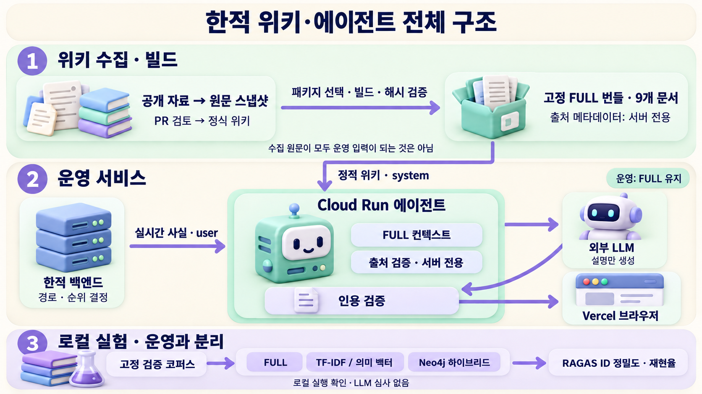
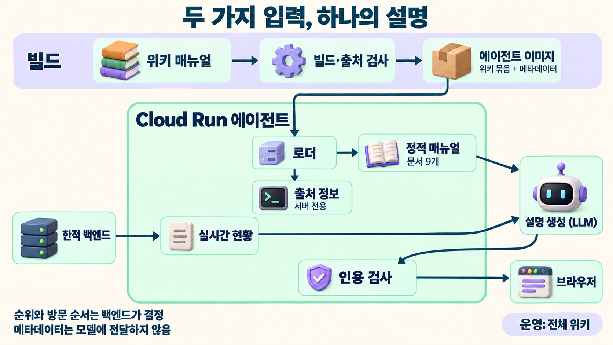
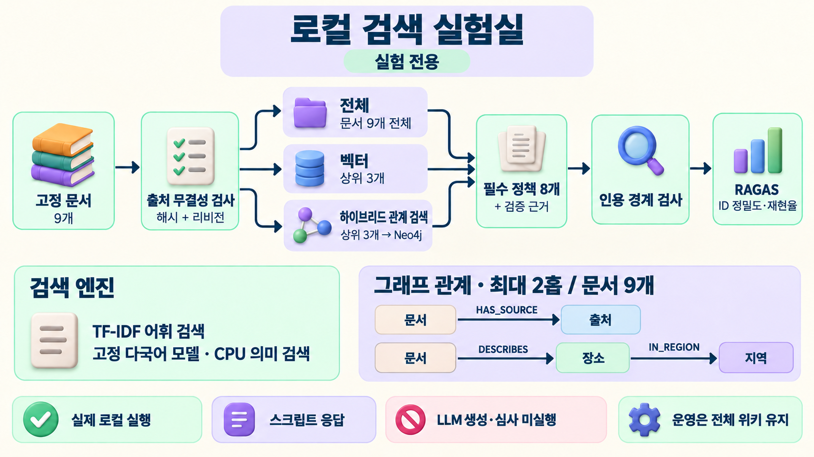

<div align="center">

# 🧭 Travel Context Wiki

**여행·관광·날씨·혼잡도·지역 맥락을 위한 근거 기반 LLM 지식 레이어.**

추천은 여행 서비스가 결정합니다. 이 wiki는 그 추천을 설명하고 검증합니다.

<br/>

[](https://www.data.go.kr/)
[](https://www.data.go.kr/)
[](#-라이선스)
[](./SCHEMA.md)
[](#-스펙-기반-워크플로우)
[](#-빠른-시작)

<br/>

[English](./README.md) · **한국어** · [日本語](./README.ja.md)

</div>

---

## 한적 위키·에이전트 전체 구조



이 3D 그림은 현재 FULL 운영 경로입니다. 검색 배포 준비 구조는 아래 변경점에서 따로 설명합니다. 출처 메타데이터는 서버에서만 검사하고 순위는 백엔드가 정합니다.

---

## 기존 FULL 방식 대비 달라진 점

**운영은 FULL을 유지합니다.** 2026-10-10 Cloud Run 설정을 읽기 전용으로 확인했으며 agent `ea47917`이 Ready·100% 트래픽이고 검색 런타임 설정은 없습니다. agent #14/wiki #33은 외부에서 merge됐고 이번 후속 변경은 별도 feature 브랜치에서 새 Draft PR로 검토합니다. 별도 API·요청별 선택은 구현·검증했으며 클라우드 배포는 보류합니다.

| 구분 | 기존 FULL 방식 | 현재 로컬 구현 |
| --- | --- | --- |
| 모델 입력 | 문서 9개, UTF-8 24,703 bytes 전체를 system 매뉴얼에 넣고 facts를 user에 전달 | 기본 FULL은 기존 bytes를 그대로 쓰고 검색을 호출하지 않습니다. 선택 모드 VECTOR/HYBRID_GRAPH도 필수 정책 8개를 항상 유지하며 선택 seed JSON은 신뢰하지 않는 user 데이터로 전달합니다. |
| 검색 | 런타임 검색 없이 빌드 시 package 문서 목록 사용 | 별도 Python ASGI API가 고정 인덱스를 검색합니다. TF-IDF 어휘 벡터와 실제 실행한 고정 CPU 의미 임베딩을 구분합니다. HYBRID_GRAPH는 검증한 문서·출처 및 seed의 장소·지역 관계만 최대 2홉/9문서로 확장합니다. |
| 역할 | Kotlin이 전체 번들을 읽고 백엔드 facts를 설명 | API는 문서 ID·해시·출처 서명만 반환합니다. Kotlin이 로컬 원문·근거 범위·인용을 검증하고 스트림을 수리합니다. 순위는 계속 백엔드가 정하며 facts 원문·이력은 검색 API에 보내지 않습니다. |
| 버전·공개 | 번들과 출처 메타데이터를 agent 이미지에 함께 고정 | 인덱스·모델·런타임·번들·출처 메타데이터 버전을 고정·재검사합니다. 검증 후 로컬 registry를 수동 공개·롤백하며 실행 중 서비스 재적재나 클라우드 트래픽 전환은 없습니다. |
| 실패·캐시 | 전체 번들 인용 목록과 코스 ID·facts 해시 기반 EXPLAIN 캐시 | 요청별 인용 목록과 컨텍스트 ID를 캐시·진행 중 생성 공유 키에 포함해 동시 선택/FULL 결과도 분리합니다. 인증·시간 초과·잘못된 버전·근거 누락 등은 검증된 FULL로 복귀하고 FULL 원본 손상은 응답을 차단합니다. |
| 평가 | 고정 응답 기반 fixture 29개 문서 선택 비교와 과거 모델 평가 | 실제 RAGAS 0.3.9 문서 ID 정밀도·재현율을 답변 생성·LLM 심사와 구분합니다. 실제 HTTP·Neo4j·Kotlin 인용 E2E도 프로바이더는 고정 응답이며 유료 LLM·심사 호출은 없습니다. |

**로컬 검증 완료:** Python API 19/19·새 CPU builder 13/13이 통과했습니다. JVM 339/339(56 suite), lab 34/34와 기존 fixture 29개/58개 행도 검증됐습니다. 전체 Linux ARM64 CPU 의미 이미지를 실제 빌드하고 별도 인덱스를 재생성해 Neo4j·HTTP·Kotlin으로 실행했습니다. HYBRID·VECTOR 각각 fixture 35개/105개 경로와 실제 facts EXPLAIN을 검증했습니다. HYBRID는 SELECTED, VECTOR는 필수 seed 누락을 명시하고 원래 FULL로 복구합니다. [Linux 실행·재현 기록](docs/linux-semantic-followup-report.md)을 참고하세요. 기존 native·어휘·RAGAS 기록은 보존하며 새 LLM 또는 Linux RAGAS 점수라고 주장하지 않습니다.

**amd64 부분 검증:** 기존 builder 이미지 빌드와 x86_64 Python 실행, `pip check`, 실제 모델 가중치 로딩까지 확인했습니다. 새 amd64 인덱스와 health, 최종 fixture 결과는 미확인입니다. 이전 Mac 인덱스를 포함한 builder는 배포용으로 사용할 수 없습니다. [보존한 출력과 복구 기록](docs/amd64-semantic-recovery.md)에서 단계를 구분합니다.

**배포 전 준비사항:** Cloud Run에 맞는 새 linux/amd64 이미지·인덱스가 필요합니다. private IAM·네트워크 경로와 실제 운영 Neo4j Enterprise reader ACL은 미검증이며 조회 범위에서 검색 서비스·reader endpoint/secret을 찾지 못했습니다. [구체적 대상·순서·비용 전제](docs/linux-semantic-followup-report.md)를 기록했습니다. credentials·IAM·클라우드 자원·트래픽 변경과 별도 한적 DB/SMTP 배포는 수행하지 않았습니다.

**측정 한계:** 선택 대상은 501-byte 경복궁 seed 하나뿐이므로 문서 선택 절감은 최대 501/24,703 = 2.03%입니다. guard 추가나 user 입력 이동이 총 토큰·비용 절감을 증명하지 않습니다. 보존한 의미 실험의 VECTOR/HYBRID 후보 precision은 검색 허용 24건에서 0.250000/0.172619, recall은 0.645833/1.000000입니다. 최종 근거 완전성은 30/35 대 35/35이며 VECTOR seed 누락 5건을 기록했습니다. 배포용 guard는 명시적인 필수 seed 누락 시 FULL로 복귀하고 과거 지표를 덮어쓰지 않습니다. 이 제한된 관계 검색은 Microsoft community GraphRAG 전체 구현이나 답변 품질 개선 입증이 아닙니다. 없는 교통·날씨 및 합성 관계는 검증 그래프에 넣지 않습니다.

agent #14/wiki #33 게시와 해당 head의 CI는 이미 merge된 PR의 과거 증거이며 이번 후속 작업은 별도 Draft PR로 검토합니다. [기존 게시 준비 기록](docs/publication-preparation.json)과 이전 검증 JSON은 당시 범위를 보존합니다. [현재 그림 수정 기록](docs/readme-illustration-correction.json)에 따라 필요한 기존 3D 그림을 복원하고 중복 도식을 제거했으며 새 이미지를 생성하지 않았습니다.

### 검색 구조 — 로컬 구현, 운영 미배포


새 API와 Kotlin 설명·인용 경계는 본문과 비교 표에서 구분합니다. 런타임 모델 다운로드는 없고 검증된 source hash/revision만 인덱스에 포함합니다. 해시 검사가 내용의 진실성이나 주장의 검토 완료를 증명하지 않습니다.


## 📖 목차

- [무엇인가요?](#-무엇인가요)
- [Travel Context Layer](#-travel-context-layer)
- [데이터 출처](#-데이터-출처)
- [수집 현황](#-수집-현황)
- [지식 계층](#-지식-계층)
- [레포지토리 구조](#-레포지토리-구조)
- [데이터 흐름](#-데이터-흐름)
- [서비스 연동 모델](#-서비스-연동-모델)
- [배치 수집 모델](#-배치-수집-모델)
- [지식 저장소 경계](#-지식-저장소-경계)
- [에이전트 전달](#-에이전트-전달)
- [설명 모델](#-설명-모델)
- [프로젝트 산출물 연결](#-프로젝트-산출물-연결)
- [빠른 시작](#-빠른-시작)
- [스펙 기반 워크플로우](#-스펙-기반-워크플로우)
- [MVP 범위](#-mvp-범위)
- [범위 밖](#-범위-밖)
- [기여하기](#-기여하기)
- [라이선스](#-라이선스)

---

## 🤔 무엇인가요?

**Travel Context Wiki**는 **여행지, 관광 공공데이터, 날씨, 혼잡도, 지역 맥락, 연구 자료**를
연결해 LLM이 사용하도록 만든 범용 Markdown/Git 기반 지식 레포지토리입니다.

이 레포는 특정 서비스의 코드를 **대체하지 않습니다**. 여행 서비스는 각자의 백엔드에서
**결정적인** 추천을 수행하고, 이 wiki는 그 추천을 _설명하고 검증하는_ **컨텍스트 레이어**로
사용됩니다. 한적은 이 wiki를 사용하는 첫 번째 소비 서비스일 뿐, 유일한 목적이 아닙니다.

> **한 줄 요약:** 무엇을 추천할지는 서비스가 정하고, 근거 기반의 _왜_ 는 이 wiki가 제공합니다.

---

## 🧩 Travel Context Layer

사용자가 여행 서비스에 **목적지, 날짜, 시간대, 이동 반경, 여행 선호**를 입력하면 서비스
백엔드는 관광지, 날씨, 혼잡도, 이동 조건을 기반으로 후보와 코스를 계산합니다. 이후 LLM은
이 레포의 **canonical wiki**를 검색해 다음 설명을 만듭니다.

- 오늘 이 여행지가 왜 적합한가
- 날씨가 코스 선택에 어떤 영향을 주는가
- 혼잡하면 어떤 대안지가 적합한가
- 실내/실외 대안은 어떤 기준으로 갈리는가
- 공공 API와 연구 자료의 근거는 어디에 있는가

---

## 🗃 데이터 출처

이 wiki의 canonical 지식은 **공공데이터 OpenAPI**에 근거합니다. 한국관광공사(KTO)의 관광 데이터와
대기질 참조 데이터를 공공데이터포털을 통해 받아오며, 모든 파생 레코드와 canonical page는 `raw/`
아래의 원천 증거 스냅샷으로 역추적됩니다.

[](https://www.data.go.kr/)
[](https://www.data.go.kr/)
[](https://www.data.go.kr/)
[](https://www.data.go.kr/)
[](https://www.data.go.kr/data/15073877/openapi.do)
[](https://www.data.go.kr/data/15101972/openapi.do)

| 데이터 출처 | 제공기관 | 용도 | 원천 증거 |
| --- | --- | --- | --- |
| TourAPI KorService2 (국문 관광정보) | 한국관광공사 (KTO) | 관광지 상세, 좌표, 이미지, 개요 | `raw/public-tourism-api/2026-openapi-briefing.txt` |
| 관광지 집중률 방문자 추이 예측 | 한국관광공사 (KTO) | `congestion-diagnosis` 혼잡 등급화 | `raw/public-tourism-api/2026-openapi-briefing.txt` |
| 관광지별 연관 관광지 | 한국관광공사 (KTO) | `alternative-scoring` 대안 후보 구성 | `raw/public-tourism-api/2026-openapi-briefing.txt` |
| 에어코리아 측정소 목록 | 한국환경공단 (KECO) | 지역의 대기질 근거가 어느 측정소에서 왔는지 명시 | `raw/external-snapshots/air-quality-airkorea-station-list.json` |
| 지역별 방문자 수 (한국관광 데이터랩) | 한국관광공사 (KTO) | 혼잡 백분위 척도를 실제 방문량에 근거시키기 | `raw/external-snapshots/tourism-visitors/<YYYY-MM>.json` _(2026-06부터)_ |
| 날씨 / 계절성 데이터 | 기상 OpenAPI _(예정)_ | 날씨 인지 추천 및 실내/실외 폴백 | `raw/weather-api/` _(수집 예정)_ |

> 2026-05 OpenAPI 설명회 자료는 약 **458만 건**의 관광 데이터를 실시간 OpenAPI로 개방하는 한국
> 관광공사 공공데이터 서비스를 설명합니다. 원천 스냅샷은 `raw/` 아래에 원문 그대로 보존되며 절대
> 수정하지 않고, 갱신은 새 스냅샷으로만 이뤄집니다. 재배포 전에는
> [공공데이터포털](https://www.data.go.kr/)에서 정확한 라이선스 조건(예: 공공누리/KOGL)을
> 확인하세요.

앞의 세 줄은 설명회 자료에서 읽어낸 문서상의 출처이고, 뒤의 두 줄은 예약 워크플로우가 스스로
가져옵니다([예약 워크플로우](#예약-워크플로우) 참고). 라이선스는 각각 다릅니다. 에어코리아 측정소
목록은 **공공누리 제3유형**(출처표시 + 변경금지)이고, 방문자 수 시계열은 이용허락범위 제한이
없습니다. 방문자 행은 소스가 돌려준 그대로 저장하며, `touDivCd`가 현지인, 외지인, 외국인으로 나눈
값을 합치지 않습니다. 저장 전에 집계하면 파생 데이터가 `raw/`에 들어가기 때문입니다.

---

## 📊 수집 현황

| 보존한 공개 참고 자료 | 값 |
| --- | --- |
| 수집 기간 | 2개월 (2026-06–2026-07) |
| 일별 행 | 49,137 |
| 최신 기간 기초지자체 | 270 |
| 대기측정소 | 672 |
| 마지막 변경 수집 | 2026-09-14 |

커밋한 수집 통계 산출물의 값이며 실시간 관측이 아닙니다. `scripts/build-collection-stats.sh`가 raw 스냅샷에서 계산합니다. 날짜는 마지막으로 내용이 달라진 수집일이고 기초지자체는 최신 기간만 셉니다. 예약 SVG 생성기는 유지하되 중복 그림은 README에서 제거했습니다.

---

## 🗂 지식 계층

```text
Layer 1: Evidence
  raw/public-tourism-api/     관광 공공 API 설명회, 매뉴얼, 정책 자료
  raw/weather-api/            날씨 API 문서와 검증 자료
  raw/tourism-research/       관광, 혼잡, 날씨 영향 관련 논문/리포트
  raw/service-snapshots/      이 wiki를 소비하는 서비스의 설계/하네스 스냅샷
  raw/experiments/            API 실호출 검증 결과
  raw/external-snapshots/     예약 수집물: 참조 목록과 기간 스냅샷 시계열
  raw/user-input/             동의를 받고 정제한 사용자 입력 캡처
  raw/project-guides/         산출물 연결의 근거가 되는 프로젝트 가이드/PRD

Layer 2: Canonical Memory
  entities/                   관광/날씨 API, 기관, 데이터셋, 주요 시스템
  concepts/                   날씨 인지 추천, 혼잡 회피, 계절성, 지역 맥락
  comparisons/                API/데이터소스/추천 정책 비교
  queries/                    재사용 가능한 근거 기반 질의응답
  decisions/                  LLM wiki 운영과 서비스 연동 의사결정

Layer 3: Operation Metadata
  SCHEMA.md                   wiki 계약
  index.md                    active canonical catalog
  log.md                      append-only operation history
  harness/                    시나리오, 픽스처, smoke 게이트
```

---

## 📁 레포지토리 구조

| 계층 | 경로 | 목적 |
| --- | --- | --- |
| 임시 수집 | `inbox/` | 아직 출처와 형식이 확정되지 않은 입력 |
| 원천 증거 | `raw/` | 수정하지 않는 원천 자료, API 응답, PDF 추출본, 서비스 스냅샷 |
| 정규화 레코드 | `records/` | 서비스가 읽기 쉬운 JSON 파생 데이터 |
| Canonical 메모리 | `concepts/`, `entities/`, `queries/`, `decisions/`, `comparisons/` | 사람이 읽고 LLM이 검색하는 지식 |
| 검색 인덱스 | `indexes/` | 정적 RAG manifest, chunk, source map |
| 서비스 패키지 | `packages/` | 서비스별 context bundle과 prompt |
| 계약과 게이트 | `harness/`, `scripts/` | 시나리오, 픽스처, smoke 게이트, 배치 스크립트 |
| 설계 기록 | `docs/superpowers/` | 이 wiki와 소비 에이전트의 스펙과 계획 |

---

## 🔀 데이터 흐름

이 구조는 `hyunolike/2nd-brain-template`의 **Evidence → Canonical Memory → Discovery → Human
Decision** 흐름을 따르되, 여행 서비스 연동을 위해 정규화 레코드와 서비스 패키지를 추가합니다.

입력은 `inbox/`에서 원본을 보존하는 `raw/`로 옮긴 뒤, 출처가 연결된 `records/`와 canonical 문서로 정리합니다. 두 계층을 `indexes/`에 연결하고 명시한 `packages/` 목록으로 소비 서비스에 전달합니다. 출처 경로·revision을 유지하며 canonical 변경은 `index.md`·`log.md`도 함께 갱신합니다.

---

## 🔌 서비스 연동 모델

배포된 한적 연동은 **두 입력**을 받습니다. 이 저장소의 정적 매뉴얼과 백엔드의 현재 facts입니다. 정책 문서와 정규화 레코드는 **빌드 시점**에 조립하고 질문마다 GitHub에서 찾지 않습니다. 런타임에는 Hanjeok Agent가 백엔드의 코스와 혼잡도, 대안을 조회합니다. 순위와 방문 순서는 이미 백엔드가 정했고 모델은 전체 매뉴얼로 그 사실을 설명합니다. 이 연동은 날씨나 운영시간 facts를 제공하지 않습니다.

| 입력 | 경계 | 용도 |
| --- | --- | --- |
| 전체 매뉴얼: 9문서 / UTF-8 24,703 bytes | 위키 빌드 → agent 이미지 → 모델 `system` | 정책과 정적 맥락 |
| 백엔드 facts | 런타임 백엔드 조회 → 모델 `user` | 현재 코스와 사실 |
| metadata sidecar | 빌드 → agent 서버 무결성/provenance | 서버 검증 전용, 모델 입력 아님 |

현재 FULL 구조는 위 3D 그림에, 로컬 검색 배포 준비는 본문과 비교 표에 표시했습니다. 위키 구조와 저장 경계 설명은 일반적인 저장소 기능을 다룹니다. 운영 agent가 런타임 문서 검색이나 날씨, 객체 저장소를 사용한다는 의미가 아닙니다.


---

## ⚙️ 배치 수집 모델

처음 단계에서는 별도 백엔드 배치 서버를 두지 않습니다. 이 repo의 배치는 **sanitized evidence
capture**와 **static index build**까지만 담당합니다. 실시간 날씨, 실시간 혼잡도, 사용자별
추천 이력처럼 빠르게 바뀌거나 개인적인 데이터는 소비 서비스 백엔드가 관리합니다.

위키 배치는 익명화 fixture·외부 스냅샷을 `raw/`에 보존하고 records·canonical 문서, indexes, 서비스 package를 만듭니다. 실시간 관측과 개인 이력은 소비 백엔드의 런타임 DB에 두며 위키 저장소와 구분합니다.

### 배치 명령어

```bash
scripts/collect-user-input.sh harness/fixtures/user-input-capture.valid.json /tmp/wiki-user-input
scripts/collect-external-snapshot.sh harness/fixtures/external-tourism-snapshot.valid.json /tmp/wiki-external
scripts/collect-period-snapshot.sh harness/fixtures/period-snapshot.valid.json /tmp/wiki-periods
scripts/build-index.sh
scripts/build-index.sh --check
scripts/build-bundle.sh --list
scripts/build-bundle.sh hanjeok
scripts/build-collection-stats.sh --check
./harness/scripts/smoke.sh
```

**규칙:**

- `collect-user-input.sh`는 `consentForWiki`가 `true`이고 `containsPersonalData`가 `false`가 아니면 입력을 거부합니다.
- `collect-external-snapshot.sh`는 소스 URL, 라이선스, 수집 시각, 페이로드를 요구합니다.
- `collect-period-snapshot.sh`는 **늘어나는 시계열**을 다룹니다. `YYYY-MM` 기간마다 파일 하나를
  쓰고, 이미 저장한 기간은 다시 쓰지 않습니다. 단일 파일 수집기로는 이걸 표현할 수 없습니다.
  매 실행마다 페이로드가 바뀌므로 "값이 그대로면 건너뛴다"는 필터가 아무것도 걸러내지 못합니다.
- `build-index.sh --check`는 CI 안전 모드로, 커밋된 검색 산출물이 오래되면 실패합니다.
- `build-bundle.sh <service>`는 패키지를 에이전트가 실제로 보내는 문자열로 조립합니다.
  [에이전트 전달](#-에이전트-전달)을 보세요.
- 인증이 필요한 API 폴링은 이제 **이 레포 안에서** 돌아갑니다. 다만 `SCHEMA.md`의
  _Scheduled Collection Rules_가 정한 좁은 예외 안에서만 허용됩니다. 느리게 바뀌는 공개 참조
  데이터일 것, 하루 한 번을 넘지 않을 것, 서비스 키는 실제로 호출하는 워크플로우 스텝만 읽을 것,
  URL을 로그에 찍지 않을 것, `raw/`에 저장하고 PR을 열 것. 실시간 관측값과 개인 데이터, 하루보다
  잘게 봐야 의미가 있는 데이터는 소비 서비스 백엔드에 남습니다.

### 예약 워크플로우

| 워크플로우 | 하는 일 | 주기 |
| --- | --- | --- |
| `collect-air-quality-stations.yml` | 에어코리아 **측정소 목록**을 수집합니다. 참조 목록이고 실시간 농도가 아닙니다 | 매주 화 06:00 KST |
| `collect-regional-visitors.yml` | 기초지자체별 일별 방문자 수를 월 단위 불변 기간 스냅샷으로 수집 | 매월 8일 06:00 KST |
| `collection-stats.yml` | 이미 커밋된 증거로 `docs/collection-stats.svg`를 다시 그림 | 매일, 그리고 `raw/external-snapshots/`가 바뀐 push마다 |
| `wiki-batch.yml` | `smoke.sh`와 `build-index.sh --check` 실행 | 모든 push와 PR, 그리고 매주 |
| `stale-capture-check.yml` | `collect/*` PR이 사흘 넘게 열려 있으면 실패 | 매일 07:00 KST |

- `DATA_GO_KR_SERVICE_KEY`가 없으면 수집기는 notice를 남기고 건너뜁니다. 시크릿이 없다고 실행이
  실패하지 않으며, `scripts/` 아래 어떤 스크립트도 시크릿을 요구하지 않습니다.
- 수집물은 `raw/`까지만 들어오고 PR을 엽니다. `records/` 파생, `indexes/` 재빌드, canonical page
  승격은 사람의 일로 남겨 리뷰 게이트를 우회하지 않습니다.
- `main`에 직접 push하는 워크플로우는 `collection-stats.yml` 하나뿐입니다. 커밋된 증거를 다시
  그릴 뿐 새로운 주장을 더하지 않아 리뷰어가 판단할 것이 없기 때문이고, 이 예외는 `SCHEMA.md`의
  _Generated Artifact Rules_에 적혀 있습니다.

---

## 🧱 지식 저장소 경계

에이전트가 읽는 저장소는 하나가 아닙니다. 흔한 설계 실수는 "지식 저장소"와 "데이터 랜딩존"을
객체 스토리지 한 곳에 몰아넣는 것인데, 두 계층은 **쓰기 주체도 빈도도 삭제 가능성도 다릅니다.**
이 wiki는 그 경계를 리포지토리 경계로 그었습니다.

| | **이 GitHub 리포** | **객체 스토리지 / 서비스 DB** |
| --- | --- | --- |
| 담는 것 | canonical pages, `records/`, `indexes/`, `packages/` | 실시간 날씨, 실시간 혼잡도, 사용자 입력, 세션 이력 |
| 쓰기 주체 | 사람 (Pull Request) | 배치와 런타임 (기계) |
| 쓰기 빈도 | 낮음. 변경마다 리뷰 | 높음. 분 단위 가능 |
| 검증 관문 | `smoke.sh` + 코드 리뷰 | 서비스 스키마 검증 |
| 이력 | Git 전체 이력, diff, blame | 최신값 위주 |
| 삭제 | 어려움. 히스토리에 남음 | 쉬움 |
| 개인정보 | **금지** | 서비스 경계 안에서만 허용 |

지식 계층을 Git에 두면 **출처 추적이 저장소의 기본 기능**이 됩니다. 반대로 고빈도 자동 수집을
Git에 두면 커밋 이력이 폭증하고, 동시 쓰기에 push 경합이 생기며, 한 번 들어간 개인정보를
지우려면 히스토리 재작성이 필요합니다. 고빈도 수집과 개인정보 수집은 이 리포 밖에 둡니다. 앞에서 설명한, 천천히 바뀌는 공개 기준 데이터의 검토된 수집만 좁은 예외입니다.

큐레이터는 PR로 위키를 수정하고 smoke·index 검증과 검토 뒤 번들을 패키징합니다. 실시간 관측·개인 세션은 소비 백엔드가 담당합니다. 한적 운영은 백엔드 facts와 패키징한 FULL 매뉴얼을 사용하며 이 일반 저장 경계가 날씨 조회나 객체 저장소를 추가하지 않습니다.

에이전트는 **정적 컨텍스트는 번들에서, 실시간 사실은 서비스 저장소에서** 받습니다. 이 우선순위는
`indexes/retrieval-policy.md`가 이미 규정하고 있습니다: backend facts가 최우선이고, 그다음이
`packages/`, 그다음이 canonical page입니다.

---

## 🚚 에이전트 전달

이 리포의 지식을 실행 중인 에이전트에 전달하는 방법은 셋입니다.

| 방식 | 동작 | 적합한 경우 |
| --- | --- | --- |
| **빌드 타임 번들 (권장)** | 이미지 빌드 시 리포를 복사하거나 clone해 `packages/`와 `indexes/`를 이미지에 포함 | 런타임 네트워크 의존과 요청 한도가 없어야 할 때. 갱신은 재배포 |
| 런타임 pull + 캐시 | 기동 시 clone, webhook이나 주기 pull로 갱신 | 지식이 자주 바뀌고 재배포가 부담일 때 |
| HTTP 직접 조회 | 정적 호스팅으로 `indexes/`를 노출해 fetch | 번들이 불가능할 때. CDN 캐시 지연과 요청 한도를 감안할 것 |

`packages/<service>/context-bundle.json`과 `indexes/manifest.json`이 이 전달을 전제로 만들어진
산출물입니다. 세 방식 모두 이 두 파일을 진입점으로 씁니다.

### Hanjeok의 빌드 단계와 요청 처리



현재 FULL 운영 입력입니다. 전체 매뉴얼은 system, 백엔드 facts는 user에 넣고 출처 메타데이터는 서버에만 둡니다. 선택 검색 준비는 별도로 설명합니다.


wiki #31과 agent #12는 머지됐습니다. [운영 검증](docs/production-verification.json)은 2026-10-09 09:13 UTC에 agent `ea47917`의 Ready와 트래픽 100%, health/readiness UP, 전체 번들/sidecar hash 일치를 확인했습니다. 프론트도 배포됐습니다. 이 검증에서는 실제 LLM을 호출하지 않았고 별도 한적 본체 DB/SMTP 배포 보류는 유지합니다. 빌드 단계에서는
wiki의 출처 hash와 Git revision을 검사한 뒤 전체 번들 본문과 JSON sidecar를
만듭니다. agent는 두 산출물을 함께 패키징합니다. sidecar는 무결성 검사와
`/agent/provenance` 조회에 쓰며 모델 입력에는 넣지 않습니다. 요청 시점에는
백엔드 facts가 우선하고 추천 순위는 백엔드가 결정합니다.

`POST /agent/explain`은 매 요청 facts를 새로 조회한 뒤 코스 UUID와 facts의
실제 UTF-8 바이트 SHA-256으로 캐시와 진행 중 호출을 구분합니다. 적중하면 저장된
설명과 실제 생성 시각을 반환합니다. 없거나 만료됐으면 모델 생성과 검증을 마친
설명을 저장하며 TTL은 생성 완료부터 5분입니다. facts가 바뀌면 새 키를 쓰고,
조회나 생성이 실패해도 오래된 설명으로 대신하지 않습니다. `retrievedAt`은
facts 조회 완료 시각이며 예보 발표 시각이나 자료의 신선함을 보증하지 않습니다.

`POST /agent/ask/stream`은 별도 경로입니다. facts와 대화 맥락을 받아 모델이
혼잡도나 대안 조회를 제안하면 서버가 인자를 검증하고 도구를 실행합니다. 결과를
루프에 돌려주고 인용 게이트를 통과한 뒤 본문을 스트리밍합니다. 대화 이력은
새 사실이 아니며 거부되거나 실패한 조회는 근거 합집합에 넣지 않습니다.
비스트리밍 `POST /agent/ask`에는 도구 루프가 없습니다. 두 ASK 경로에는
설명 캐시를 적용하지 않습니다.

hash와 revision 검사 및 제한된 인용 주제 검사는 문장의 의미적 진실이나 실험
승인을 증명하지 않습니다. 초기 주장은 `unverified`이고 변경된 출처는 재검토가
필요합니다. wiki 생성기와 agent 소비 코드는 통합됐습니다. 이후에도 번들 본문과 sidecar를 함께 동기화해야 합니다.
[출처 판본 결정](decisions/bind-claims-to-source-versions.md)을 참고하세요.


### 로컬 벡터·그래프·RAGAS 실험



소비 코드의 별도 FULL / VECTOR / HYBRID_GRAPH lab은 운영 FULL과 기존 29 fixture·그래프 경계 6건을 보존합니다. [실행 상태와 한계](docs/retrieval-experiment-report.md)는 기존 TF-IDF 어휘 baseline과 실제 고정 다국어 CPU 의미 임베딩·RAGAS 0.3.9 ID 평가·출처/seed 선언 관계의 메모리 그래프를 구분합니다. 의미 VECTOR / HYBRID 후보 recall은 검색 허용 24건에서 0.645833 / 1.000000, precision은 정의된 24건에서 0.250000 / 0.172619입니다. 최종 근거가 완전한 행은 30/35 / 35/35이며 VECTOR seed 누락 5건을 기록합니다. 정책 8개 유지와 결정성은 105/105이고 답변 진실성·LLM judge 지표는 아닙니다.

실제 격리 Neo4j Community 5.26.31 통합을 완료했습니다. 시작 노드 15개가 메모리 결과와 일치하고 2홉 검색·합성 관계 배제·문서/출처 해시 변조 거부를 통과했습니다. 두 벡터 방식 각각 105개 행/210개 RAGAS sample의 별도 프로세스 bytes 재현 및 실제 Kotlin citation 계약 검증도 완료했습니다. 실제 검사와 mock 계약을 구분하며 이전 승인 차단은 해소됐습니다. 전용 bridge의 masquerading을 끄고 localhost Bolt만 게시하며 HTTP/사용량 보고를 비활성화했습니다. 소유 자원은 정리했습니다. 없는 교통/날씨나 합성 관계는 curated graph에 들어가지 않고 Microsoft community GraphRAG 전체 구현도 아닙니다. canonical/raw·운영 입력·약 2.03% 문서 bytes 절감 상한은 그대로입니다. 이 lab에서 유료 LLM/judge·외부 업로드·운영 배포는 없고 별도 DB/SMTP 배포도 보류입니다.

### 오프라인 문서 선택 비교

소비 코드의 `SELECTED_EXPERIMENT`는 오프라인 비교이며 운영은 **FULL**을 유지합니다. 정책 문서 8개는 필수이고 `records/places/gyeongbokgung.json`만 선택 대상입니다. 불명확한 질문이나 참조는 검증된 전체 번들로 fallback하고 본문/sidecar hash가 손상되면 fail closed합니다. 운영에는 GraphRAG나 벡터 DB, 런타임 문서 검색이 없습니다. 별도 로컬 실험 구현은 위 상태 보고서에서 구분합니다. [비교 결과와 한계](docs/context-selection-report.md): 직렬화된 system bytes의 최대 감소는 501/24,703 = 2.03%입니다. scripted provider/tool은 배선만 확인하며 유료 모델 품질과 정확도, 지연, 토큰, 비용은 측정하지 않았습니다.

### 번들 만들기

```bash
scripts/build-bundle.sh --list
scripts/build-bundle.sh hanjeok
```

`build-bundle.sh`는 패키지의 canonical page와 정규화 레코드, 서비스 prompt를 하나의 결정적
문자열로 이어 붙입니다. LLM `system` 블록의 `cache_control` 경계 뒤에 그대로 넣으라고 만든
출력입니다. 순서는 탐색하지 않고 패키지가 선언합니다. 정책 페이지가 먼저, 그 정책이 가리키는 값이
다음, 서비스 prompt가 마지막입니다. 지시가 사용자 턴에 가장 가깝게 놓이도록 하기 위해서입니다.

결정성이 핵심입니다. 출력은 파일 내용과 선언된 순서에만 의존하며 타임스탬프, 호스트명, 실행 횟수,
디렉터리 나열 순서 중 어느 것도 섞이지 않습니다. 한 바이트만 달라져도 모든 요청이 캐시 미스가 되어
돈이 나가고, 그런데도 어떤 테스트도 실패하지 않기 때문입니다. `smoke.sh`는 연속 두 번의 실행을
바이트 단위로 비교합니다. 또 `----- FILE: … -----` 형태의 줄을 가진 소스 파일은 거부합니다. 그런
줄이 있으면 문서가 없는 경로를 만들어낼 수 있고, 인용 검사는 바로 그 가짜 경로를 실재하는
것으로 받아들이게 됩니다. 번들이 40KB 소프트 한도를 넘으면 경고하는데, 지금은 한참 아래입니다.
정적 로컬 검색이 벡터 스토어보다 나은 이유이기도 합니다.

---

## 🧪 설명 모델

번들은 종이 위의 계획이 아니라 이미 돌려본 것입니다. `harness/scripts/explain-spike.sh`는 조립된
번들과 픽스처의 백엔드 사실을 모델에 보내 설명과 인용, 그리고 공급자가 돌려준 사용량을 출력합니다. 서버도 DB도 컨테이너도
없이 "이 wiki가 작동하는가"에 답하는 가장 작은 장치입니다.

```bash
./harness/scripts/explain-spike.sh --provider openrouter
```

두 공급자의 요청을 같은 번들과 같은 픽스처로 만들기 때문에, 비교가 프롬프트가 아니라 모델을 재게
됩니다. 출력 계약도 양쪽이 같은 `{ explanation, citations }`이며, 한쪽은 스키마로, 다른 쪽은
`tool_choice`로 고정한 함수 호출로 강제합니다. 이 스크립트가 `scripts/`가 아니라 `harness/`에 있는
이유는 API 키가 필요해서입니다. `scripts/` 아래 스크립트는 시크릿을 요구할 수 없습니다. 키가 없으면
보냈을 요청 본문을 그대로 출력하고 정상 종료합니다.

**측정이 결정한 것**(`decisions/choose-explanation-model.md`): 하네스가 세는 금지 행동은
후보를 **가르지 못했습니다.** 같은 프롬프트, 같은 픽스처, 각 5회 실행에서 `gpt-4o-mini`와 `gpt-4o`가
모두 7종 전부 0%였습니다. 가른 것은 규칙이 못 보는 축, 한국어 가독성이었습니다. 실행당 지적이 1.2건
대 0.5건이었고, 작은 모델 쪽에서는 문장 가운데 알파벳 조각이 남고, JSON의 영어 필드 이름이 그대로
옮겨지고, 한국어에 없는 조사가 붙었습니다. 어느 것도 규칙에 걸리지 않지만, 이 계층이 만드는 것은
문장뿐입니다. 코스와 등급은 서비스가 만들고 에이전트가 더하는 것은 문장입니다. 그래서 쇼케이스는
`gpt-4o`로 돌립니다.

7종은 그 측정을 한 날 하네스가 세던 수입니다. 지금 무엇이 규칙이고 몇 개인지는
`packages/explanation-rules.json`이 정합니다. 여덟 개이고, 각 규칙이 그 규칙에 합의해야 하는
문서 목록을 함께 들고 있습니다.

한계는 숫자를 피해 가지 않고 숫자 옆에 적었습니다. Anthropic은 키가 없어 재지 못했고, 판정자가
`gpt-4o`라 한쪽 실행에서는 자기 출력을 자기가 채점했으며, 이 표 전체가 픽스처 하나와 모델당 5회
실행에 얹혀 있습니다.

---

## 🔗 프로젝트 산출물 연결

오픈소스 AI 자동화 에이전트 프로젝트 자료의 요구를 반영해, 이 wiki는 서비스 데이터뿐 아니라
**포트폴리오 산출물**도 연결 가능한 artifact로 관리합니다. PRD, GitHub Issue/PR, RAGAS 평가
보고서, 배포 URL, service package, GraphRAG export는 `records/project-artifacts/`에 기록하고
canonical page와 source-map으로 역추적합니다.

PRD 원본은 `raw/project-guides/`, issue·PR 링크·평가 보고서·배포 URL은 `records/project-artifacts/`에 보존합니다. canonical 산출물 문서에서 `indexes/source-map.json`, 서비스 package와 소비 context loader까지 출처를 연결합니다.

이를 통해 배포된 AI 서비스는 포트폴리오 자산으로 설명 가능해집니다. 서비스 URL에서 이슈, 구현,
평가, prompt 패키지, 검색 규칙, 최초 프로젝트 요구사항까지 역추적할 수 있습니다.

---

## 🚀 빠른 시작

```bash
./harness/scripts/smoke.sh
```

이 폴더를 **Obsidian vault**로 열거나 **VS Code**에서 여세요. canonical page를 추가하거나
수정하기 전에 `SCHEMA.md`, `index.md`, 그리고 `log.md`의 최신 항목을 읽으세요.

### 운영 워크플로우

증거 수집 → 출처 경로·JSON·frontmatter 검증 → 출처를 단 canonical 문서 작성 → `index.md`·`log.md` 동기화 → 정적 index 생성 → 서비스 context 패키징 → 사람이 수용·이의 제기·수정 여부를 검토합니다.

---

## 📐 스펙 기반 워크플로우

이 레포는 **Spec Kit** 스캐폴딩을 포함합니다. 큰 변경은 다음 순서로 진행합니다.

```text
$speckit-constitution
$speckit-specify
$speckit-plan
$speckit-tasks
$speckit-implement
```

새 런타임 연동 기능은 반드시 `harness/scenarios/`의 시나리오, `harness/fixtures/`의 fixture,
그리고 Spec Kit feature 브랜치에서 시작해야 합니다.

---

## ✅ MVP 범위

- 최초 관광 OpenAPI 설명회 추출본과 첫 소비 서비스 스냅샷을 원천 증거로 보존.
- 관광 데이터, 날씨 인지 추천, 혼잡 인지 라우팅, LLM 설명 경계에 대한 canonical wiki page 유지.
- 정규화 `records/`, 검색 `indexes/`, 서비스 `packages/`를 파생 산출물로 유지.
- 느리게 바뀌는 공개 참조 데이터를 예약 수집해 PR로 올리되, 시크릿은 호출 스텝 밖으로 나가지 않게 유지.
- 서비스별로 결정적이고 캐시 가능한 context bundle을 조립하고, 설명 스파이크로 끝까지 확인.
- frontmatter, source path, index 항목, log 항목, Spec Kit 파일을 검사하는 결정적 smoke 스크립트 제공.
- 향후 기능 작업은 `$speckit-specify`, `$speckit-plan`, `$speckit-tasks`, `$speckit-implement`로 진행.

---

## 🚫 범위 밖

- LLM이 실제 여행 코스를 결정하는 것.
- 사용자 요청마다 실시간 논문 검색.
- 실시간 관측값 수집. 대기질 농도나 실시간 혼잡도처럼 하루보다 잘게 봐야 의미가 있는 값은 담지 않습니다.
- API 키, 공공데이터 서비스 키, Telegram 토큰, 사용자 여행 이력을 Git에 저장.
- 각 소비 서비스의 결정적 추천 로직을 대체.

---

## 🤝 기여하기

1. 먼저 `SCHEMA.md`, `index.md`, `log.md`의 최신 항목을 읽으세요.
2. 새 런타임 기능은 `harness/scenarios/`에 시나리오, `harness/fixtures/`에 fixture를 추가하세요.
3. canonical page를 만들거나 수정하면 `index.md`와 `log.md`를 **같은 변경으로** 갱신하세요.
4. PR을 열기 전에 로컬에서 관문을 실행하세요.
   ```bash
   ./harness/scripts/smoke.sh
   scripts/build-index.sh --check
   ```
5. 개인 여행 입력, 위치정보, API 키, 서비스 키, 토큰은 절대 커밋하지 마세요.

---

## 📄 라이선스

현재 라이선스 파일이 선언되어 있지 않습니다. 라이선스가 추가되기 전까지는 모든 권리가
레포지토리 소유자에게 있는 것으로 간주하세요. 자료를 재사용하려면 이슈를 열어 조건을 확인해
주세요.

<div align="center">
<br/>

[English](./README.md) · **한국어** · [日本語](./README.ja.md)

<sub>추천은 여행 서비스가 결정합니다. 이 wiki는 그 추천을 설명하고 검증합니다.</sub>

</div>
