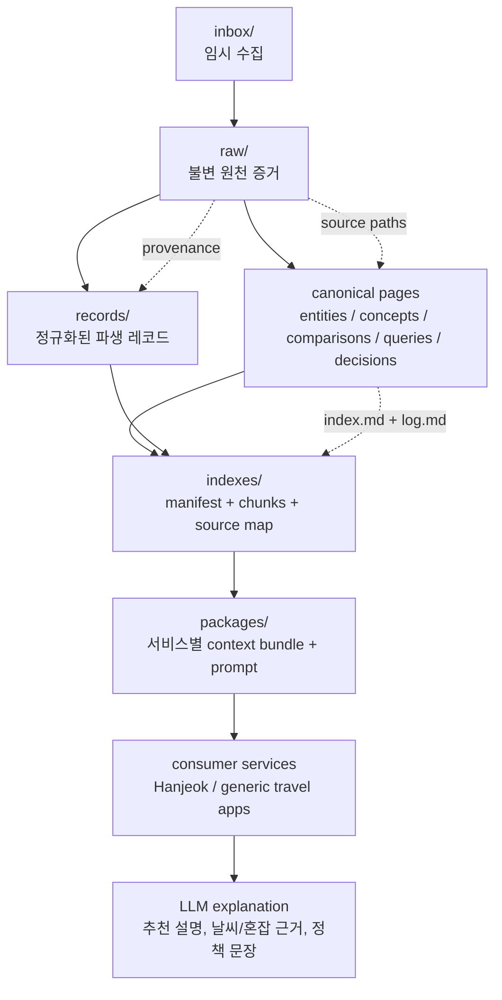
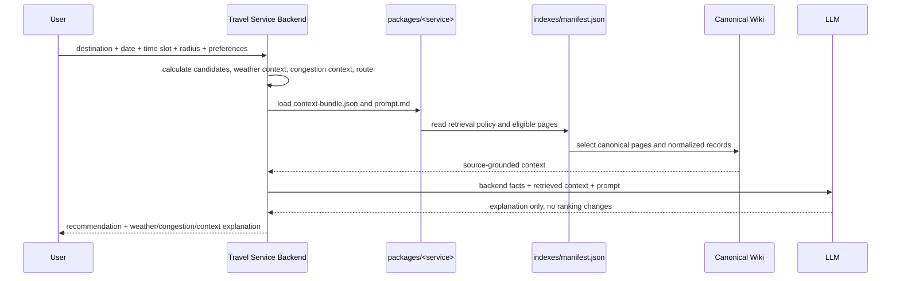
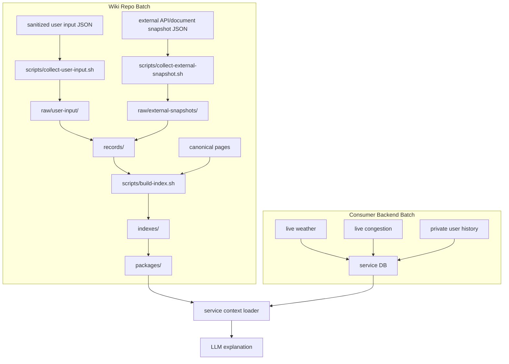
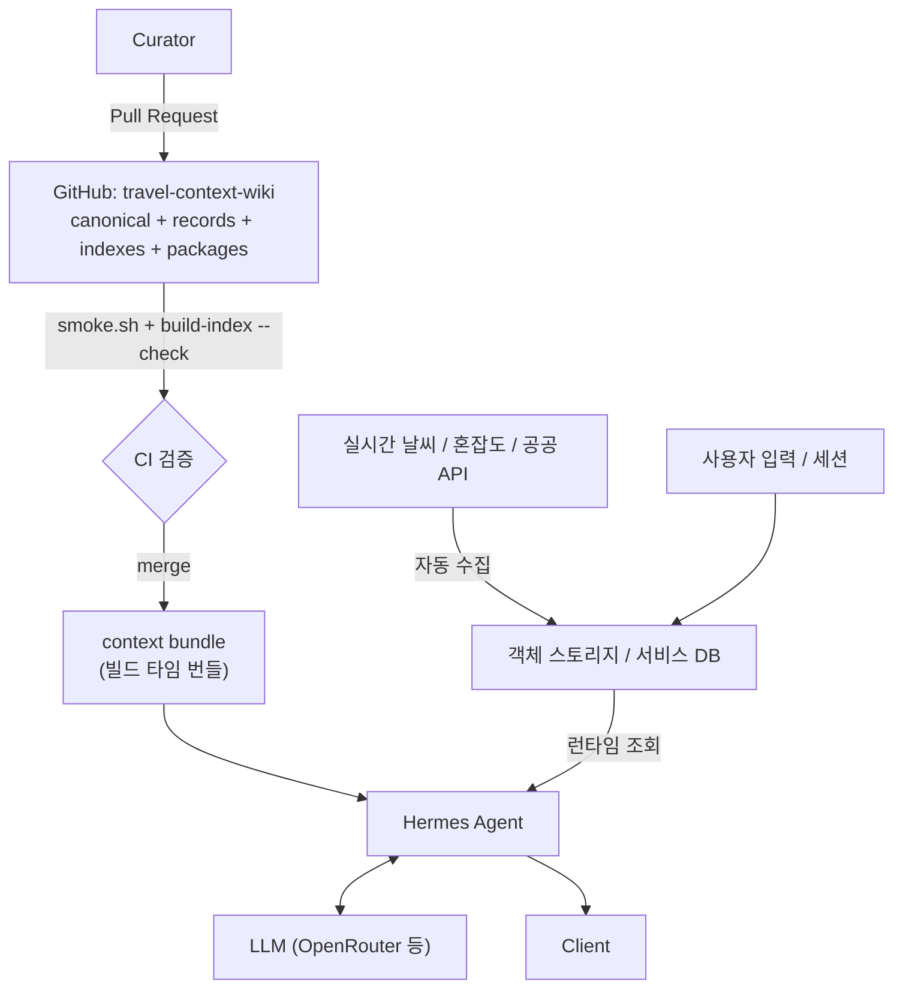
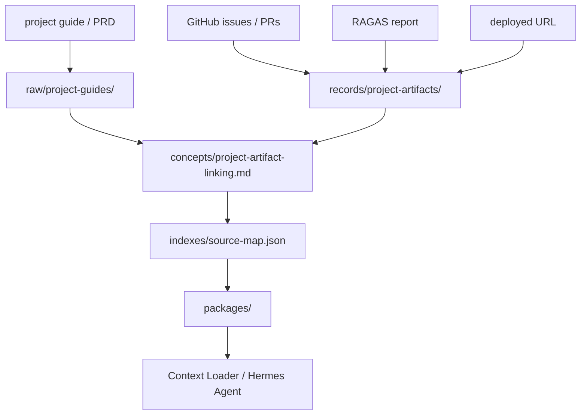
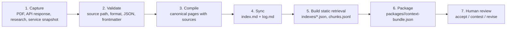
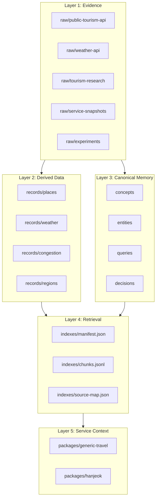

# Travel Context Wiki

여행지, 관광 공공데이터, 날씨, 혼잡도, 지역 맥락, 연구 자료를 연결하는 범용 LLM wiki 레포지토리입니다.

이 레포는 특정 서비스의 코드를 대체하지 않습니다. 여행 서비스는 각자의 백엔드에서 결정적인 추천을 수행하고, 이 wiki는 그 추천을 설명하고 검증하는 컨텍스트 레이어로 사용합니다. 한적은 이 wiki를 사용하는 첫 번째 소비 서비스일 뿐, 유일한 목적이 아닙니다.

## Concept

**Travel Context Layer**

사용자가 여행 서비스에 목적지, 날짜, 시간대, 이동 반경, 여행 선호를 입력하면 서비스 백엔드는 관광지, 날씨, 혼잡도, 이동 조건을 기반으로 후보와 코스를 계산합니다. 이후 LLM은 이 레포의 canonical wiki를 검색해 다음 설명을 만듭니다.

- 오늘 이 여행지가 왜 적합한가
- 날씨가 코스 선택에 어떤 영향을 주는가
- 혼잡하면 어떤 대안지가 적합한가
- 실내/실외 대안은 어떤 기준으로 갈리는가
- 공공 API와 연구 자료의 근거는 어디에 있는가

## Knowledge Layers

```text
Layer 1: Evidence
  raw/public-tourism-api/     관광 공공 API 설명회, 매뉴얼, 정책 자료
  raw/weather-api/            날씨 API 문서와 검증 자료
  raw/tourism-research/       관광, 혼잡, 날씨 영향 관련 논문/리포트
  raw/service-snapshots/      이 wiki를 소비하는 서비스의 설계/하네스 스냅샷
  raw/experiments/            API 실호출 검증 결과

Layer 2: Canonical Memory
  entities/                   관광/날씨 API, 기관, 데이터셋, 주요 시스템
  concepts/                   날씨 인지 추천, 혼잡 회피, 계절성, 지역 맥락
  comparisons/                API/데이터소스/추천 정책 비교
  queries/                    재사용 가능한 근거 기반 질의응답
  decisions/                  LLM wiki 운영과 서비스 연동 의사결정

Layer 3: Operation Metadata
  SCHEMA.md                   wiki 계약
  index.md                    active canonical catalog
  log.md                      append-only operation history
```

## Data Layers

이 구조는 `hyunolike/2nd-brain-template`의 Evidence → Canonical Memory → Discovery → Human Decision 흐름을 따르되, 여행 서비스 연동을 위해 정규화 레코드와 서비스 패키지를 추가합니다.



### Layer Meaning

| Layer | Path | Purpose |
| --- | --- | --- |
| Temporary intake | `inbox/` | 아직 출처와 형식이 확정되지 않은 입력 |
| Raw evidence | `raw/` | 수정하지 않는 원천 자료, API 응답, PDF 추출본, 서비스 스냅샷 |
| Normalized records | `records/` | 서비스가 읽기 쉬운 JSON 파생 데이터 |
| Canonical memory | `concepts/`, `entities/`, `queries/`, `decisions/`, `comparisons/` | 사람이 읽고 LLM이 검색하는 지식 |
| Retrieval indexes | `indexes/` | 정적 RAG manifest, chunk, source map |
| Service packages | `packages/` | 서비스별 context bundle과 prompt |

## Service Integration Model



## Batch Collection Model

처음 단계에서는 별도 백엔드 배치 서버를 두지 않습니다. 이 repo의 배치는 **sanitized evidence capture**와 **static index build**까지만 담당합니다. 실시간 날씨, 실시간 혼잡도, 사용자별 추천 이력처럼 빠르게 바뀌거나 개인적인 데이터는 소비 서비스 백엔드가 관리합니다.



### Batch Commands

```bash
scripts/collect-user-input.sh harness/fixtures/user-input-capture.valid.json /tmp/wiki-user-input
scripts/collect-external-snapshot.sh harness/fixtures/external-tourism-snapshot.valid.json /tmp/wiki-external
scripts/build-index.sh
scripts/build-index.sh --check
./harness/scripts/smoke.sh
```

Rules:

- `collect-user-input.sh` rejects input unless `consentForWiki` is `true` and `containsPersonalData` is `false`.
- `collect-external-snapshot.sh` requires source URL, license, collection time, and payload.
- `build-index.sh --check` is the CI-safe mode; it fails if committed retrieval artifacts are stale.
- Authenticated live API polling should be added later in a service backend or secret-managed scheduled job, not directly in this public wiki repo.

## Knowledge Store Boundary

에이전트가 읽는 저장소는 하나가 아닙니다. 흔한 설계 실수는 "지식 저장소"와 "데이터 랜딩존"을 객체 스토리지 한 곳에 몰아넣는 것인데, 두 계층은 쓰기 주체도 빈도도 삭제 가능성도 다릅니다. 이 wiki는 그 경계를 리포지토리 경계로 그었습니다.

| | **이 GitHub 리포** | **객체 스토리지 / 서비스 DB** |
| --- | --- | --- |
| 담는 것 | canonical pages, `records/`, `indexes/`, `packages/` | 실시간 날씨, 실시간 혼잡도, 사용자 입력, 세션 이력 |
| 쓰기 주체 | 사람 (Pull Request) | 배치와 런타임 (기계) |
| 쓰기 빈도 | 낮음. 변경마다 리뷰 | 높음. 분 단위 가능 |
| 검증 관문 | `smoke.sh` + 코드 리뷰 | 서비스 스키마 검증 |
| 이력 | Git 전체 이력, diff, blame | 최신값 위주 |
| 삭제 | 어려움. 히스토리에 남음 | 쉬움 |
| 개인정보 | **금지** | 서비스 경계 안에서만 허용 |

지식 계층을 Git에 두면 출처 추적이 저장소의 기본 기능이 됩니다. 반대로 고빈도 자동 수집을 Git에 두면 커밋 이력이 폭증하고, 동시 쓰기에 push 경합이 생기며, 한 번 들어간 개인정보를 지우려면 히스토리 재작성이 필요합니다. 그래서 자동 수집은 이 리포로 들어오지 않습니다.



에이전트는 **정적 컨텍스트는 번들에서, 실시간 사실은 서비스 저장소에서** 받습니다. 이 우선순위는 `indexes/retrieval-policy.md`가 이미 규정하고 있습니다: backend facts가 최우선이고, 그다음이 `packages/`, 그다음이 canonical page입니다.

### Agent Delivery

이 리포의 지식을 실행 중인 에이전트에 전달하는 방법은 셋입니다.

| 방식 | 동작 | 적합한 경우 |
| --- | --- | --- |
| **빌드 타임 번들 (권장)** | 이미지 빌드 시 리포를 복사하거나 clone해 `packages/`와 `indexes/`를 이미지에 포함 | 런타임 네트워크 의존과 요청 한도가 없어야 할 때. 갱신은 재배포 |
| 런타임 pull + 캐시 | 기동 시 clone, webhook이나 주기 pull로 갱신 | 지식이 자주 바뀌고 재배포가 부담일 때 |
| HTTP 직접 조회 | 정적 호스팅으로 `indexes/`를 노출해 fetch | 번들이 불가능할 때. CDN 캐시 지연과 요청 한도를 감안할 것 |

`packages/<service>/context-bundle.json`과 `indexes/manifest.json`이 이 전달을 전제로 만들어진 산출물입니다. 세 방식 모두 이 두 파일을 진입점으로 씁니다.

## Project Artifact Links

오픈소스 AI 자동화 에이전트 프로젝트 자료의 요구를 반영해, 이 wiki는 서비스 데이터뿐 아니라 포트폴리오 산출물도 연결 가능한 artifact로 관리합니다. PRD, GitHub Issue/PR, RAGAS 평가 보고서, 배포 URL, service package, GraphRAG export는 `records/project-artifacts/`에 기록하고 canonical page와 source-map으로 역추적합니다.



This makes the deployed AI service explainable as a portfolio asset: the user can trace from service URL to issue, implementation, evaluation, prompt package, retrieval rule, and original project requirement.

## Operating Workflow



## Mermaid Architecture



## MVP Scope

- Preserve the initial tourism OpenAPI briefing extract and first consumer-service snapshots as raw evidence.
- Maintain canonical wiki pages for tourism data, weather-aware recommendation, congestion-aware routing, and LLM explanation boundaries.
- Maintain normalized `records/`, retrieval `indexes/`, and service `packages/` as derived artifacts.
- Provide a deterministic smoke script that checks frontmatter, source paths, index entries, log entries, and Spec Kit files.
- Use Spec Kit for future feature work through `$speckit-specify`, `$speckit-plan`, `$speckit-tasks`, and `$speckit-implement`.

## Out Of Scope

- Letting an LLM decide the actual travel course.
- Real-time paper search per user request.
- Storing API keys, public-data service keys, Telegram tokens, or user travel history in Git.
- Replacing each consumer service's deterministic recommendation logic.

## Quick Start

```bash
./harness/scripts/smoke.sh
```

Open this folder as an Obsidian vault or in VS Code. Before adding or changing canonical pages, read `SCHEMA.md`, `index.md`, and the latest entries in `log.md`.

## SDD Workflow

This repository includes Spec Kit scaffolding.

```text
$speckit-constitution
$speckit-specify
$speckit-plan
$speckit-tasks
$speckit-implement
```

New runtime integration features must start with a scenario under `harness/scenarios/`, a fixture under `harness/fixtures/`, and a Spec Kit feature branch.

## Initial Source Snapshots

- `raw/public-tourism-api/2026-openapi-briefing.txt`
- `raw/service-snapshots/hanjeok/design-v3.md`
- `raw/service-snapshots/hanjeok/course-recommendation.md`
- `raw/service-snapshots/hanjeok/attractions.fixture.json`

## Initial Data Artifacts

- `records/places/gyeongbokgung.json`
- `records/weather/rules.json`
- `records/congestion/grade-policy.json`
- `records/regions/seoul-jongno.json`
- `records/project-artifacts/portfolio-deliverables.json`
- `indexes/manifest.json`
- `indexes/chunks.jsonl`
- `indexes/source-map.json`
- `packages/generic-travel/context-bundle.json`
- `packages/hanjeok/context-bundle.json`

## Recommended Repository Name

`travel-context-wiki`
