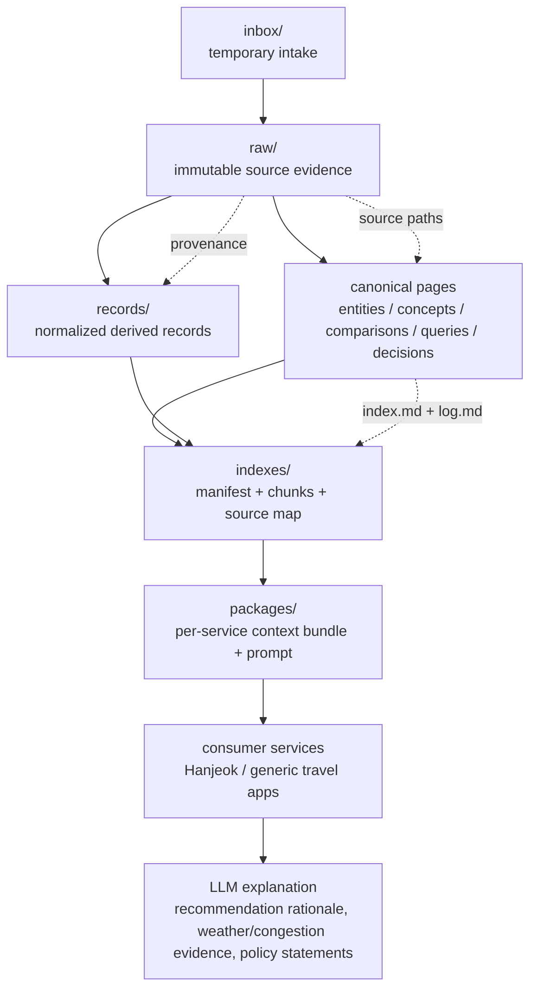
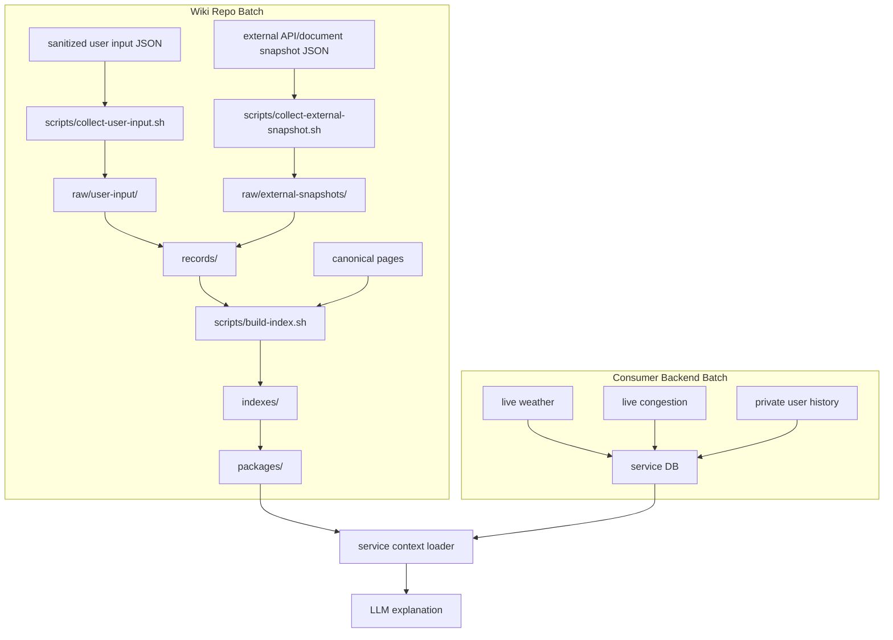
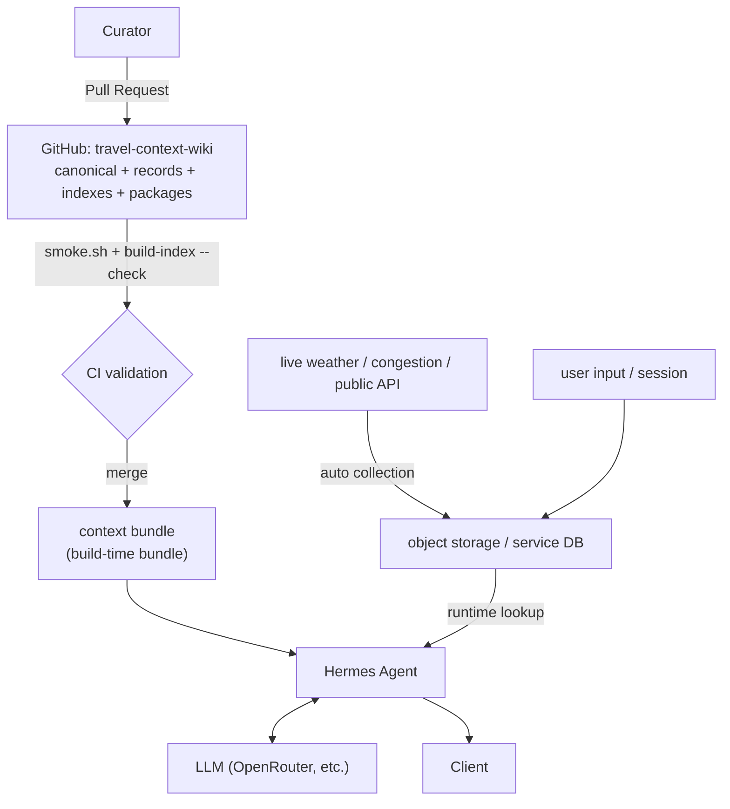
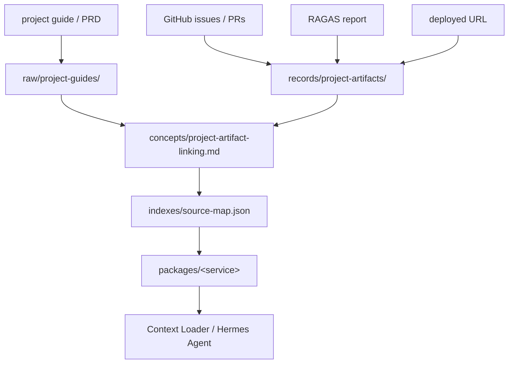
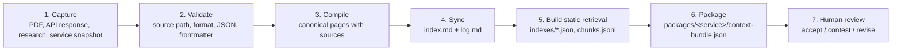

<div align="center">

# 🧭 Travel Context Wiki

**A source-grounded LLM knowledge layer for travel, tourism, weather, congestion, and regional context.**

Travel services decide the recommendation. This wiki explains and verifies it.

<br/>

[](#-license)
[](./SCHEMA.md)
[](#-spec-driven-workflow)
[](#-quick-start)

<br/>

**English** · [한국어](./README.ko.md) · [日本語](./README.ja.md)

</div>

---

## 📖 Table of Contents

- [What Is This?](#-what-is-this)
- [The Travel Context Layer](#-the-travel-context-layer)
- [Knowledge Layers](#-knowledge-layers)
- [Repository Structure](#-repository-structure)
- [Data Flow](#-data-flow)
- [Service Integration Model](#-service-integration-model)
- [Batch Collection Model](#-batch-collection-model)
- [Knowledge Store Boundary](#-knowledge-store-boundary)
- [Agent Delivery](#-agent-delivery)
- [Project Artifact Links](#-project-artifact-links)
- [Quick Start](#-quick-start)
- [Spec-Driven Workflow](#-spec-driven-workflow)
- [MVP Scope](#-mvp-scope)
- [Out of Scope](#-out-of-scope)
- [Contributing](#-contributing)
- [License](#-license)

---

## 🤔 What Is This?

**Travel Context Wiki** is a general-purpose, Markdown/Git-based knowledge repository that
connects **destinations, public tourism data, weather, congestion, regional context, and
research material** for use by large language models.

This repo does **not** replace any service's code. Each travel service performs its own
**deterministic** recommendation in its own backend; this wiki is used as a **context layer**
that _explains_ and _verifies_ those recommendations. Hanjeok is simply the first consuming
service — it is one use case, not the only purpose.

> **In one sentence:** the service picks _what_ to recommend; this wiki supplies the
> source-grounded _why_.

---

## 🧩 The Travel Context Layer

When a user enters a **destination, date, time slot, travel radius, and preferences** into a
travel service, the service backend computes candidate places and courses from attractions,
weather, congestion, and routing conditions. The LLM then searches this repo's **canonical
wiki** to produce explanations such as:

- Why this destination fits **today**
- How **weather** affects the choice of course
- Which **alternatives** fit when a place is crowded
- What criteria split **indoor vs. outdoor** fallbacks
- Where the **public API and research evidence** lives

---

## 🗂 Knowledge Layers

```text
Layer 1: Evidence
  raw/public-tourism-api/     Tourism public-API briefings, manuals, policy material
  raw/weather-api/            Weather API docs and validation material
  raw/tourism-research/       Papers/reports on tourism, congestion, weather impact
  raw/service-snapshots/      Design/harness snapshots of consuming services
  raw/experiments/            Real API-call validation results

Layer 2: Canonical Memory
  entities/                   Tourism/weather APIs, agencies, datasets, key systems
  concepts/                   Weather-aware recommendation, congestion avoidance, seasonality
  comparisons/                API / data-source / recommendation-policy comparisons
  queries/                    Reusable, evidence-grounded Q&A
  decisions/                  Operating & service-integration decisions

Layer 3: Operation Metadata
  SCHEMA.md                   Wiki contract
  index.md                    Active canonical catalog
  log.md                      Append-only operation history
```

---

## 📁 Repository Structure

| Layer | Path | Purpose |
| --- | --- | --- |
| Temporary intake | `inbox/` | Inputs whose source & format are not yet finalized |
| Raw evidence | `raw/` | Untouched source material, API responses, PDF extracts, service snapshots |
| Normalized records | `records/` | Service-readable derived JSON |
| Canonical memory | `concepts/`, `entities/`, `queries/`, `decisions/`, `comparisons/` | Human-readable, LLM-retrievable knowledge |
| Retrieval indexes | `indexes/` | Static RAG manifest, chunks, source map |
| Service packages | `packages/` | Per-service context bundle + prompt |

---

## 🔀 Data Flow

This structure follows the **Evidence → Canonical Memory → Discovery → Human Decision** flow of
`hyunolike/2nd-brain-template`, adding normalized records and service packages for travel-service
integration.



---

## 🔌 Service Integration Model

```mermaid
sequenceDiagram
    participant User
    participant Service as Travel Service Backend
    participant Package as packages/&lt;service&gt;
    participant Index as indexes/manifest.json
    participant Wiki as Canonical Wiki
    participant LLM

    User->>Service: destination + date + time slot + radius + preferences
    Service->>Service: calculate candidates, weather context, congestion context, route
    Service->>Package: load context-bundle.json and prompt.md
    Package->>Index: read retrieval policy and eligible pages
    Index->>Wiki: select canonical pages and normalized records
    Wiki-->>Service: source-grounded context
    Service->>LLM: backend facts + retrieved context + prompt
    LLM-->>Service: explanation only, no ranking changes
    Service-->>User: recommendation + weather/congestion/context explanation
```

**Key rule:** the LLM produces **explanation only**. It never changes the service's ranking.

---

## ⚙️ Batch Collection Model

In the early stage there is **no separate backend batch server**. This repo's batch scope covers
only **sanitized evidence capture** and **static index build**. Fast-changing or personal data —
live weather, live congestion, per-user history — is managed by the consumer service backend.



### Batch Commands

```bash
scripts/collect-user-input.sh harness/fixtures/user-input-capture.valid.json /tmp/wiki-user-input
scripts/collect-external-snapshot.sh harness/fixtures/external-tourism-snapshot.valid.json /tmp/wiki-external
scripts/build-index.sh
scripts/build-index.sh --check
./harness/scripts/smoke.sh
```

**Rules:**

- `collect-user-input.sh` rejects input unless `consentForWiki` is `true` and `containsPersonalData` is `false`.
- `collect-external-snapshot.sh` requires source URL, license, collection time, and payload.
- `build-index.sh --check` is the CI-safe mode; it fails if committed retrieval artifacts are stale.
- Authenticated live API polling should be added later in a service backend or a secret-managed
  scheduled job — **not** directly in this public wiki repo.

---

## 🧱 Knowledge Store Boundary

An agent does not read from a single store. A common design mistake is to cram the "knowledge
store" and the "data landing zone" into one object store — but the two layers differ in **who
writes, how often, and whether deletion is possible**. This wiki draws that boundary as a
**repository boundary**.

| | **This GitHub repo** | **Object storage / service DB** |
| --- | --- | --- |
| Holds | canonical pages, `records/`, `indexes/`, `packages/` | live weather, live congestion, user input, session history |
| Writer | humans (Pull Request) | batch & runtime (machines) |
| Write frequency | low — reviewed per change | high — possibly per-minute |
| Validation gate | `smoke.sh` + code review | service schema validation |
| History | full Git history, diff, blame | latest value mostly |
| Deletion | hard — remains in history | easy |
| Personal data | **forbidden** | allowed only within the service boundary |

Keeping the knowledge layer in Git makes **provenance a built-in feature**. Conversely, putting
high-frequency automated collection into Git explodes commit history, creates push contention on
concurrent writes, and requires history rewrites to erase personal data. So automated collection
never enters this repo.



The agent receives **static context from the bundle** and **live facts from the service store**.
This priority is already defined in `indexes/retrieval-policy.md`: backend facts come first, then
`packages/`, then canonical pages.

---

## 🚚 Agent Delivery

There are three ways to deliver this repo's knowledge to a running agent.

| Method | Behavior | When it fits |
| --- | --- | --- |
| **Build-time bundle (recommended)** | Copy/clone the repo at image-build time so `packages/` and `indexes/` ship inside the image | When runtime network dependency and rate limits are unacceptable. Refresh = redeploy |
| Runtime pull + cache | Clone on startup, refresh via webhook or periodic pull | When knowledge changes often and redeploy is costly |
| Direct HTTP fetch | Expose `indexes/` via static hosting and fetch | When bundling is impossible. Account for CDN cache lag and rate limits |

`packages/<service>/context-bundle.json` and `indexes/manifest.json` are the artifacts built for
this delivery. All three methods use these two files as entry points.

---

## 🔗 Project Artifact Links

Reflecting the needs of an open-source AI-automation-agent portfolio, this wiki manages not only
service data but also **portfolio artifacts** as linkable assets. PRDs, GitHub Issues/PRs, RAGAS
evaluation reports, deployment URLs, service packages, and GraphRAG exports are recorded under
`records/project-artifacts/` and traced back via canonical pages and the source map.



This makes the deployed AI service explainable as a portfolio asset: you can trace from the
service URL to the issue, implementation, evaluation, prompt package, retrieval rule, and the
original project requirement.

---

## 🚀 Quick Start

```bash
./harness/scripts/smoke.sh
```

Open this folder as an **Obsidian vault** or in **VS Code**. Before adding or changing canonical
pages, read `SCHEMA.md`, `index.md`, and the latest entries in `log.md`.

### Operating Workflow



---

## 📐 Spec-Driven Workflow

This repository includes **Spec Kit** scaffolding. Large changes proceed in this order:

```text
$speckit-constitution
$speckit-specify
$speckit-plan
$speckit-tasks
$speckit-implement
```

New runtime-integration features must start with a scenario under `harness/scenarios/`, a fixture
under `harness/fixtures/`, and a Spec Kit feature branch.

---

## ✅ MVP Scope

- Preserve the initial tourism OpenAPI briefing extract and first consumer-service snapshots as raw evidence.
- Maintain canonical wiki pages for tourism data, weather-aware recommendation, congestion-aware routing, and LLM explanation boundaries.
- Maintain normalized `records/`, retrieval `indexes/`, and service `packages/` as derived artifacts.
- Provide a deterministic smoke script that checks frontmatter, source paths, index entries, log entries, and Spec Kit files.
- Use Spec Kit for future feature work through `$speckit-specify`, `$speckit-plan`, `$speckit-tasks`, and `$speckit-implement`.

---

## 🚫 Out of Scope

- Letting an LLM decide the actual travel course.
- Real-time paper search per user request.
- Storing API keys, public-data service keys, Telegram tokens, or user travel history in Git.
- Replacing each consumer service's deterministic recommendation logic.

---

## 🤝 Contributing

1. Read `SCHEMA.md`, `index.md`, and the latest `log.md` entries first.
2. For new runtime features, add a scenario under `harness/scenarios/` and a fixture under `harness/fixtures/`.
3. When you create or change a canonical page, update `index.md` and `log.md` in the **same change**.
4. Run the gate locally before opening a PR:
   ```bash
   ./harness/scripts/smoke.sh
   scripts/build-index.sh --check
   ```
5. Never commit personal travel input, location data, API keys, service keys, or tokens.

---

## 📄 License

No license file is currently declared. Until a license is added, treat all rights as reserved by
the repository owner. If you intend to reuse this material, please open an issue to clarify terms.

<div align="center">
<br/>

**English** · [한국어](./README.ko.md) · [日本語](./README.ja.md)

<sub>Travel services decide the recommendation. This wiki explains and verifies it.</sub>

</div>
