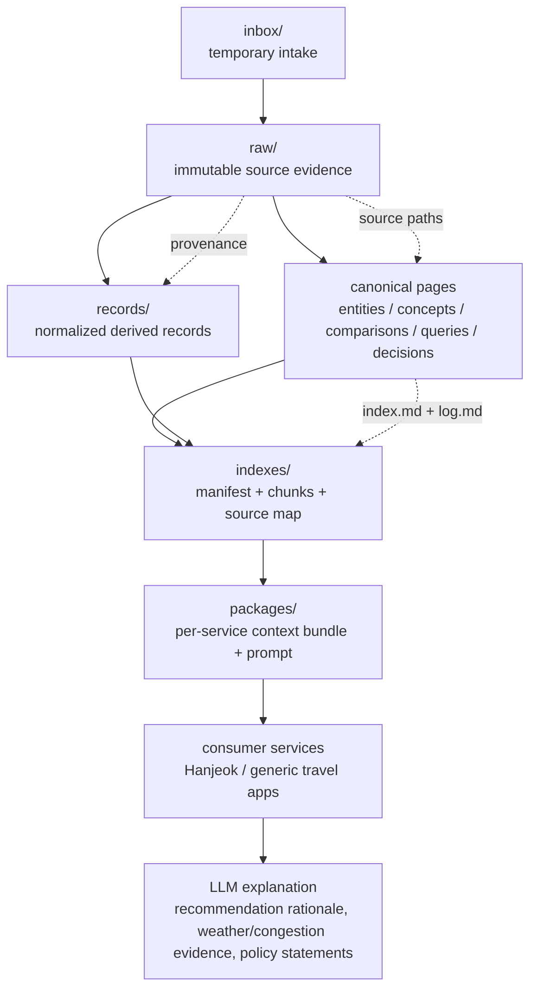
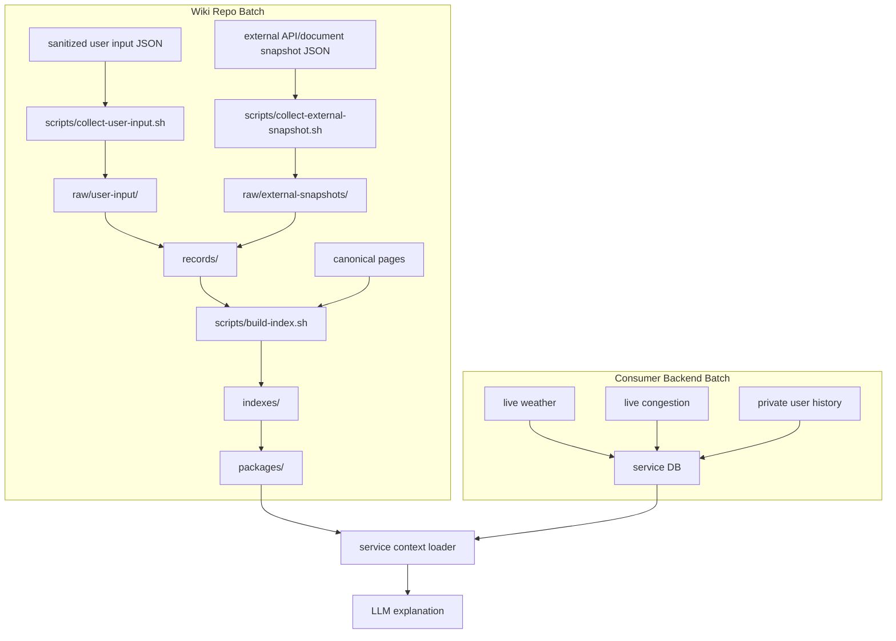
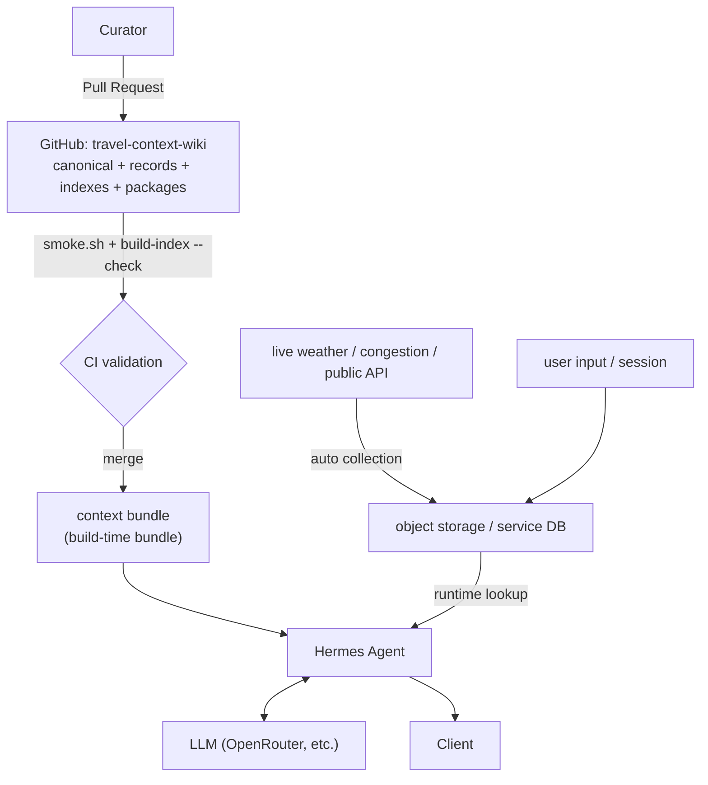
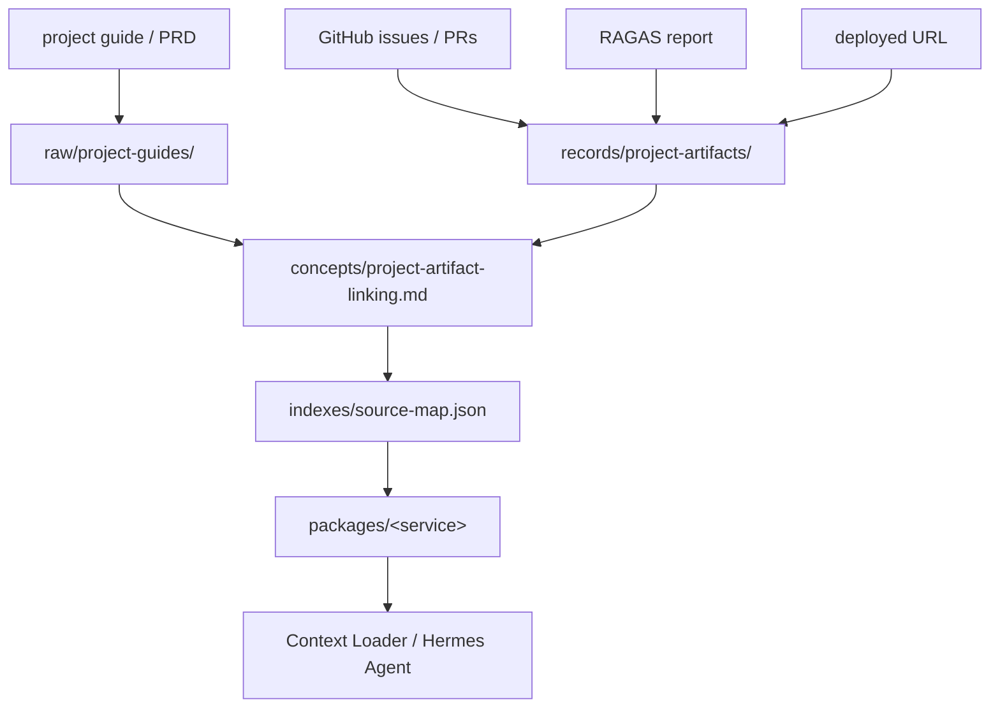
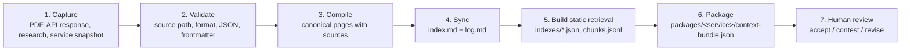

<div align="center">

# 🧭 Travel Context Wiki

**A source-grounded LLM knowledge layer for travel, tourism, weather, congestion, and regional context.**

Travel services decide the recommendation. This wiki explains and verifies it.

<br/>

[](https://www.data.go.kr/)
[](https://www.data.go.kr/)
[](#-license)
[](./SCHEMA.md)
[](#-spec-driven-workflow)
[](#-quick-start)

<br/>

**English** · [한국어](./README.ko.md) · [日本語](./README.ja.md)

</div>

---

## 📖 Table of Contents

- [What Is This?](#-what-is-this)
- [The Travel Context Layer](#-the-travel-context-layer)
- [Data Sources](#-data-sources)
- [Collection Status](#-collection-status)
- [Knowledge Layers](#-knowledge-layers)
- [Repository Structure](#-repository-structure)
- [Data Flow](#-data-flow)
- [Service Integration Model](#-service-integration-model)
- [Batch Collection Model](#-batch-collection-model)
- [Knowledge Store Boundary](#-knowledge-store-boundary)
- [Agent Delivery](#-agent-delivery)
- [Explanation Model](#-explanation-model)
- [Project Artifact Links](#-project-artifact-links)
- [Quick Start](#-quick-start)
- [Spec-Driven Workflow](#-spec-driven-workflow)
- [MVP Scope](#-mvp-scope)
- [Out of Scope](#-out-of-scope)
- [Contributing](#-contributing)
- [License](#-license)

---

## 🤔 What Is This?

**Travel Context Wiki** is a general-purpose, Markdown/Git-based knowledge repository that
connects **destinations, public tourism data, weather, congestion, regional context, and
research material** for use by large language models.

This repo does **not** replace any service's code. Each travel service performs its own
**deterministic** recommendation in its own backend; this wiki is used as a **context layer**
that _explains_ and _verifies_ those recommendations. Hanjeok is simply the first consuming
service — it is one use case, not the only purpose.

> **In one sentence:** the service picks _what_ to recommend; this wiki supplies the
> source-grounded _why_.

---

## 🧩 The Travel Context Layer

When a user enters a **destination, date, time slot, travel radius, and preferences** into a
travel service, the service backend computes candidate places and courses from attractions,
weather, congestion, and routing conditions. The LLM then searches this repo's **canonical
wiki** to produce explanations such as:

- Why this destination fits **today**
- How **weather** affects the choice of course
- Which **alternatives** fit when a place is crowded
- What criteria split **indoor vs. outdoor** fallbacks
- Where the **public API and research evidence** lives

---

## 🗃 Data Sources

The canonical knowledge in this wiki is grounded in **Korean public open data** — Korea Tourism
Organization (KTO) tourism data, plus air-quality reference data — opened through the national
public-data portal. Every derived record and canonical page traces back to a raw evidence
snapshot under `raw/`.

[](https://www.data.go.kr/)
[](https://www.data.go.kr/)
[](https://www.data.go.kr/)
[](https://www.data.go.kr/)
[](https://www.data.go.kr/data/15073877/openapi.do)
[](https://www.data.go.kr/data/15101972/openapi.do)

| Data source | Provider | Used for | Raw evidence |
| --- | --- | --- | --- |
| TourAPI KorService2 (국문 관광정보) | 한국관광공사 (KTO) | Attraction detail, coordinates, images, overview | `raw/public-tourism-api/2026-openapi-briefing.txt` |
| 관광지 집중률 방문자 추이 예측 (Congestion Forecast) | 한국관광공사 (KTO) | `congestion-diagnosis` congestion grading | `raw/public-tourism-api/2026-openapi-briefing.txt` |
| 관광지별 연관 관광지 (Related Attraction) | 한국관광공사 (KTO) | `alternative-scoring` candidate sets | `raw/public-tourism-api/2026-openapi-briefing.txt` |
| 에어코리아 측정소 목록 (Air-quality station list) | 한국환경공단 (KECO) | Naming the station a region's air-quality claim comes from | `raw/external-snapshots/air-quality-airkorea-station-list.json` |
| 지역별 방문자 수 (Regional visitor counts, 한국관광 데이터랩) | 한국관광공사 (KTO) | Grounding the congestion percentile scale in observed visits | `raw/external-snapshots/tourism-visitors/<YYYY-MM>.json` _(2026-06 onward)_ |
| Weather / seasonality data | Meteorological open API _(planned)_ | Weather-aware recommendation & indoor/outdoor fallback | `raw/weather-api/` _(to be captured)_ |

> The 2026-05 OpenAPI briefing describes the KTO open-data service that opens roughly **4.58 million
> tourism records** as real-time OpenAPI. Source snapshots are preserved verbatim under `raw/` and
> are never edited — updates arrive as new snapshots. Confirm the exact license terms
> (e.g. KOGL) on the [public-data portal](https://www.data.go.kr/) before redistribution.

The first three rows are documented sources read out of that briefing. The last two arrive by
themselves — see [Scheduled Workflows](#scheduled-workflows) — and carry their own terms: the
AirKorea station list is **KOGL type 3** (attribution required, modification prohibited), while
the visitor series is published with no usage restriction. Visitor rows are stored exactly as the
source returned them, split by `touDivCd` into 현지인 / 외지인 / 외국인 with no rollup, because
aggregating before storage would put derived data in `raw/`.

---

## 📊 Collection Status


`scripts/build-collection-stats.sh` reads `raw/external-snapshots/` and redraws this
figure daily. A day whose numbers did not move is not committed, so the date on the
figure is the day the evidence was last captured, not the day it was drawn. And
because the collectors skip an unchanged payload and treat a stored period as
immutable, it is precisely the last capture that **differed** — not the last one
that ran.

The figure counts what the evidence layer actually holds — periods stored, daily rows, 기초지자체
covered in the newest period, and monitoring stations — and nothing it has not captured. Coverage
is counted in the newest period only; unioning every period would report which regions have
_ever_ appeared, which is a more flattering number and a different claim.

---

## 🗂 Knowledge Layers

```text
Layer 1: Evidence
  raw/public-tourism-api/     Tourism public-API briefings, manuals, policy material
  raw/weather-api/            Weather API docs and validation material
  raw/tourism-research/       Papers/reports on tourism, congestion, weather impact
  raw/service-snapshots/      Design/harness snapshots of consuming services
  raw/experiments/            Real API-call validation results
  raw/external-snapshots/     Scheduled captures: reference lists and period series
  raw/user-input/             Sanitized, consented user-input captures
  raw/project-guides/         Project guides / PRDs behind the artifact links

Layer 2: Canonical Memory
  entities/                   Tourism/weather APIs, agencies, datasets, key systems
  concepts/                   Weather-aware recommendation, congestion avoidance, seasonality
  comparisons/                API / data-source / recommendation-policy comparisons
  queries/                    Reusable, evidence-grounded Q&A
  decisions/                  Operating & service-integration decisions

Layer 3: Operation Metadata
  SCHEMA.md                   Wiki contract
  index.md                    Active canonical catalog
  log.md                      Append-only operation history
  harness/                    Scenarios, fixtures, and the smoke gate
```

---

## 📁 Repository Structure

| Layer | Path | Purpose |
| --- | --- | --- |
| Temporary intake | `inbox/` | Inputs whose source & format are not yet finalized |
| Raw evidence | `raw/` | Untouched source material, API responses, PDF extracts, service snapshots |
| Normalized records | `records/` | Service-readable derived JSON |
| Canonical memory | `concepts/`, `entities/`, `queries/`, `decisions/`, `comparisons/` | Human-readable, LLM-retrievable knowledge |
| Retrieval indexes | `indexes/` | Static RAG manifest, chunks, source map |
| Service packages | `packages/` | Per-service context bundle + prompt |
| Contract & gate | `harness/`, `scripts/` | Scenarios, fixtures, the smoke gate, and the batch scripts |
| Design record | `docs/superpowers/` | Specs and plans for this wiki and its consuming agent |

---

## 🔀 Data Flow

This structure follows the **Evidence → Canonical Memory → Discovery → Human Decision** flow of
`hyunolike/2nd-brain-template`, adding normalized records and service packages for travel-service
integration.



---

## 🔌 Service Integration Model

```mermaid
sequenceDiagram
    participant User
    participant Service as Travel Service Backend
    participant Package as packages/&lt;service&gt;
    participant Index as indexes/manifest.json
    participant Wiki as Canonical Wiki
    participant LLM

    User->>Service: destination + date + time slot + radius + preferences
    Service->>Service: calculate candidates, weather context, congestion context, route
    Service->>Package: load context-bundle.json and prompt.md
    Package->>Index: read retrieval policy and eligible pages
    Index->>Wiki: select canonical pages and normalized records
    Wiki-->>Service: source-grounded context
    Service->>LLM: backend facts + retrieved context + prompt
    LLM-->>Service: explanation only, no ranking changes
    Service-->>User: recommendation + weather/congestion/context explanation
```

**Key rule:** the LLM produces **explanation only**. It never changes the service's ranking.

---

## ⚙️ Batch Collection Model

In the early stage there is **no separate backend batch server**. This repo's batch scope covers
only **sanitized evidence capture** and **static index build**. Fast-changing or personal data —
live weather, live congestion, per-user history — is managed by the consumer service backend.



### Batch Commands

```bash
scripts/collect-user-input.sh harness/fixtures/user-input-capture.valid.json /tmp/wiki-user-input
scripts/collect-external-snapshot.sh harness/fixtures/external-tourism-snapshot.valid.json /tmp/wiki-external
scripts/collect-period-snapshot.sh harness/fixtures/period-snapshot.valid.json /tmp/wiki-periods
scripts/build-index.sh
scripts/build-index.sh --check
scripts/build-bundle.sh --list
scripts/build-bundle.sh hanjeok
scripts/build-collection-stats.sh --check
./harness/scripts/smoke.sh
```

**Rules:**

- `collect-user-input.sh` rejects input unless `consentForWiki` is `true` and `containsPersonalData` is `false`.
- `collect-external-snapshot.sh` requires source URL, license, collection time, and payload.
- `collect-period-snapshot.sh` handles a **growing series**: one file per `YYYY-MM`, and a stored
  period is never rewritten. The single-file collector cannot express this — its payload changes
  on every run, so its unchanged-payload filter stops filtering anything.
- `build-index.sh --check` is the CI-safe mode; it fails if committed retrieval artifacts are stale.
- `build-bundle.sh <service>` assembles a package into the string an agent sends. See
  [Agent Delivery](#-agent-delivery).
- Authenticated API polling now runs **in this repo**, but only through the narrow exception in
  `SCHEMA.md` → _Scheduled Collection Rules_: slowly changing public reference data, at most once
  a day, the service key read only by the workflow step that fetches, never printed in a URL,
  landing in `raw/` and opening a pull request. Live readings, per-user data, and anything
  meaningful at a finer interval than a day stay in the consumer service backend.

### Scheduled Workflows

| Workflow | What it does | Cadence |
| --- | --- | --- |
| `collect-air-quality-stations.yml` | Captures the AirKorea monitoring **station list** — a reference list, never a concentration reading | Weekly, Tue 06:00 KST |
| `collect-regional-visitors.yml` | Captures daily visitor counts per 기초지자체 as immutable monthly period snapshots | Monthly, 8th 06:00 KST |
| `collection-stats.yml` | Redraws `docs/collection-stats.svg` from evidence already committed here | Daily, and on a push touching `raw/external-snapshots/` |
| `wiki-batch.yml` | Runs `smoke.sh` and `build-index.sh --check` | Every push and pull request, plus weekly |
| `stale-capture-check.yml` | Fails while a `collect/*` pull request has been open more than three days | Daily, 07:00 KST |

- Without `DATA_GO_KR_SERVICE_KEY` a collector logs a notice and skips. A missing secret never
  fails a run, and no script under `scripts/` needs one.
- A capture lands in `raw/` and opens a pull request; deriving `records/`, rebuilding `indexes/`,
  and promoting canonical pages stay human work, so the review gate is never bypassed.
- `collection-stats.yml` is the only workflow that pushes to `main`. It redraws committed
  evidence and adds no claim of its own, so there is no judgement for a reviewer to make —
  the exception is written down in `SCHEMA.md` → _Generated Artifact Rules_.

---

## 🧱 Knowledge Store Boundary

An agent does not read from a single store. A common design mistake is to cram the "knowledge
store" and the "data landing zone" into one object store — but the two layers differ in **who
writes, how often, and whether deletion is possible**. This wiki draws that boundary as a
**repository boundary**.

| | **This GitHub repo** | **Object storage / service DB** |
| --- | --- | --- |
| Holds | canonical pages, `records/`, `indexes/`, `packages/` | live weather, live congestion, user input, session history |
| Writer | humans (Pull Request) | batch & runtime (machines) |
| Write frequency | low — reviewed per change | high — possibly per-minute |
| Validation gate | `smoke.sh` + code review | service schema validation |
| History | full Git history, diff, blame | latest value mostly |
| Deletion | hard — remains in history | easy |
| Personal data | **forbidden** | allowed only within the service boundary |

Keeping the knowledge layer in Git makes **provenance a built-in feature**. Conversely, putting
high-frequency automated collection into Git explodes commit history, creates push contention on
concurrent writes, and requires history rewrites to erase personal data. So automated collection
never enters this repo.



The agent receives **static context from the bundle** and **live facts from the service store**.
This priority is already defined in `indexes/retrieval-policy.md`: backend facts come first, then
`packages/`, then canonical pages.

---

## 🚚 Agent Delivery

There are three ways to deliver this repo's knowledge to a running agent.

| Method | Behavior | When it fits |
| --- | --- | --- |
| **Build-time bundle (recommended)** | Copy/clone the repo at image-build time so `packages/` and `indexes/` ship inside the image | When runtime network dependency and rate limits are unacceptable. Refresh = redeploy |
| Runtime pull + cache | Clone on startup, refresh via webhook or periodic pull | When knowledge changes often and redeploy is costly |
| Direct HTTP fetch | Expose `indexes/` via static hosting and fetch | When bundling is impossible. Account for CDN cache lag and rate limits |

`packages/<service>/context-bundle.json` and `indexes/manifest.json` are the artifacts built for
this delivery. All three methods use these two files as entry points.

### Building the Bundle

```bash
scripts/build-bundle.sh --list
scripts/build-bundle.sh hanjeok
```

`build-bundle.sh` concatenates a package's canonical pages, its normalized records, and the
service prompt into one deterministic string, meant to sit behind a `cache_control` breakpoint in
the LLM `system` block. Order is declared by the package, never discovered: policy pages first,
the values those policies refer to next, the service prompt last so its instructions sit closest
to the user turn.

Determinism is the point. The output depends on file contents and declared order only — no
timestamp, no hostname, no run counter, no directory listing order — because a single varying
byte turns every request into a cache miss, which costs money and fails no test. `smoke.sh`
compares two consecutive runs byte for byte. The script also refuses any source file carrying a
`----- FILE: … -----` marker line: such a line would let a document fabricate a path, and a
fabricated path is exactly what a citation check would then accept as real. A bundle past a 40 KB
soft limit warns; today's are far below it, which is also why static local retrieval beats a
vector store here.

---

## 🧪 Explanation Model

The bundle is not a plan on paper; it has been run. `harness/scripts/explain-spike.sh` sends an
assembled bundle plus a fixture's backend facts to a model and prints the explanation, its
citations, and the usage the provider reported — the smallest thing that answers _"does this
wiki work"_ with no server, no database, and no container.

```bash
./harness/scripts/explain-spike.sh --provider openrouter
```

It builds the request for either provider from the same bundle and the same fixture, so a
comparison measures the model rather than the prompt, and both paths return the same
`{ explanation, citations }` contract — enforced by a schema on one side and by a
`tool_choice`-pinned function call on the other. It lives under `harness/` rather than `scripts/`
because it needs an API key, which every script under `scripts/` is forbidden to require; with no
key present it prints the exact request body it would have sent and exits clean.

**What the measurement settled** (`decisions/choose-explanation-model.md`): the forbidden
behaviours this harness counts **do not separate the candidates**. `gpt-4o-mini` and `gpt-4o`
both scored 0% on all seven, five runs each, same prompt and fixture. What separated them was the
axis no rule sees — Korean readability, 1.2 findings per run against 0.5 — where the smaller
model left an alphabet fragment mid-sentence, copied an English field name out of the JSON, and
attached a particle that does not exist in Korean. None of that trips a rule, and the sentence is
the only thing this layer produces: the service makes the course and the grades, the agent adds
prose. So the showcase runs `gpt-4o`.

Seven is what the harness counted on the day of that measurement. Which rules are in force
now, and how many, is settled in `packages/explanation-rules.json` — eight, each carrying the
list of documents that must agree on it.

The limits are recorded with the number rather than around it: Anthropic was never measured (no
key), the judge was `gpt-4o` grading its own output in one arm, and the whole table rests on one
fixture and five runs per model.

---

## 🔗 Project Artifact Links

Reflecting the needs of an open-source AI-automation-agent portfolio, this wiki manages not only
service data but also **portfolio artifacts** as linkable assets. PRDs, GitHub Issues/PRs, RAGAS
evaluation reports, deployment URLs, service packages, and GraphRAG exports are recorded under
`records/project-artifacts/` and traced back via canonical pages and the source map.



This makes the deployed AI service explainable as a portfolio asset: you can trace from the
service URL to the issue, implementation, evaluation, prompt package, retrieval rule, and the
original project requirement.

---

## 🚀 Quick Start

```bash
./harness/scripts/smoke.sh
```

Open this folder as an **Obsidian vault** or in **VS Code**. Before adding or changing canonical
pages, read `SCHEMA.md`, `index.md`, and the latest entries in `log.md`.

### Operating Workflow



---

## 📐 Spec-Driven Workflow

This repository includes **Spec Kit** scaffolding. Large changes proceed in this order:

```text
$speckit-constitution
$speckit-specify
$speckit-plan
$speckit-tasks
$speckit-implement
```

New runtime-integration features must start with a scenario under `harness/scenarios/`, a fixture
under `harness/fixtures/`, and a Spec Kit feature branch.

---

## ✅ MVP Scope

- Preserve the initial tourism OpenAPI briefing extract and first consumer-service snapshots as raw evidence.
- Maintain canonical wiki pages for tourism data, weather-aware recommendation, congestion-aware routing, and LLM explanation boundaries.
- Maintain normalized `records/`, retrieval `indexes/`, and service `packages/` as derived artifacts.
- Capture slowly changing public reference data on a schedule, as pull requests, with no secret leaving the workflow step that fetches.
- Assemble a deterministic, cacheable context bundle per service, and prove it end to end with the explanation spike.
- Provide a deterministic smoke script that checks frontmatter, source paths, index entries, log entries, and Spec Kit files.
- Use Spec Kit for future feature work through `$speckit-specify`, `$speckit-plan`, `$speckit-tasks`, and `$speckit-implement`.

---

## 🚫 Out of Scope

- Letting an LLM decide the actual travel course.
- Real-time paper search per user request.
- Capturing live readings — air-quality concentrations, live congestion — or anything meaningful at a finer interval than a day.
- Storing API keys, public-data service keys, Telegram tokens, or user travel history in Git.
- Replacing each consumer service's deterministic recommendation logic.

---

## 🤝 Contributing

1. Read `SCHEMA.md`, `index.md`, and the latest `log.md` entries first.
2. For new runtime features, add a scenario under `harness/scenarios/` and a fixture under `harness/fixtures/`.
3. When you create or change a canonical page, update `index.md` and `log.md` in the **same change**.
4. Run the gate locally before opening a PR:
   ```bash
   ./harness/scripts/smoke.sh
   scripts/build-index.sh --check
   ```
5. Never commit personal travel input, location data, API keys, service keys, or tokens.

---

## 📄 License

No license file is currently declared. Until a license is added, treat all rights as reserved by
the repository owner. If you intend to reuse this material, please open an issue to clarify terms.

<div align="center">
<br/>

**English** · [한국어](./README.ko.md) · [日本語](./README.ja.md)

<sub>Travel services decide the recommendation. This wiki explains and verifies it.</sub>

</div>
