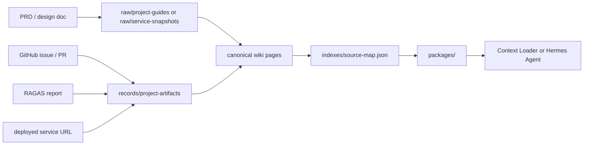

# Project Artifact Linking

Project artifact linking is the rule that PRD, design docs, GitHub issues, pull requests, RAGAS reports, deployment URLs, service packages, and graph exports are treated as linked evidence assets in the LLM Wiki.

This keeps the wiki useful as a portfolio-grade engineering record: a reader can move from a deployed AI service to the prompt package, retrieval policy, canonical explanation rules, source evidence, evaluation report, and implementation issue.

## Artifact Link Model

## Required Links

Every portfolio-relevant artifact should preserve these fields when available:

- stable `id`
- `artifactType`
- owning `repository`
- immutable `commit` or release tag when the artifact is code-backed
- `path` for repository files
- `url` for GitHub issues, pull requests, deployments, or reports
- `source` pointing to raw evidence when derived from a local document
- `canonicalRefs` linking to explanation or architecture pages
- `recordRefs` linking to normalized records used at runtime

## Runtime Boundary

The linked artifact record is not runtime state. Private user history, API keys, live weather responses, and live congestion responses stay in the consuming backend. The LLM Wiki stores only stable, reviewable assets that help explain how the AI service was designed, evaluated, deployed, and connected.

## Related Pages

- [[travel-context-layer]]
- [[raw-derived-data-separation]]
- [[separate-context-wiki-from-services]]
