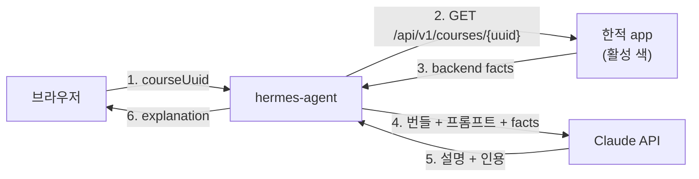

# Hermes Agent 설계

> **부분 대체됨 (2026-08-31).** 코드가 사는 곳, 한적 호출 횟수, 노출 엔드포인트,
> 사용자 접점, 배포 다섯 항목은 `2026-08-31-hermes-agent-repo-design.md`가 대체한다.
> `max_tokens`는 §6.2의 4,096이 아니라 8,192이고, §5의 번들 실측 7,208바이트는
> 15,681바이트로 갱신됐다. 그 외 — LLM 파라미터, 프롬프트 캐싱, 실패 처리,
> 테스트 전략, 하지 않는 것 — 은 이 문서가 정본이다. 대체된 항목의 대조표는
> 새 문서 §0에 있다.

- **작성일**: 2026-08-17
- **상태**: 설계 (부분 대체)
- **관련 결정**: `decisions/keep-llm-out-of-ranking.md`, `decisions/separate-context-wiki-from-services.md`
- **관련 개념**: `concepts/travel-context-layer.md`, `queries/why-this-place-today.md`

---

## 1. 목적과 경계

Hermes Agent는 **한적이 결정론적으로 만든 코스에 대해, 위키의 보존된 근거를 인용해 설명을 생성하는 서비스**다. 순위는 바꾸지 않는다.

`concepts/travel-context-layer.md`가 이 역할을 이미 규정하고 있다.

> The travel service backend makes deterministic recommendations and the LLM wiki explains those recommendations using preserved evidence. The LLM wiki **must not change ranking results.**

허용되는 것과 금지되는 것도 같은 문서에 있다. 이 스펙은 그 경계를 구현으로 옮길 뿐 새로 정하지 않는다.

| 허용 | 금지 |
| --- | --- |
| 왜 후보가 선정됐는지 설명 | 백엔드가 반환하지 않은 관광지 발명 |
| 왜 혼잡한 곳을 뒤로 미뤘는지 설명 | 코스 순서 변경 |
| 폴백이 쓰인 이유 설명 | 출처 없는 공공 API 사실 주장 |
| 공공데이터 준수 사항 설명 | LLM이 코스를 골랐다는 서술 |

---

## 2. 계약 정리 — 7개에서 5개로

`packages/hanjeok/context-bundle.json`의 `requiredBackendFacts` 7개 중 **5개만 한적에 실재한다.** 이 스펙의 첫 번째 작업은 계약을 실제에 맞추는 것이다.

| requiredBackendFacts | 한적 엔드포인트 | 조치 |
| --- | --- | --- |
| `destination` | `GET /api/v1/attractions/{id}` | 유지 |
| `visitDate` | `date` 쿼리 파라미터 | 유지 |
| `congestionDiagnosis` | `GET /api/v1/attractions/{id}/congestion?date=` | 유지 |
| `alternatives` | `GET /api/v1/attractions/{id}/alternatives?date=&radius=` | 유지 |
| `courseItems` | `GET /api/v1/courses/{uuid}` | 유지 |
| `timeSlot` | **없음** — v4 계약에서 삭제("미구현이 아니라 폐기") | **제거** |
| `weather` | **없음** — 한적 백엔드에 날씨 코드 0건, `design.md`에 언급 0건 | **제거** |

`weather`를 제거하면 `records/weather/rules.json`(RAIN·HEAT 규칙 2개)과 `concepts/weather-aware-travel-recommendation.md`가 소비자 없는 자산이 된다. **삭제하지 않는다** — 날씨를 다루는 소비 서비스가 나중에 생길 수 있고, `raw/`가 증거 보존 계층인 것과 같은 이유로 근거는 남긴다. 대신 `packages/hanjeok/context-bundle.json`의 참조에서만 빼고, 해당 문서에 "현재 소비 서비스 없음"을 명시한다.

이 정리를 먼저 하지 않으면 Hermes는 뜨는 순간 존재하지 않는 사실을 요구하게 된다.

---

## 3. 데이터 흐름



**핵심은 2번이다.** 클라이언트가 facts를 넘기지 않고 Hermes가 직접 조회한다. 클라이언트가 facts를 실어 보내면 위조된 혼잡도를 LLM이 그럴듯하게 설명해주는 경로가 생긴다. **사실의 출처는 항상 백엔드여야 한다**는 것이 `retrieval-policy.md`의 1순위 규정이기도 하다.

---

## 4. 인터페이스

```
POST /agent/explain
  Content-Type: application/json
  { "courseUuid": "..." }

200 OK
  {
    "explanation": "경복궁은 8월 15일 매우 혼잡할 것으로 예측됩니다. ...",
    "citations": ["concepts/congestion-diagnosis.md", "records/congestion/grade-policy.json"],
    "generatedAt": "2026-08-17T10:00:00Z",
    "model": "claude-opus-5"
  }

503 Service Unavailable
  { "code": "EXPLANATION_UNAVAILABLE" }
```

엔드포인트는 하나다. `courseUuid`만 받는 이유는 한적에 이미 공유 링크(`GET /courses/{uuid}`)가 있어 코스가 불변 식별자를 갖기 때문이다. 새 UX를 발명하지 않고 기존 공유 화면에 설명을 얹는다.

---

## 5. 컨텍스트 번들 — 전량 프롬프트, 벡터 검색 없음

`packages/hanjeok/context-bundle.json`이 참조하는 문서를 실측했다.

| 파일 | 바이트 |
| --- | ---: |
| `concepts/travel-context-layer.md` | 1,829 |
| `concepts/alternative-scoring.md` | 1,232 |
| `concepts/course-generation-policy.md` | 1,230 |
| `queries/why-this-place-today.md` | 1,343 |
| `records/places/gyeongbokgung.json` | 448 |
| `records/congestion/grade-policy.json` | 593 |
| `packages/hanjeok/prompt.md` | 533 |
| **합계 (weather 제외)** | **7,208** |

**7.2KB — 대략 2,000~2,500 토큰이다.** 검색으로 골라 넣을 크기가 아니라 통째로 넣을 크기다.

따라서 **MVP에 임베딩도 벡터DB도 없다.** `indexes/retrieval-policy.md`가 "static local retrieval comes before vector search"라고 이미 규정했고, 실측이 그 판단을 뒷받침한다. `indexes/chunks.jsonl`은 이 단계에서 쓰지 않는다.

번들은 **이미지 빌드 시 동봉**한다. 런타임에 wiki를 clone하지 않는다 — 2026-08-06 업무일지가 세 방식(빌드 타임 번들 / 런타임 pull+캐시 / HTTP 직접 조회)을 비교해 빌드 타임을 골랐고, 그 근거(지식 갱신 주기가 낮으므로 런타임 네트워크 의존을 새로 만들 이유가 없다)는 그대로 유효하다.

부팅 시 1회 메모리에 적재하고 그 뒤로는 파일을 읽지 않는다.

---

## 6. LLM 연동

### 6.1 공급자 — OpenRouter가 아니라 Anthropic 직접

`README.md`의 다이어그램은 `LLM (OpenRouter 등)`이라고 적혀 있다. **"등"을 Anthropic 직접 호출로 확정한다.** 이유가 셋 있다.

1. **프롬프트 캐싱이 비용의 핵심 레버인데, 그걸 제대로 쓰려면 1차 API가 낫다.** 6.3 참조.
2. **Kotlin 공식 SDK가 있다** — `com.anthropic:anthropic-java`. OpenAI 호환 셰임을 거치면 `cache_control`, `output_config`, 구조화 출력이 전부 우회 경로가 된다.
3. **모델 하나만 쓴다.** OpenRouter의 값인 다중 공급자 라우팅이 필요 없다.

```kotlin
// backend/build.gradle.kts
implementation("com.anthropic:anthropic-java:2.34.0")
```

```kotlin
val client: AnthropicClient = AnthropicOkHttpClient.fromEnv()  // ANTHROPIC_API_KEY
```

### 6.2 모델과 파라미터

| 항목 | 값 | 근거 |
| --- | --- | --- |
| 모델 | `claude-opus-5` | 기본값. 날짜 접미사를 붙이지 않는다 |
| effort | `low`로 시작 | 설명 생성은 추론 부담이 낮다. 품질 미달 시 `medium`으로 |
| thinking | 명시하지 않음(= adaptive) | Claude Opus 5는 thinking이 기본 ON이다 |
| max_tokens | 4096 | **thinking + 응답 텍스트를 합쳐서 제한한다** |
| streaming | 안 씀 | 4096은 타임아웃 위험 구간이 아니다 |

**`max_tokens`가 thinking까지 덮는다는 점이 함정이다.** 응답만 보고 1024쯤 잡으면 thinking이 먹고 답이 잘린다. 4096으로 여유를 준다.

`temperature`·`top_p`·`top_k`는 **쓰지 않는다.** Claude Opus 5에서 400을 반환한다. 문체 다양성이 필요하면 프롬프트로 지시한다.

### 6.3 프롬프트 캐싱 — 이 설계의 비용 구조

캐싱은 **접두사 일치**다. 렌더 순서는 `tools` → `system` → `messages`. 그래서 배치가 이렇게 갈린다.

```
system   : [번들 7.2KB + prompt.md]  ← 매 요청 동일, cache_control 부착
messages : [backend facts JSON]      ← 매 요청 상이
```

**Claude Opus 5의 최소 캐시 가능 접두사는 512 토큰**이다. 번들 2,000~2,500 토큰은 여유 있게 넘는다.

```kotlin
.systemOfTextBlockParams(listOf(
    TextBlockParam.builder()
        .text(bundleText)
        .cacheControl(CacheControlEphemeral.builder()
            .ttl(CacheControlEphemeral.Ttl.TTL_1H)
            .build())
        .build()
))
```

TTL은 1시간을 쓴다. 5분 TTL은 쓰기 1.25배·읽기 0.1배라 2회 요청이면 손익분기지만, 트래픽이 산발적이면 5분 안에 두 번째 요청이 안 온다. 1시간 TTL은 쓰기 2배지만 3회 이상이면 이득이고, **공유 링크가 하루 걸쳐 열리는 이 워크로드에 맞다.**

**침묵의 캐시 무효화 요인**을 코드 리뷰 체크리스트에 넣는다.

- `system`에 타임스탬프·UUID·세션ID를 절대 끼워넣지 않는다
- 번들 직렬화를 결정론적으로 한다(부팅 시 1회 조립 후 불변 문자열로 보관)
- 조건부 `system` 섹션을 만들지 않는다

검증은 `usage.cacheReadInputTokens`로 한다. 반복 요청에서 0이면 무효화 요인이 있는 것이다.

### 6.4 구조화 출력

Java SDK의 클래스 기반 오버로드를 쓴다. 스키마를 손으로 쓰지 않고 반환 타입이 그대로 나온다.

```kotlin
data class Explanation(val explanation: String, val citations: List<String>)

val params = MessageCreateParams.builder()
    .model("claude-opus-5")
    .maxTokens(4096L)
    .outputConfig(Explanation::class.java)
    .systemOfTextBlockParams(cachedBundle)
    .addUserMessage(factsJson)
    .build()
```

---

## 7. 모듈 구조

한적의 Spring Modulith 관례를 따른다.

| 모듈 | 책임 |
| --- | --- |
| `facts` | 한적 API 클라이언트, 응답 → `BackendFacts` 매핑 |
| `context` | 번들 로더, 프롬프트 조립 |
| `llm` | Anthropic 클라이언트 래퍼, 재시도, 타임아웃 |
| `explanation` | 오케스트레이션, 캐시, 컨트롤러 |

기술 스택은 한적과 맞춘다 — Kotlin 2.2, Spring Boot 4.1, `spring-boot-starter-webmvc`, `spring-boot-starter-restclient`, `spring-boot-starter-actuator`. DB는 없다.

---

## 8. 실패 처리 — Hermes가 죽어도 한적은 멀쩡하다

이게 이 설계에서 가장 중요한 속성이다.

한적은 이미 규칙 기반 문구를 갖고 있다(`CourseTextPolicy`, `AlternativeTextPolicy`, `CongestionMessagePolicy`). 따라서 **Hermes는 순수 부가 기능(progressive enhancement)이다.** 503이 오면 프론트엔드는 기존 템플릿 문구를 그대로 쓰면 되고, 사용자는 기능이 하나 덜 보일 뿐 서비스는 정상 동작한다.

| 상황 | 처리 |
| --- | --- |
| 한적 API 실패 | 503, 재시도 안 함 |
| LLM 호출 실패·타임아웃(8초) | 503 |
| LLM 429 / 5xx | SDK 기본 재시도 2회 후 503 |
| `stop_reason == "refusal"` | 503, `content` 읽기 전에 분기 |
| 응답 스키마 불일치 | 503 |

**`refusal` 분기를 빠뜨리면 안 된다.** Claude Opus 5는 안전 분류기가 요청을 거절할 때 HTTP 200에 `stop_reason: "refusal"`과 빈 `content`를 반환한다. `content[0]`을 무조건 읽는 코드는 여기서 깨진다.

캐시는 인메모리 LRU 1,000건. 코스는 불변이므로 같은 `courseUuid`는 같은 설명이다. Redis 공유는 넣지 않는다 — 재시작이 드물고, 필요해지면 그때 붙인다.

---

## 9. 배포

`hanjeok-app` VM의 compose에 컨테이너 하나를 추가한다.

| 항목 | 값 |
| --- | --- |
| `mem_limit` | `512m` |
| 이미지 | 기존 Artifact Registry(`asia-northeast3`, `hanjeok` 리포) |
| 노출 | Caddy에 `/agent/*` 경로 추가 |
| 시크릿 | `ANTHROPIC_API_KEY` → Secret Manager, 기존 `hanjeok-env.sh` 패턴 |

**`mem_limit`은 선택이 아니다.** e2-standard-2의 8,192MB는 이미 OS·docker 약 700MB(추정), postgres 2,048MB, redis 256MB, app 1,536MB×2(블루-그린 전환 시)로 잡혀 있다. 리밋 없이 붙이면 LLM 응답을 버퍼링하다 메모리를 밀어내는 순간 OOM killer가 postgres를 고를 수 있다. 512m을 주면 최악의 순간에도 약 1.6GB가 남는다.

### 9.1 블루-그린과 업스트림 — 한적 인프라 변경 1건 필요

Hermes는 **활성 색**의 app에 붙어야 한다. `app-blue`/`app-green`을 직접 지정하면 전환 때마다 깨진다.

Caddy가 이미 활성 색을 알고 있고 전환 시 `caddy reload`를 받으므로, **Caddyfile에 내부 전용 평문 리스너를 하나 추가**하고 Hermes는 그 고정 주소를 부른다.

전환은 `hanjeok-deploy.sh`가 이렇게 한다.

```bash
sed "s/__COLOR__/$STANDBY/" /opt/hanjeok/Caddyfile.tmpl > /opt/hanjeok/Caddyfile
```

그러므로 템플릿에 같은 `__COLOR__` 자리표시자를 쓰는 블록을 하나 더하면 전환이 그대로 따라온다.

```
# Caddyfile.tmpl (한적 infra) — 추가할 블록
:8080 {
    reverse_proxy app-__COLOR__:8080
}
```

`sed`에 `g` 플래그가 없어 **줄당 첫 번째 `__COLOR__`만** 치환된다. 위 블록은 한 줄에 하나씩만 두므로 문제없다 — 새 블록을 쓸 때 이 제약을 지켜야 한다.

Hermes는 `http://caddy:8080/api/v1/courses/{uuid}`를 호출한다. 이 리스너는 compose 네트워크 안에만 있고 VM 밖으로 나가지 않는다.

**이건 한적 repo에 대한 변경이다.** 다만 **애플리케이션 코드는 한 줄도 바뀌지 않는다** — `infra/startup.sh.tftpl`의 Caddyfile 템플릿 한 곳뿐이고, 계약 §11("LLM을 쓰지 않는다")과 충돌하지 않는다.

---

## 10. 테스트 전략

LLM 응답은 비결정적이다. 결정론적인 부분과 그렇지 않은 부분을 나눠 검증한다.

**단위 테스트(결정론적)**

- facts 매핑: 한적 응답 JSON → `BackendFacts`
- 프롬프트 조립: 같은 입력 → 바이트 단위로 같은 `system` 문자열 (캐시 히트의 전제)
- 캐시 키·적중·축출
- 실패 경로 5종(§8 표)

**harness 시나리오(계약 검증)**

`harness/scenarios/`에 `why-this-place-today` 시나리오를 추가하고, 생성된 설명이 `travel-context-layer.md`의 금지 사항을 어기지 않는지 검사한다.

| 검사 | 방법 |
| --- | --- |
| 없는 관광지 발명 | 응답에 등장하는 관광지명이 전부 facts에 있는가 |
| 코스 순서 변경 | 응답이 facts의 방문 순서와 다른 순서를 주장하는가 |
| LLM이 골랐다는 서술 | 금지 표현 목록 매칭 |
| 인용 유효성 | `citations`의 모든 경로가 번들에 실재하는가 |

**이 harness가 "LLM이 규칙 기반 템플릿보다 나은가"를 재는 자리이기도 하다.** 같은 facts에 대해 템플릿 문장과 LLM 설명을 나란히 놓고 비교한다. 배포 전에 이 비교를 한 번 돌린다.

---

## 11. 위키 쪽 변경

| 파일 | 변경 |
| --- | --- |
| `packages/hanjeok/context-bundle.json` | `requiredBackendFacts`에서 `timeSlot`·`weather` 제거, `canonicalContext`에서 weather 문서 제거 |
| `queries/why-this-place-today.md` | Required Inputs 예시에서 `timeSlot`·`weather` 제거, Answer Policy의 날씨 항목 제거 |
| `concepts/weather-aware-travel-recommendation.md` | frontmatter에 소비 서비스 없음 표시 |
| `records/weather/rules.json` | 유지(증거 보존) |
| `index.md`, `log.md` | 같은 변경으로 갱신 (AGENTS.md 규약) |

---

## 12. 하지 않는 것

YAGNI로 잘라낸 것들. 필요해지면 그때 판단한다.

- 벡터 검색·임베딩 (§5 — 번들이 7.2KB)
- Redis 공유 캐시 (§8 — 인메모리로 충분)
- 다중 질의 템플릿 (`why-this-place-today` 하나만)
- `generic-travel` 패키지 지원 (한적 하나만)
- 스트리밍 응답 (4096 토큰은 타임아웃 구간이 아님)
- 대화형 다중 턴 (요청 1회 = 설명 1개)
- 한적에 weather 모듈 추가 (§2 — 공모전 일정 중 새 공공 API 연동은 리스크 R8)

---

## 13. 미해결

1. **`effort: low`가 충분한 품질을 내는가** — §10의 비교 harness가 답한다. 구현 전 스파이크로 확인하는 편이 낫다.
2. **번들 조립 시점의 파일 목록을 어디서 읽는가** — `context-bundle.json`을 빌드 스크립트가 파싱해 나열된 파일을 이미지에 복사하는 방식을 상정했으나, 스크립트는 아직 없다.
3. **프론트엔드 붙이는 위치** — 코스 공유 화면에 얹는다고만 정했고 UI는 미정. 한적 프론트엔드 변경이 필요하다.
